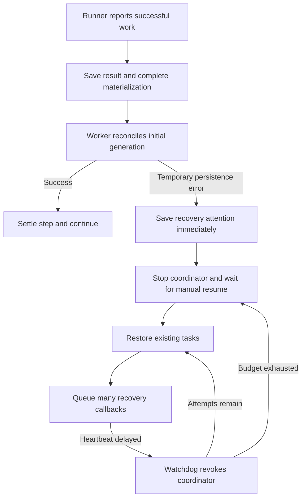
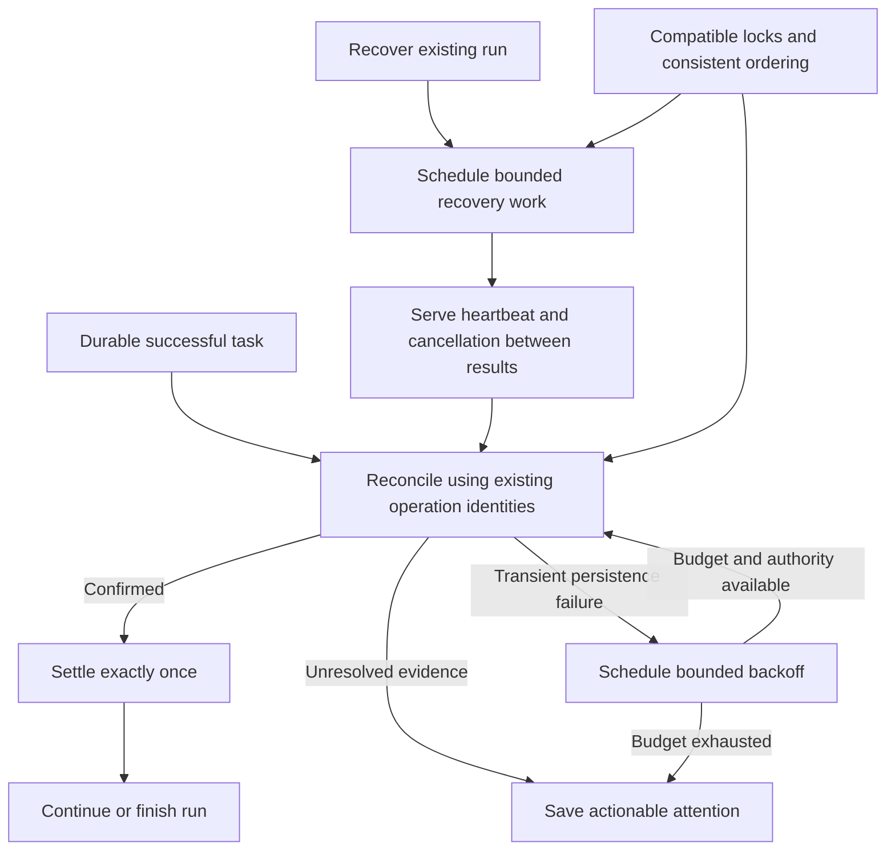
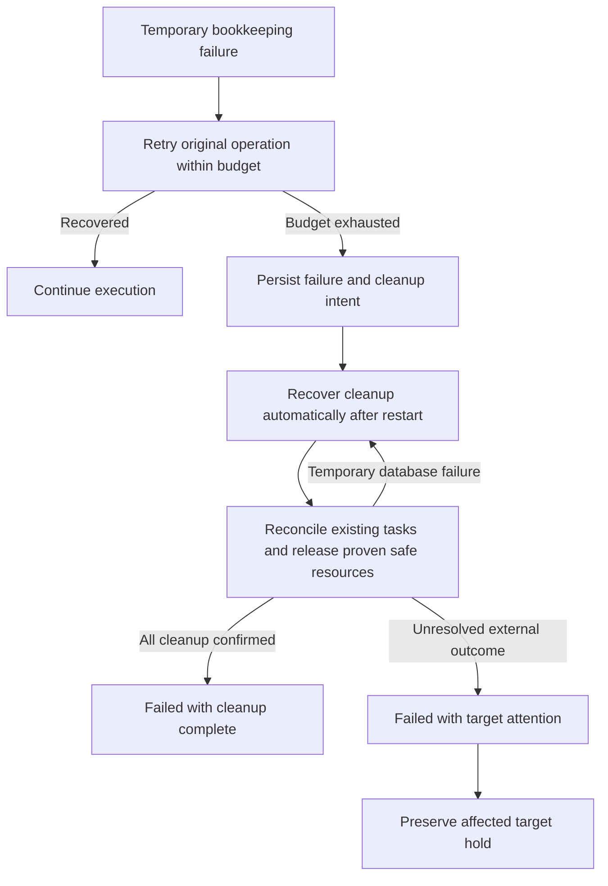
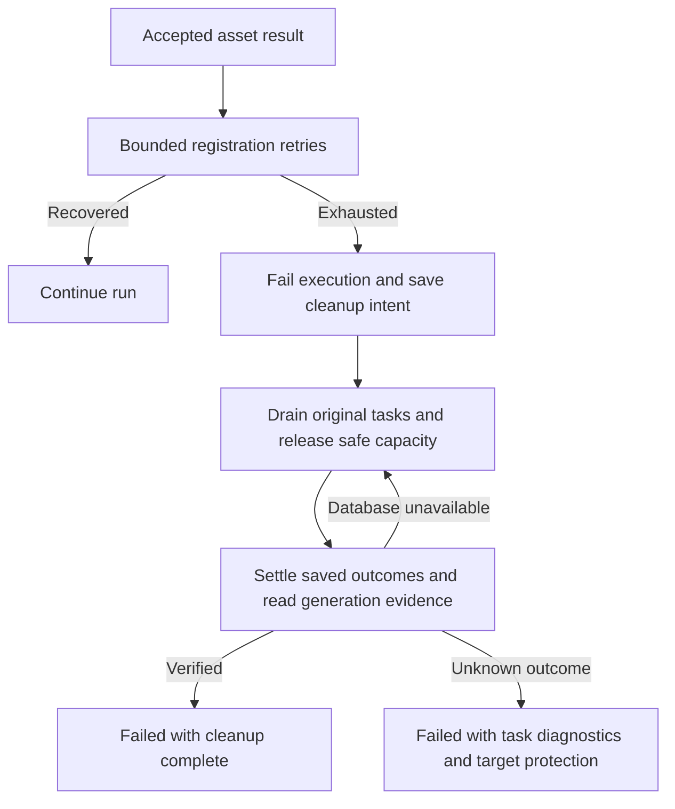
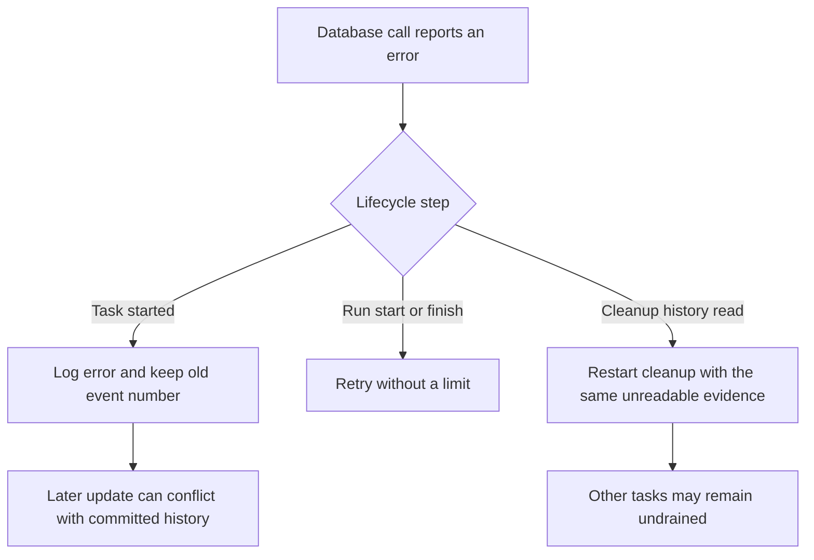
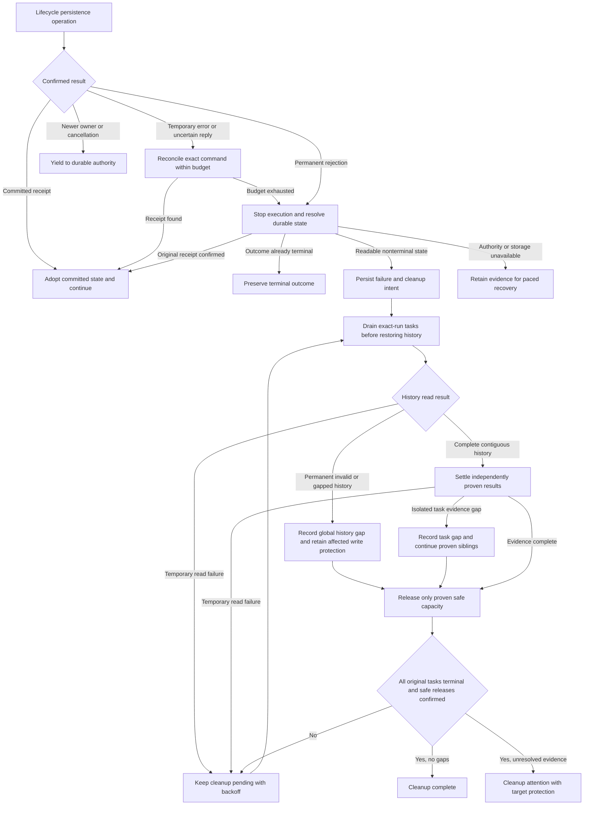

# Change Record: Recover completed work through transient control-plane failures

| Field | Value |
| --- | --- |
| Status | Implementing |
| Type | Bug fix |
| Primary issue | None. On 2026-09-23 the maintainer explicitly requested this record without a GitHub issue. |
| Pull request | [#760](https://github.com/eirhop/favn/pull/760) |
| Related work | [#754](https://github.com/eirhop/favn/pull/754), [#752](https://github.com/eirhop/favn/issues/752), [#692](https://github.com/eirhop/favn/pull/692) |
| Affected areas | PostgreSQL run coordination; orchestrator registration and recovery continuations; run recovery diagnostics and detail view |
| Approved plan commit | [9ebf481ef21edd600a0e1add6dcf6ef3309d363b](https://github.com/eirhop/favn/commit/9ebf481ef21edd600a0e1add6dcf6ef3309d363b) |
| Approved amendment commit | [95a73af4](https://github.com/eirhop/favn/commit/95a73af4) |
| Follow-up amendment | Approved by Astra Max on 2026-09-23; implementation and qualification outstanding |
| Last updated | 2026-09-23 |

## One-minute summary

Successful runner work can remain unsettled because a temporary generation
registration error immediately suspends automatic recovery. PostgreSQL run and
ownership transactions also acquire conflicting locks, while recovery can miss
responsiveness challenges despite continuing to save results. Correct the lock
protocol, automatically reconcile transient registration failures within a finite
budget, and keep recovery responsive while draining durable results. This changes
concurrency and recovery behavior across the storage, orchestrator, and View
boundaries; implementation requires this independently reviewed baseline.

## Impact

Operators repeatedly press Resume recovery for successful work. A completed
runner task can appear queued or running for over an hour while its run is
paused. The intended outcome is automatic progress after a transient control-plane
failure, with actionable attention only when bounded recovery cannot establish
safe progress. Independent runs, runners, and unrelated target writes retain
their existing concurrency.

## Problem analysis

### Assumptions and evidence boundary

- The reviewed source is RC18, `94b299df35d666b16bb1beb11fc9b706ac52f69f`,
  which was also current `origin/main` when this plan was prepared.
- Evidence comes from a saved Test investigation dated 2026-09-23. This is a
  point-in-time incident analysis, not a fresh observation of the environment.
  Customer identifiers and raw logs are omitted from this permanent record;
  the relevant observations are retained below so it is understandable without
  temporary investigation files.
- One orchestrator coordinates multiple runners. PostgreSQL 18 remains the
  durable authority. This plan does not introduce a second execution engine.
- The request authorizes planning and an independent Astra Max review.
  Inventory execution, process termination, memory sizing, and OOM investigation
  are explicitly excluded.

### Evidence

| Evidence | What it proves | What it does not prove |
| --- | --- | --- |
| Saved run events at 13:33:13 and 13:41:00 UTC | Registration attention followed retryable persistence conflicts, respectively during marker initialization and capability lookup | The precise SQL statement behind each generic conflict |
| Event at 14:46:50; state read at 14:51:41 UTC | Another registration pause followed a retryable unavailable connection; attention revision was 10 and recovery attempts were zero | Automatic attempts were exhausted on this path |
| [StageResult.finish_post_step/3](../../../apps/favn_orchestrator/lib/favn_orchestrator/run_server/execution/stage_result.ex), [RunServer](../../../apps/favn_orchestrator/lib/favn_orchestrator/run_server.ex), and [RecoveryAttention](../../../apps/favn_orchestrator/lib/favn_orchestrator/run_server/recovery_attention.ex) | A classified registration error goes directly to attention; the hardcoded 30-second diagnostic does not establish that retries happened | That every reason classified as recovery-required is safe to retry |
| PostgreSQL error export: 260 ownership NOWAIT failures, ten advisory-lock timeouts, four deadlocks | Material control-plane contention during the incident window | A task-by-task attribution of all errors; every NOWAIT rejection being an incident |
| Three deadlocks at 13:28:43, 13:29:40, and 13:31:39 UTC align with failed step-running transitions; 13:33:15 deadlock shows ownership pacing waiting for parent `runs` `FOR KEY SHARE` | The run/ownership lock cycle exists, including an implicit foreign-key lock | That every registration pause or watchdog stop was caused by that cycle |
| [Run store](../../../apps/favn_storage_postgres/lib/favn_storage_postgres/runs/store.ex) and [ownership store](../../../apps/favn_storage_postgres/lib/favn_storage_postgres/run_ownership/store.ex) | Transitions lock run then ownership; renewal holds ownership before pacing; checkpoint validation can lock ownership then run | A one-line lock change covers every affected transaction |
| Four unresponsive revocations with about 45 seconds since the last response and over 111 seconds of lease headroom | Responsiveness was lost while independent database renewal continued | The exact coordinator stack or mailbox contents |
| Nine step-finished events from 13:45:33 through 13:45:51, followed by revocation at 13:45:52 UTC | Progress continued within the watchdog interval | One synchronous call blocked for the whole interval |
| [Execution.start_pipeline_awaits/2 and start_await/3](../../../apps/favn_orchestrator/lib/favn_orchestrator/run_server/execution.ex) | Recovery queues a callback for every restored task; callbacks perform synchronous reads and settlement | That this backlog was the incident's exact starvation mechanism; reproduce it before claiming causation |
| Four sampled tasks succeeded at 13:32–13:40 but their overviews caught up around 14:46 UTC | Durable runner results can precede visible run settlement by a long interval | The delay is an independent projection defect rather than stalled reconciliation |

The existing registration worker already keeps runner inspection waits out of
the coordinator. Moving that same operation into another worker is not a fix.
The existing tests explicitly expect transient registration failures to return
recovery-required; change those expectations while preserving their proofs that
accepted results are neither lost nor recorded twice.

## Current behavior

The database also permits a cycle: a transition holds the run row while waiting
for ownership, and renewal holds ownership while its foreign-key check waits
for the run row. Waiting transactions can retain the per-run advisory lock,
delaying generation helper admission and other progress for that run.

## Approved plan

This section is the independently reviewed baseline. Implementation remains a
later step.

### 1. Make run coordination locks compatible

Define and test one lock protocol for existing run mutations. Existing
cancellation-owner/run advisory and history guards come first where the command
requires them; then acquire ownership before explicitly locking the run row.
Use `FOR NO KEY UPDATE` for run state changes that preserve the referenced run
identity, so foreign-key `FOR KEY SHARE` checks can proceed. Keep full exclusion
for deletion and identity-changing operations. Preserve the history guard that
excludes retention from active execution.

Audit transition, attention, checkpoint (with and without an embedded
transition), claim, batch recovery claim, renewal, release, resume, cancellation,
helper admission, and target maintenance transactions. The audit must include
implicit foreign-key checks and nested transaction entry points. Creation has
no pre-existing ownership row; retain its atomic creation contract. Keep
multi-run lock ordering deterministic. Do not reject an already committed exact
replay merely because its original fence is old; preserve existing receipt
semantics and validate current authority before any new mutation.

Renewal keeps its separate two-connection repo, NOWAIT ownership acquisition,
two-second operation bound, and bypass of the broad run advisory lock. Calculate
expiry and recovery eligibility in one renewal update using one database-time
observation; remove the subsequent pacing update on that path. Replaying the
same renewal identity must preserve both expiry and recovery eligibility.
Claim and release pacing retain their current durable meaning.

Keep the existing total transaction bounds. The regression must show the
specific lock cycle is removed and unrelated runs progress while one run is
contended. Audit advisory-lock hold time for this path; do not compensate by
increasing pool sizes, timeouts, leases, or globally serializing all work.

### 2. Retry registration through its existing continuation

The orchestrator owns one explicit internal registration continuation per
unsettled successful node. Extend the current post-step continuation with a
stable identity, attempt counter, first-failure time, absolute retry deadline,
timer token, and bounded last error. The coordinator owns this state; a
registered worker performs reconciliation. Waiting continuations still count as
in-flight work and prevent premature stage completion.

Classify nested persistence errors explicitly. A retryable conflict, unavailable
connection, or persistence timeout may schedule another reconciliation attempt.
Do not turn the broad `recovery_required?/1` predicate into a blanket retry
predicate: corrupt/unavailable task evidence, identity mismatch, unsupported
operations, worker crashes, and unresolved external outcomes retain their
existing explicit recovery or failure semantics. A lost fence stops the old
generation; it cannot obtain new authority by retrying.

The automatic retry window is 30 seconds from the first retryable failure, with
at most eight retry slots in addition to the original attempt. Before
dispatching a retry, save a versioned,
compact `registration_retry_scheduled` run event using the normal fenced,
idempotent transition path. It names the original node/attempt and registration
identity, retry ordinal, first failure, absolute UTC deadline, and next eligible
time. Saving the intent consumes its slot, even if the coordinator crashes before
dispatch. These events preserve the original budget and consumed-slot count across
coordinator restart and ownership replacement; their reducer is bounded by the
planned nodes and retry cap. An explicit revision-checked operator resume starts
a new recovery epoch; an automatic restart does not.

A replacement first reconciles the original task, marker, and command evidence
without admitting new work. Confirmed completion can settle the node directly.
An interrupted slot stays consumed; any further reconciliation attempt that may
admit missing helper work reserves the next ordinal within the original deadline.
A lost intent acknowledgement is reconciled by its existing command identity,
so it cannot allocate the same slot twice. This conservatively spends a slot
when dispatch is uncertain, instead of claiming to know whether it executed.

Derive the local monotonic deadline from the saved deadline and current time;
it may shorten but never extend an existing local deadline. Persisting the
retry intent must succeed or reconcile its original receipt before another
worker is dispatched. If the intent cannot be confirmed within the remaining
budget, stop for bounded ownership recovery/diagnosis. Do not invent a new
retry identity after losing that acknowledgement.

Schedule delays of 1, 2, 4, then at most 5 seconds, with bounded 20 percent
jitter, always clamped to the remaining deadline. The coordinator returns to its
mailbox during every wait. Normal initial runner inspection keeps its existing
wait policy; once retrying, pass remaining time into runner waits and give the
continuation an independent deadline timer. Expiry stops new retry dispatch and
the local worker; it does not establish rollback or cancel an external write.
Any durable task still in progress or with an uncertain result remains retained
for reconciliation. Persistent failure produces attention under current authority.

Each attempt uses the original asset step, materialization, target generation,
manifest, task domain identity, marker operation identity, and command receipt.
Read existing durable tasks before admission; a failed read is not absence.
Completed inspection/capability results are reused. A lost marker reply requires
the existing marker reconciliation path and exact identity check. An active
matching binding after a lost final database reply completes reconciliation.
Never create a replacement asset attempt or reinterpret an unknown marker write
as a rejected write.

Cancellation, fence loss, terminalization, and coordinator shutdown invalidate
timers and worker references. Late replies cannot settle or reopen a cancelled
continuation. Crash recovery reconstructs unsettled work from existing events
and tasks; it does not trust an old worker's in-memory state. Existing durable
run recovery pacing also bounds repeated coordinator failures. Reconstruct the
remaining registration budget from its events before scheduling recovery work.
Reuse the run event stream; no new retry table or schema migration is planned.

### 3. Keep recovery callbacks responsive

First reproduce the 45-second missed-response behavior with many already
completed tasks and controlled persistence delay. Measure callback duration,
mailbox length, pending recovery count, and heartbeat response age. Exercise
both a backlog of individually short callbacks and an individually slow store
call. Distinguish this from initial registration, which is already asynchronous.

Replace eager scheduling of every restored task with a bounded continuation
queue owned by `RunExecutionState`: process one recovery phase at a time and
return to the mailbox before scheduling its next phase or another task. Starting
a registration worker releases this processing slot immediately; its pending
post-step continuation still counts as in-flight work. Independent completed
siblings can reconcile and settle while that worker awaits a runner or backoff.
Do not serialize whole recovered tasks through their registration waits. Keep
event ordering and settlement in the coordinator. Split recovery reads,
reconciliation, and settlement into explicit phases so a chain of database calls
cannot occupy one callback for the whole watchdog window.

If a measured individual persistence operation can still prevent timely
responses, execute that operation in an existing registered run helper with a
bounded command and reply. Keep at most one state-mutating recovery operation
outstanding per run, retain its command identity, and apply its reply only to
the matching generation and continuation. Do not copy the entire execution
state into a worker or add a second state owner.

Reuse and extend the existing `execution_persist_pending` gate across every
coordinator transition that can advance the same run sequence: sibling results,
retry-intent events, checkpoints, and cancellation settlement included. While a
helper mutation or its receipt is unresolved, defer these transitions using the
existing execution-event gate. Its current deferred list is not a proven bound:
account retained events against execution memory limits, safely coalesce duplicate
wakeups, and drain through the bounded phase queue rather than reposting the
whole list at once. Never drop unique result or mutation evidence. Continue answering heartbeat
challenges and observing/latching cancellation intent immediately. A durable
cancellation command may win independently; reconcile that authoritative change
before applying a late helper reply or advancing the sequence. Resume deferred
work only after the original command receipt or conclusive rejection is known.
Unknown command completion and worker cancellation cannot be treated as rollback.

The acceptance target is a heartbeat response within five seconds while test
recovery work is delayed, no revocation across more than one real watchdog
interval, responsive cancellation, and eventual settlement of every confirmed
result. Merely increasing the watchdog, sending fabricated heartbeats from a
helper, or treating result activity as authority is unacceptable. Reproduce
`target_maintenance_lost` alongside contention; preserve target-lock deadlines
and held-write protection. Any required change to target-lock ownership policy
is a deviation requiring review, not part of this plan.

### Make recovery diagnostics accurate

This is the operator presentation of the three fixes above. Inventory/OOM work
remains excluded.

Keep persisted run status semantics. The existing orchestrator run-detail read
contract should provide a presentation state of recovery attention when
authoritative ownership says attention, taking terminal/cancellation precedence
into account. The View renders that state through the public facade rather than
querying ownership itself. Limit the UI work to the run detail header and notice;
do not redesign every run listing or introduce a new persisted run status.

Expose bounded operation and persistence reason codes plus consumed registration
retry slots, elapsed retry time, and exhaustion reason when available. Label the
persisted count as scheduled retries, not confirmed worker executions. Observed
worker-start/completion measurements are separate telemetry and may be incomplete
after a crash. Keep both separate from the existing automatic coordinator-recovery
count. Remove the
unconditional claim that every attention path used a 30-second retry budget.
Old snapshots lacking these fields display unknown/not recorded, never zero
attempts inferred from missing data. Existing attention revision checks and
resume authorization remain unchanged.

### Contracts and invariants

- The coordinator is the only execution-state owner. Workers have explicit
  lifecycle ownership and bounded replies.
- PostgreSQL ownership, sequence, cancellation, retention, and task identities
  remain authoritative. New mutations require valid current authority.
- Accepted asset results survive retry, cancellation, and restart. Result and
  settlement events are not duplicated by reply replay.
- Unknown external writes retain their claims and target holds; no new asset
  execution is authorized by a metadata failure or local timeout.
- No new work is admitted during authority degradation. Reconciliation uses
  existing identities and follows current cleanup permissions.
- This changes internal recovery continuation and operator read behavior, not
  runner wire payloads, the DSL, adapter write semantics, or concurrency limits.

### Scope and non-goals

Included: the three recovery defects, their focused diagnostics, canonical
documentation, and regression evidence. Excluded: inventory processing, runner
termination diagnostics, OOM or memory tuning, Landing recovery, SQL retries,
increasing retry/watchdog limits, global write serialization, and cloud actions.

### Implementation slices and complexity budget

Ranges exclude this record, generated files, dependency locks, and formatting-only
changes. Supporting lines include tests, fixtures, and canonical documentation.

| Slice | Outcome and owner | Depends on | Production added | Production deleted | Supporting added | Supporting deleted |
| --- | --- | --- | ---: | ---: | ---: | ---: |
| 1 | Lock protocol and real concurrency regression; PostgreSQL | None | 70–150 | 40–100 | 180–320 | 10–40 |
| 2 | Finite registration reconciliation; orchestrator | 1 | 160–280 | 30–80 | 260–440 | 20–60 |
| 3 | Responsive recovery continuation; orchestrator | Reproduction, then 1 | 100–220 | 40–110 | 200–350 | 20–60 |
| 4 | Accurate recovery detail and documentation; orchestrator, storage, View | 2 and 3 | 50–100 | 15–45 | 90–160 | 10–30 |
| Total | Focused correction using existing lifecycle owners | | 380–750 | 125–335 | 730–1,270 | 60–190 |

The substantial supporting budget buys real concurrent transactions, durable
lost-reply proof, and watchdog timing coverage. Extend existing fixtures. Do not
build a generic retry framework or a replacement run manager. Explain overruns
above the upper bound by more than 25 percent or 100 lines, whichever is smaller,
and materially fewer deletions, as required by the [record process](../README.md).

### Implementation map

| Concept | Expected code area | Responsibility |
| --- | --- | --- |
| Run lock protocol | `favn_storage_postgres` run, ownership, cancellation, admission and task stores | Compatible ordered locking, bounded transactions and exact replay |
| Registration continuation | `RunServer.Execution`, `StageResult`, `RunExecutionState`, `InitialTargetGenerationReconciler` | Retry lifecycle and use of existing durable evidence |
| Recovery scheduling | `Execution.Restore`, `RecoveredTask`, `RunServer` | Bounded work and single-owner state transitions |
| Authority | `RunLeaseKeeper`, `RunHelper`, `RunTargetMaintenance` | Existing lease, worker ownership and target protection; regression coverage |
| Operator detail | `OperatorReadStore`, PostgreSQL operator reads, View run detail components | Bounded authoritative presentation and diagnostics |
| Canonical documentation | [Run ownership and recovery](../../architecture/run-ownership-and-recovery.md), [operator runbook](../../production/postgresql_operator_runbook.md), [generation architecture](../../architecture/target-generations-and-rebuilds.md) | Explain the changed contracts once in their owning pages |

## Operational design

### Failures and diagnostics

| Condition | Behavior | Diagnostic |
| --- | --- | --- |
| Transient registration persistence error | Reconcile original identity within remaining budget | Operation, allowlisted error code, scheduled retry ordinal, elapsed/remaining time |
| Deadline or repeated failure | Stop local continuation and save attention | Consumed retry slots, elapsed time and stop reason; preserve original failure |
| Lost acknowledgement | Read original task, marker, binding or command receipt | Reconciliation outcome; never claim a rejected write without proof |
| Cancellation or lost fence | Stop new attempts; follow existing cancellation/ownership recovery | Stable cancellation/fence category |
| Slow recovery | Continue serving control messages while work is outstanding | Callback duration, bounded queue count and heartbeat age |

Use existing operational-event/telemetry boundaries. Log the first retry at
warning, intermediate attempts at debug, and one final recovery or exhaustion
event. Allowlist SQLSTATE/reason codes; never expose raw SQL, parameters, arbitrary
exception terms, customer data, or credentials. Store bounded diagnostics through
the shared JSON-safe codec. Avoid per-task high-cardinality metric labels.

### Deployment, migration, and compatibility

No schema or runner wire change is planned. Deploy the qualified control-plane
binary through the existing single-orchestrator replacement procedure. Already
paused runs remain paused: upgrading does not silently resume operator attention.
After the cause is corrected, the operator may use the current revision-checked
resume action; existing tasks are reconciled first. No status/fence edits,
claim deletion, data rewrite, or live resume is part of this change.

Old snapshots remain readable and additional diagnostic fields are optional,
but the new retry events carry behavior: RC18 ignores their deadline and slot
cap. Ordinary rollback with an active new retry continuation is unsupported.
Before replacing the binary with RC18, verify every run containing these events
has either completed settlement/terminalization or is durably in attention with
all local helpers stopped. Keep affected attention runs paused until a compatible
binary is restored; resuming them on RC18 would abandon the saved retry policy.
If that precondition cannot be met through supported commands, use a forward fix.
Do not repair compatibility by editing statuses or deleting event history.

Test older-codec readability and the rollback eligibility check separately from
new-version budget enforcement. If implementation needs a schema, wire, or
ownership-policy change, record a deviation and obtain review before proceeding.

## Verification plan

| Acceptance criterion | Planned evidence | Owning layer |
| --- | --- | --- |
| The observed lock cycle cannot recur | Deterministically interleave real transition and renewal transactions on independent PostgreSQL connections; exercise implicit FK checks and prove both complete | PostgreSQL concurrency |
| All entry paths follow the protocol | Transition, checkpoint with/without embedded transition, resume, cancellation, claim/recovery batch, release, helper admission and target maintenance matrix; stale fences still reject new writes | PostgreSQL integration |
| Independent renewal is preserved | Broad advisory lock held, ordinary pool saturated, ownership row busy, exact renewal replay, and unrelated run progressing | Existing lease reliability suite |
| Transient registration errors recover | Inject nested conflict/unavailable/timeout at binding read, helper ensure, and final reconcile; recover without attention and without a new asset attempt | Orchestrator |
| Lost replies cannot duplicate side effects | Commit enqueue/marker/final binding then lose acknowledgement; assert original IDs, one asset execution, matching marker and one settlement; unknown mismatch retains holds | PostgreSQL plus orchestrator |
| Retry is bounded and revocable | Persistent error, deadline while worker is waiting, crash before dispatch and after dispatch before acknowledgement, replacement retaining consumed slots/deadline, cancellation during backoff/work, lost fence, duplicate/late worker replies and stale timers | Orchestrator lifecycle |
| Helpers cannot race the run sequence | Delay or lose a helper mutation reply while sibling completion, retry intent, checkpoint and cancellation arrive; prove one ordered outcome, cancellation precedence and responsive heartbeats | Orchestrator plus PostgreSQL |
| Registration waits preserve sibling progress | Hold one recovered node's registration worker through backoff/runner wait while independent completed siblings settle; the run still waits for unresolved continuation before finalizing | Orchestrator continuation |
| Recovery remains responsive | Many durable terminal tasks, slow calls and callback backlog; heartbeat within five seconds, cancellation handled, no false revocation across a real 45-second interval, all outcomes eventually settled | Orchestrator; slow tier for wall-clock proof |
| Real stuck work remains revocable | A coordinator that genuinely stops responding is still revoked; late responses cannot reopen it | Lease keeper lifecycle |
| Target maintenance remains safe | Concurrent recovery/registration load; no unknown-write hold released or expired lease silently reacquired | PostgreSQL and orchestrator |
| Operator detail is truthful | Attention header, nested bounded reason, scheduled-versus-executed count distinction, old snapshot fallback, terminal/cancellation precedence and resume revision conflict | Operator read contract and focused LiveView test |
| Rollback respects durable retry policy | Old-reader compatibility plus rejection of rollback with active retry continuations; terminal/settled or attention-stopped runs satisfy the documented precondition | Storage contract and operator procedure |

Start with the owning tests using `mise exec -- mix` and app-scoped `cmd mix test`.
Use the documented disposable PostgreSQL 18 `favn_test` setup and both test
database URLs; never use the normal development workspace. After focused checks,
run formatting, warnings-as-errors compilation, affected fast/acceptance/slow
tiers, and the tag guard. Require the relevant CI checks on the exact PR head.
Plan-only verification is Markdown link/diagram review and `git diff --check`.
Tests do not prove a live rollout fixed the historical run; that requires a
separately authorized observation after deployment.

## Risks and open questions

| Risk or question | Impact | Mitigation or decision |
| --- | --- | --- |
| An implicit/nested lock remains in reverse order | Deadlocks persist | Enumerate entry paths and test real independent connections; do not stop at mocked locks |
| Registration retry repeats an uncertain mutation | Duplicate or conflicting effects | Exact durable identities, receipt reads, marker reconciliation and nonempty hold regression |
| The watchdog cause is broader than a recovery backlog | Proposed scheduling change alone is insufficient | Reproduce backlog and slow-call cases before selecting helper boundaries; record additional causes and deviations |
| A worker reply races cancellation or a new generation | Old work mutates current execution state | Reference/generation checks, cleanup and durable cancellation precedence |
| Diagnostics overstate proof or grow snapshots | Operators retry incorrectly or persistence degrades | Actual measured budget fields, bounded allowlisted codes and legacy fallback |

## Plan review

| Field | Result |
| --- | --- |
| Reviewer | Independent Astra agent, `gpt-6-astra`, reasoning effort `max` |
| Reviewed against | Maintainer scope, saved incident evidence, RC18 source, existing tests and this record |
| Findings | Four P2 findings: transition gating, scheduled-versus-executed retry counts, sibling progress during registration waits, and rollback policy for durable retry events |
| Findings addressed and rechecked | All four clarified in the plan and verification matrix; Astra Max independently rechecked the corrections on 2026-09-23 |
| Verdict | Approved. No remaining actionable plan findings or material scope creep; complexity budget accepted. Design approval only. |

## Plan amendment: fail execution and retain automatic cleanup

On 2026-09-23 the maintainer authorized implementation and requested a finite
execution outcome with automatic cleanup, instead of an indefinite manual pause.
The approved baseline above remains unchanged. This amendment supersedes its
exhaustion-to-attention behavior for exhausted registration retries and exhausted
automatic coordinator recovery. Inventory/OOM remains excluded.

### Outcome and authority

After the finite retry budget, persist the existing failed run status (`error`)
and a versioned cleanup intent atomically, preserving the original failure and
accepted results. Present **Failed — cleanup pending**. Never declare failure
saved, release live authority, or dispatch cleanup based on an unconfirmed write.
Reconcile the original transition receipt after a lost acknowledgement.

Failure is scoped to the exact run. Never synthesize cancellation intent, call
operation-wide cancellation, or cancel sibling backfill windows as a shortcut.
Discover all original tasks with the existing exact-run keyset query, including
helper tasks absent from active-task metadata.

Cleanup is independent of execution completion. Reuse the existing ownership
purpose `cleanup`, lease keeper, managed helpers, run event history, and recovery
sweep. Select failed runs with pending cleanup separately from executable runs;
claiming them must never grant execution purpose. Ordinary execution claims,
asset admission, retry, and stage advancement remain forbidden after failure.
Cleanup mutations require the current fence and cannot change the terminal
outcome, its original error, or its terminal timestamp. Cancellation remains
independently authoritative; a cancellation that wins before failure prevents
that failure transition. Failed-cleanup and cancelled-cleanup authorization must
remain explicit so one cannot reopen the other.

Persist compact cleanup state and progress in the run snapshot/event stream,
with an ownership projection for bounded recovery selection. Prefer the existing
ownership columns where their semantics suffice; any new persisted column or
index needs migration and explicit review. Cleanup scheduling has independent
bounded pages and backoff, survives coordinator/process restart, and does not
consume or reset the execution retry budget. Temporary cleanup database failures
remain automatically eligible; exhausted execution attempts do not force cleanup
into the execution diagnosis loop.

### Cleanup permissions and progress

Read original durable tasks and outcomes, settle confirmed results exactly once,
and reconcile their materialization and generation bookkeeping. Reuse the
existing settlement contracts with a cleanup-only continuation that cannot
classify, admit, or retry asset work. Cancel queued/unneeded work through existing
cancellation commands; active work requires its durable completion/cancellation
outcome before releasing its execution resources. Lost cancellation replies do
not prove that an external write stopped.

Keep the existing cleanup permission boundary: completed operation evidence can
be reused; new physical work is limited to read-only inspection/capability/marker
reads. Failure cleanup must not create a new marker write or replay an uncertain
one. If an original marker operation already exists, reconcile its durable
result and exact marker identity. Missing or mismatching evidence becomes a
specific cleanup-attention diagnostic, preserving the affected target hold.
The normal bounded registration phase remains responsible for admissible marker
initialization before execution failure.

Release each proven-terminal task's execution leases and demand as it settles;
release run-wide waiters/capacity when no active tasks remain. A held unknown
external write continues to block conflicting work on that target. Unrelated
runs and targets retain their concurrency. Cleanup completion must verify all
required outcomes and resource releases before saving its completion receipt;
failures during release remain retryable cleanup work. Every release requires
the current cleanup fence. The existing unfenced bulk release must not be used
as cleanup proof: the final release transaction must lock and verify ownership
and confirm no active exact-run task remains before releasing remaining leases
and waiters. Propagate release errors
instead of using the current best-effort cleanup wrapper. Retention must preserve
pending/attention cleanup evidence even after the run is terminal, using an
explicit cleanup-state exclusion under the existing history lock. Protect the
snapshot, events, task payloads/outcomes, pinned manifest and required inputs
from age-based deletion across long outages. Do not equate a terminal
run label with safe release, or report cleanup complete while evidence is missing.

Record unresolved evidence per task/target and continue draining every other
task before parking cleanup in attention. One unknown marker/write must not
prevent successful siblings settling, active siblings receiving cancellation,
or their proven-safe capacity being released. After draining, retain only the
affected target protection and the evidence needed to resolve it.

A failed run never resumes asset execution. Existing revision-checked Resume
continues to apply to legacy running attention states. Failed cleanup attention
must explain the unresolved task/target and permit the existing supported target
reconciliation workflow; it must not offer execution Resume as a cleanup action.
No automatic conversion or resume of legacy attention runs is included.

### Responsiveness and diagnostics

The coordinator retains state ownership. Bounded recovery reads and persistence
commands run in registered helpers where delay measurements demonstrate the
need; helpers return explicit results, not a copied execution state. One mutation
may be outstanding per run. Heartbeats and cancellation intent remain responsive
while sequence-changing events wait behind its receipt. Cleanup reports pending,
complete, or attention separately from the immutable failed outcome. Diagnostics
contain bounded reason codes and scheduled retry counts, with no raw SQL/data.

### Additional verification and complexity budget

Extend the baseline tests with failure plus cleanup atomicity, lost replies,
restart after terminal failure, strict cleanup claim/transition permissions,
cancellation races, read-only helper admission, confirmed sibling settlement,
release failures, bounded sweep fairness, and nonempty unknown-write protection.
Include omitted helper tasks, concurrent terminal and active task releases,
lost release acknowledgements, and a mixed unknown/successful/live sibling case.
Use an old terminal fixture to prove retention exclusion and cleanup resumption
after a prolonged outage. Prove that a later unrelated run executes while failed cleanup remains pending,
and that a conflicting target stays protected. A failed run must never become
running/successful or create a replacement asset task. Both fresh and upgraded
storage must select pending cleanup and stop selecting completed cleanup.

| Additional slice | Production added | Production deleted | Supporting added | Supporting deleted |
| --- | ---: | ---: | ---: | ---: |
| Failed execution with durable cleanup, narrow UI/read contract and canonical docs | 350–650 | 40–100 | 400–750 | 20–60 |

This is additional to the unchanged baseline budget. It is justified by the
separate terminal-cleanup lifecycle and its persistence/authorization proof.
Ordinary rollback is additionally forbidden while failed cleanup is pending or
in attention: RC18 does not recover those terminal runs. Settle cleanup with the
compatible binary or use a forward fix; retain unresolved target protection.

### Implementation refinement: bounded settlement helpers

Astra Max reviewed the helper boundary on 2026-09-23. Recovery reads and
settlement use explicit operations with a scoped stage snapshot. The coordinator
retains awaits, timers, cancellation intent, and scheduling state. Stage snapshots
can include sibling results: reserve their temporary input and reply copies through
PlanCapacity before dispatch. Match the receipt to the owner generation and base
sequence; process receipts before deferred messages. A lost settlement reply stops
the owner and restores durable phases instead of repeating a multi-write closure.
The same boundary includes `StageResult.resume_persisted/2`.
The interim review also identified a capacity deadlock if ordinary runs occupy
all slots while waiting for resources retained by a failed run. Astra Max approved
two separate cleanup slots/preparers, still under PlanCapacity memory limits,
with discovery outside ordinary admission. This is an explicit refinement of the
shared active-run limit; ordinary execution concurrency remains unchanged.
Read-only cleanup helpers reuse original successful evidence; otherwise they use
a cleanup-generation identity after old tasks drain. This avoids waiting forever
on an old-fence queued inspection. No new marker initialization is permitted;
read helpers use the existing five-minute operation wait while their coordinator
remains responsive. This refinement leaves original asset task identities intact.

### Reviewed complexity-budget adjustment

The formatted implementation currently adds 2,124 production lines and
removes 340, versus the combined baseline/amendment range of +730–1,400 and
−165–435. Supporting code/docs add 1,547 and remove 76, within the combined
supporting range. These counts include formatting within edited functions and
exclude this record and generated files.

The production overrun comes from two concrete requirements exposed by review:
terminal cleanup needs an explicit phased inventory/settlement/release state
machine with durable restart and bounded attention, and moving settlement alone
left synchronous cancellation reads, checkpoint writes, and refill on the receipt
path. Explicit helper operations now cover those follow-up calls as well. The
coordinator still owns timers/awaits and the existing manager owns helpers; no
new scheduler, database table, dependency, or generic retry framework was added.
Astra Max explicitly approved this complexity refinement on 2026-09-23 after comparing the final code with the preserved baseline and amendment.

### Amendment review

Astra Max requested three P2 clarifications: complete exact-run task inventory
and fenced release proof, draining siblings before per-target attention, and
retention protection across long outages. All three are now explicit above and
were independently rechecked and approved by Astra Max on 2026-09-23.
Approval covers the design; implementation verification remains required.

## Implementation outcome

The implementation corrects the PostgreSQL lock order and renewal write, saves
bounded registration retry slots, moves delayed recovery/settlement work into
registered helpers, and adds durable cleanup after immutable execution failure.
Cleanup uses the existing manager, ownership, event stream, and storage facades;
there is no new table, dependency, scheduler, or asset retry policy.

Cleanup first pages through all exact-run tasks, cancels active work, and releases
safe terminal execution capacity/permits. Only after that drain does it settle
original outcomes and read generation evidence. Queued work cannot be claimed or
started after failure under the same history lock; current-generation cleanup
reads and completion of already-started tasks remain permitted. A task cancelled
before its first assignment is conclusive pre-start evidence even when a legacy
retry-class field says unknown. Started unknown writes remain protected.
Sequential settlement reuses its existing outcome/receipt path without pipeline
materialization publication or advancing to another task. Cleanup shares the
normal restoration outcome compatibility check. Failed cleanup attention shows
bounded reason codes and original task IDs and refers administrators to the
canonical held-write procedure; it offers no execution Resume.

Admission waiters returned by short-lived helpers are registered to the long-lived
coordinator. Resumed/rejected admission continuations also use explicit helpers.
Lost replies stop the owner and restore durable evidence rather than rerunning a
multi-write closure. No cloud configuration or live run state has been changed.

### Final behavior

## Deviations and decisions

| Decision | Reason and effect | Review |
| --- | --- | --- |
| No GitHub issue; no inventory/OOM work | Explicit maintainer instructions; neither is added by implementation | Authorized by maintainer |
| Fail execution with durable independent cleanup | Authorized amendment; retains immutable failure and target protections | Astra Max approved amendment |
| Two reserved cleanup slots | Ordinary runs can occupy all slots waiting for failed-run resources; cleanup must still progress under memory limits | Astra Max approved refinement |
| Scoped helper operations and cleanup-generation reads | Keeps receipt follow-up calls responsive and avoids waiting forever on old-fence read helpers; original asset identities remain unchanged | Astra Max approved design refinement; implementation rechecked |
| Production line-count overrun | Explicit cleanup phases and follow-up helper boundaries exceeded the estimate; no new scheduler, table or dependency | Astra Max explicitly approved the final counts and rationale |
| No orphan-claim sweep | Admission atomically commits claim, task and step; existing rollback tests prove the invariant. Exact-run paging reaches committed unstarted tasks | Astra Max confirmed no additional sweep needed |
| Serialized restart fixtures | Harness events now round-trip through the production codec and expose complete hydrated helper identities | Covers both approved retry crash cut points |

The original approved plan remains intact. The incident watchdog gap is not
claimed to have one proven production cause: fault injection demonstrates that
blocked settlement with a callback backlog now remains responsive beyond the
watchdog interval.

## Verification evidence

All checks use disposable local test databases or test stores. No production or
Test run was resumed, reset, or otherwise mutated.

| Check | Result | Evidence boundary |
| --- | --- | --- |
| Source and incident review | Completed against RC18 | Saved Test evidence; no fresh live incident inspection |
| Real PostgreSQL lock regression | Red with original lock protocol; green with correction | Parent foreign-key/ownership lock cycle exercised with separate connections |
| Renewal, cleanup, admission and task storage tests | 125 passed, 3 excluded | Reserved renewal pool, bounded total transaction deadline, cleanup authority/discovery, immutable failure, fenced release, nonempty unknown claim hold, aged retention exclusion |
| Orchestrator fast suite | 981 passed (6 doctests, 975 tests), 3 excluded | Transient retry budget, helpers, late receipts, cancelled intent, cleanup restart, reserved slots, terminal sibling drain and unknown outcome protection |
| Watchdog fault injection | Passed | Settlement held 50 seconds with 300 deferred callbacks; 500 ms coordinator queries and challenges remain responsive beyond the 45-second watchdog; no claim of production-load equivalence |
| Durable registration crash points | 2 passed | Real Restore path from serialized events before dispatch and after dispatch/lost receipt; original task, retry count and absolute deadline checked |
| Run detail component | 66 passed | Pending/complete/attention display, exact task diagnostics and no execution Resume |
| Browser route catalog | Passed: 31 browser and 67 API routes | Route catalog guard |
| Full security qualification | Passed on final code: 379 unique assertions | Final rerun after all code corrections in disposable Docker; dirty-worktree diagnostic, not exact-head release qualification |
| Compile, format, static security, test-tier guard and links | Passed | Warnings-as-errors compile, strict Credo warning checks, Sobelow scans, CI tier coverage, clean whitespace and all changed-document relative links resolve |
| Mermaid diagrams | All four diagrams parsed and rendered locally; three approved diagrams previously rendered on GitHub at `95a73af4` | Approved diagrams remain unchanged; final behavior diagram records the implemented drain/settlement order |
| Independent plan/amendment reviews | Approved by Astra Max | Baseline and amendment approval, followed by interim implementation findings and corrections |
| Independent implementation review | Approved by Astra Max on 2026-09-23 after findings were fixed and rechecked | Compared preserved baseline/amendment with final code, tests and outcome; explicitly accepted complexity increase |
| Subsequent exact-head CI | Failed at `3ccc56093adec1016f6920e2329614a9913dae03` | [Fast tests](https://github.com/eirhop/favn/actions/runs/35895699439/job/107299008260): 15 storage lifecycle failures; [slow tests](https://github.com/eirhop/favn/actions/runs/35895699439/job/107299008562): transition query count 16 exceeds budget 13; [Dialyzer](https://github.com/eirhop/favn/actions/runs/35895699439/job/107299008159): 10 warnings. Acceptance, image qualification and HTTP security checks passed. |

Verification limitations: no deployment, live incident recovery, production latency
measurement, or exact-merged-SHA release qualification. Earlier broad local runs
hit an unrelated 100 ms manifest-memory timing assertion under concurrent Docker
build load; its focused rerun passed. A preexisting stale disposable database was
replaced with a fresh uniquely named test database; no development data was reset.

## Follow-up lifecycle audit: qualification blocked

After the implementation review, the maintainer requested a wider audit of runs.
The findings below were checked against `3ccc56093adec1016f6920e2329614a9913dae03`
on 2026-09-23. The earlier review remains part of the history; these new findings
reopen implementation and block qualification. The approved baseline and amendment
remain unchanged. This audit changed no production code and excludes inventory/OOM.

| Finding | Evidence and impact | Required correction |
| --- | --- | --- |
| A lost `step_running` commit reply can strand successful work | A disposable PostgreSQL test committed the real transition, then returned a timeout. The runner task succeeded, but the next `step_finished` write reused the committed sequence with different content and stopped with `persistence_replay_rejected`. The error branch in `Execution.finish_step_running/4` retains the old run sequence. This behavior predates this PR. | Resolve the exact transition receipt before allowing the next transition. Preserve the original command and external task identity; never repeat the successful asset execution. |
| Permanent cleanup evidence errors are retried indefinitely | Tidewave evaluation confirmed that event, detail and outcome read errors with `retryable?: false` return `{:retry, reason}`. A missing detail returns `:invalid_cleanup_reply`. `RunServer` stops in both cases while durable cleanup remains pending; discovery schedules another attempt. History reads precede task draining, so this can prevent sibling cleanup. This is in the new cleanup path. | Distinguish transient reads from permanent evidence failures. Drain safely identifiable tasks, retain unresolved write protection, and reach durable cleanup attention for evidence that cannot be repaired automatically. |
| Permanent start and terminal persistence errors have no retry limit | A disposable PostgreSQL-backed run with an injected permanent start rejection repeated the same write four times, remained pending and alive, and recorded neither failure cleanup nor recovery attention. Source inspection confirms no retry budget in start or terminal persistence handling. The terminal case was not separately fault-injected. These paths predate this PR. | Use consistent error classification and bounded exact-command reconciliation. Preserve cancellation and ownership fencing, and make failure/attention durable when the database is writable. |

The fast-suite failures include crash probes that assume persistence runs in the
coordinator process; the new helper boundary changes the sender PID and the
lifetime of process-local counters. Repair those probes without weakening their
crash/restart assertions and rerun the complete affected suite. The query-count
failure is an exceeded constant budget; it does not demonstrate growth with the
number of siblings. Review the extra locking queries before changing the budget.
The Dialyzer failures include continuation-state contracts that no longer match
the implementation.

The umbrella Phoenix server and Tidewave were started with an isolated local
database. Runtime evaluation supports the cleanup finding; the two additional
fault tests used separate disposable PostgreSQL fixtures. These are controlled
reproductions, not observations of a new production incident. Sequential execution
and cancellation still contain synchronous database work; their responsiveness
under sustained contention remains a verification gap. No unsafe replay of an
unknown external write was found in the inspected paths.

## Plan amendment: close the remaining lifecycle failure gaps

On 2026-09-23 the maintainer requested that the audit recommendations be added
to this record and independently reviewed. This section plans the corrections;
it does not claim they are implemented. It supplements the preserved baseline
and first amendment. The existing issue waiver also applies to this update.

### Intended outcome and scope

A lost database reply must not strand successful work. A permanent error must
end execution or require a specific evidence decision, rather than keep a
coordinator alive retrying the same rejected command. Cleanup must drain every
task it can identify safely before reporting evidence that remains unresolved.

The corrections cover the three audited paths, the failing lifecycle fixtures,
state types and query budget, and delayed-storage verification of sequential
execution and cancellation. The orchestrator keeps lifecycle decisions; PostgreSQL
keeps atomic receipts and authority checks. Reuse the existing persistence retry,
managed-helper, cleanup and recovery-discovery mechanisms. No new scheduler,
general retry framework, persistence backend, public execution mode, database
table, or dependency is planned. Inventory/OOM remains excluded.

The lost-reply and permanent-start defects were reproduced with real run
coordinators and disposable PostgreSQL fixtures. The cleanup error classification
was executed through Tidewave; its repeated restart follows from source inspection.
Terminal persistence and sequential/cancellation responsiveness still require
their own fault-injection proofs. These differences in evidence must remain
visible in implementation results.

### Current and proposed behavior

The current paths disagree about the meaning of a failed database call:

The amended paths use the existing receipt and cleanup boundaries consistently:

### A. Confirm task-start transitions before advancing

Route `step_running` failures through the existing `PersistenceRetry` continuation
instead of returning unchanged execution state. Retain the original run snapshot,
event sequence, event data and timestamps for exact replay. Do not construct a
fresh event for each attempt. Acknowledging this advisory status event still
participates in the authoritative sequence; its unknown outcome cannot be ignored.

Allow only one sequence-changing command per run in flight. While its receipt is
unresolved, defer runner results and other sequence-changing messages; continue
servicing ownership challenges and cancellation intent. Apply a reply only to its
matching helper reference, base sequence and ownership generation. Stop local
helpers before relinquishing authority; stopping a helper is not proof that its
database command rolled back. Fences and receipt reconciliation govern late writes.

After a confirmed receipt, adopt the committed sequence, mark the task-start
notification handled, then drain deferred results. On restart, restore committed
history and the original task identities. A stale-owner reply cannot restart
execution. Never replay asset execution, materialization or marker writes to repair
this control-plane transition.

`step_running` shares section B's budget, final receipt/state reconciliation,
cancellation/fencing rules and failure/cleanup fallback with run-start and terminal
commands. It must not fall through to the existing generic running-attention branch
on retry exhaustion or permanent rejection. Even after repeated reply loss reaches
the budget, a confirmed original receipt permits its matching continuation; failure
is considered only after resolving the current durable state as described below.

### B. Bound task-start, run-start and terminal persistence through the same policy

Use the existing `PersistenceRetry` 30-second budget and one-second scheduling
interval for `step_running`, run-start and terminal commands. Measure elapsed time
from the first failed attempt using a monotonic clock. The same command's
retry, reread and cancellation-reconciliation branches share that budget; a
callback or phase change must not restart it. Registration keeps its separately
persisted retry deadline and attempt count.

The 30-second budget is per live ownership generation, not a new promise of a
30-second lifetime across process crashes. A restart uses the existing persisted
ownership recovery-attempt limit and diagnosis-to-failure/cleanup route. Do not
reset that counter merely because ownership renews, a status event saves, or a
coordinator starts. Existing genuine settlement progress retains its current
reset semantics. Tests must prove repeated crashes without progress eventually
reach the existing exhausted-recovery outcome.

| Result | Required action |
| --- | --- |
| Exact committed receipt | Adopt it once and continue the matching continuation. |
| Explicit retryable conflict, timeout or unavailable database | Reconcile the original command within the remaining budget. Preserve uncertainty after a lost reply. |
| Permanent rejection | Stop retrying that rejected command immediately; resolve current durable state before choosing an outcome. A permanent response after an earlier uncertain attempt does not prove the earlier write was absent. |
| Lost ownership | Stop local execution; do not persist a new failure or release another owner's resources. |
| Authoritative cancellation | Follow the existing cancellation lifecycle and its immutable outcome; do not convert it to failure cleanup. |
| Budget exhausted | End the current execution attempt, resolve the latest durable state under fencing, and use the failure/cleanup or recovery path below. |

On permanent rejection or exhaustion, first check the original receipt and current
durable run state. Preserve an already committed terminal success, failure or
cancellation, including its original result, error and terminal timestamp. A
nonterminal snapshot with valid current authority may transition atomically to
failed execution plus cleanup intent using `FailureCleanup.fail/2`; retain accepted
task results and the original failure reason. A sequence race requires rereading
durable authority, not overwriting the competing transition.

If that durable state cannot be established or failure/attention cannot be saved,
stop the live attempt with all necessary task/target evidence retained. Use the
existing paced ownership recovery/diagnosis path; do not claim that failure or
cleanup is durable, release unresolved write protection, or keep a healthy
coordinator in an unlimited persistence loop. Database unavailability is not proof
of an external outcome. Terminal receipt and release failures must likewise retain
their actual uncertainty rather than report cleanup complete.

Perform potentially slow start, terminal, reread and failure persistence through
the existing registered-helper contract. The coordinator owns timers and intent;
its callbacks do not wait for those database operations.

### C. Drain cleanup tasks before depending on run history

Begin failed cleanup with the existing bounded exact-run task inventory and drain
pass. It includes original asset and helper tasks omitted from active-task metadata.
Cancel still-active work through existing fenced cancellation commands and wait
for durable terminal outcomes. Release only capacity proven safe by the existing
task/fence checks. Historical event reconstruction must not be a prerequisite for
requesting cancellation of an independently identified task.

Distinguish unreadable overall history from missing evidence for one known task.
`RecoveryProgress` requires contiguous history up to the pinned snapshot sequence;
the PostgreSQL event decoder can reject an entire page without identifying a task.
A valid prefix does not prove that later settlement receipts are absent.

For a permanently unreadable or gapped event stream, record a run-level history
reason. Continue the independent task drain and proven-terminal execution-capacity
release, retaining every affected materialization/target hold whose settlement
cannot be established. Do not feed the valid prefix or a gapped reducer into
settlement, reconstruct missing outcomes, or infer that work is unsettled from
absence in that prefix. After the existing active-task and resource guards pass,
finish in cleanup attention with the global history reason. Unavailable database
reads remain transient and do not establish such a permanent history gap.

Only after the complete contiguous event stream is validated may the cleanup
continuation classify isolated detail/outcome, checkpoint or task evidence failures
and settle siblings whose required evidence is complete:

- Temporary database failures remain pending cleanup with the existing discovery
  backoff. A database outage is not a permanent evidence gap.
- A permanent invalid/missing detail, outcome or required task evidence records
  a bounded reason code and affected task/sequence, then advances to other tasks.
  Never interpret a failed read as empty history or successful settlement.
- A missing/invalid checkpoint blocks every settlement that depends on it; it does
  not prevent task draining or independently proven execution-capacity release.
- Skip only the settlement whose required evidence is unavailable. Retain its
  materialization/target protection. Keep draining and settling independent tasks.
- Preserve known unresolved reasons across a deferred cleanup/restart through the
  existing versioned cleanup metadata and `run_cleanup_progress` event. Keep the
  existing bounded diagnostic sample and count; do not copy raw history or payloads.

An incomplete task-inventory page is not an empty page. If inventory or active-task
status cannot be established, retain pending cleanup and the last verified cursor;
surface its precise failure. Do not bypass the storage checks that prohibit final
cleanup attention/completion while original tasks are active or execution leases
and waiters remain. Permanent per-task evidence failure must not prevent advancing
past that task in an otherwise readable inventory. No schema migration is planned;
any need for a new authority/storage contract requires a reviewed amendment.

After all original tasks are terminal and safe resource releases are confirmed,
persist cleanup `attention` for unresolved evidence, or `complete` only if all
required evidence is resolved. A failed run's outcome, error and timestamp remain
immutable. Attention stops automatic cleanup discovery for that run and names what
needs reconciliation; it cannot offer execution Resume. Pending and attention
continue to protect retained history and unknown external writes.

### D. Repair qualification and close the responsiveness proof gap

Adapt crash gates in `CoreAuthorityTest` to distinguish coordinator and helper
processes explicitly. Replace process-dictionary counters that depended on one
long-lived worker with fixture-owned, run-scoped probe state. Gate and kill the
intended process at the same durable cut point. Keep assertions for task identity,
accepted receipts, sibling outcomes, capacity and target exclusion; do not fix a
test by removing its crash or extending an arbitrary sleep.

Make continuation types describe the actual waiting/running/completed states and
their retry fields. Correct incomplete state construction or return handling where
the warning reveals code defects. Require Dialyzer without new suppressions or
broadening the affected contracts to unrestricted `term()`/`map()` to hide errors.

Measure and explain the extra transition queries. Remove redundant reads/locking
where safe, preserving cancellation-owner serialization and the corrected lock
order. Keep the no-growth assertion at 10,000 group siblings. A higher constant
budget is acceptable only with measured query accounting and explicit reviewer
acceptance; passing a looser assertion alone is not evidence of improvement.

Exercise sequential dispatch/settlement and cancellation with delayed storage,
including a large active-task set. If the coordinator cannot answer challenges
and cancellation intent while database work waits, move only the demonstrated
blocking operations or bounded batches through the existing helper continuation.
One mutation remains outstanding per run; result ordering, cancellation authority,
late replies and helper accounting keep their current invariants. Do not increase
the watchdog, database timeouts or concurrency limits as a substitute.

Update the canonical run-ownership/recovery document and owning moduledocs with
the resulting behavior. No new UI flow is expected; existing diagnostics should
render the specific reason and cleanup state through the orchestrator facade.

### Verification required before implementation approval

Each fault regression must fail for the intended reason on the audited code and
pass after its owning correction. Use the existing shared fixtures and disposable
PostgreSQL setup. Fault hooks must distinguish rejection before commit, committed
reply loss, and loss of the helper/coordinator after commit.

| Scenario | Required proof |
| --- | --- |
| `step_running` rejection before commit and committed reply loss | Original transition reconciles; correct next sequence; successful task settles once; no manual recovery, replacement task or repeated external write. |
| `step_running` repeated committed reply loss through budget expiry, permanent rejection before commit, and permanent rejection after an uncertain attempt | Final receipt/state reconciliation adopts a confirmed original receipt or reaches durable failure/cleanup; preserved successful task results; no fallback to running attention merely from generic retry exhaustion; no repeated asset execution. |
| Start and terminal permanent rejection | Rejected command is not retried indefinitely; a readable nonterminal run reaches durable failure/cleanup, while an already committed terminal outcome remains unchanged. Exercise both paths, not only start. |
| Start/terminal transient faults and lost replies | Exact command identity survives retries; original result/error/timestamp survives terminal replay; bounded retries reach the defined recovery/failure branch. |
| Crash and takeover at each unresolved receipt | Restore actual durable state; preserve task identities; reject stale replies; repeated crashes without progress spend the persisted recovery limit. Include committed terminal reply loss. |
| Global unreadable/gapped cleanup history after a valid prefix | Corrupt a later event page; no settlement is reconstructed from the prefix; independently identified siblings drain; safe execution capacity is released; actual target holds survive; cleanup reaches attention only after storage guards pass and a later automatic sweep does not select it. |
| One task's missing detail/outcome with complete contiguous history | The affected settlement is skipped and reported; a sibling with complete evidence settles once; live and queued siblings drain; unresolved target protection survives; cleanup reaches attention after safe releases. |
| Transient cleanup outage and restart | Pending remains automatically discoverable; stored unresolved reasons survive restart; no false attention/completion or premature release. |
| Unknown write mixed with successful/live siblings | A real nonempty claim/target hold survives; conflicting replacement work is refused; unrelated run/target proceeds; original assignments and write count are unchanged. |
| Cancellation and ownership races | Durable cancellation wins when committed first; old owners cannot fail, settle or release resources for a new generation; no asset work starts after immutable failure. |
| Sequential and cancellation responsiveness | Under delayed storage beyond the real 45-second watchdog window, actual challenges and bounded coordinator calls remain responsive; ordered receipt processing and durable cancellation remain correct. |
| Existing regressions and query cost | Repaired crash fixtures retain their proofs; affected fast/slow suites pass; query work stays independent of sibling count and the final constant budget is justified. |

Run the owning-layer tests first, then required format/compile, Dialyzer, fast,
acceptance, slow and test-tier gates on the completed change. Obtain green CI on
the final pushed code and a new Astra Max implementation review against both
preserved baselines and this amendment. Plan approval does not clear the existing
CI failures or authorize a claim that the implementation is complete.

### Additional complexity budget and rollout

These estimates cover the incremental correction against audited commit
`3ccc56093adec1016f6920e2329614a9913dae03`; the previously approved budgets and
actual counts remain unchanged. Supporting lines include tests, fixtures and
canonical documentation; this record and generated files are excluded.

| Slice | Production added | Production deleted | Supporting added | Supporting deleted |
| --- | ---: | ---: | ---: | ---: |
| Exact transition reconciliation for task start, run start and terminal persistence | 100–220 | 80–160 | 180–320 | 10–40 |
| Cleanup drain ordering, permanent evidence classification and retained diagnostics | 80–160 | 30–90 | 180–300 | 10–40 |
| Fixture/type/query correction and verified sequential/cancellation helper gaps | 40–140 | 30–110 | 160–300 | 50–140 |
| Total incremental budget | 220–520 | 140–360 | 520–920 | 70–220 |

The production allowance assumes reuse of existing continuations and removal of
the replaced retry loops. It includes helper changes only where the delayed-storage
test demonstrates a gap. Apply the repository's variance-review rule to actual
counts, including materially fewer deletions. A new retry engine, storage schema
or broader runner/adapter redesign would exceed this amendment's scope.

Deploy through the normal qualified release path after implementation approval.
No automatic resume of legacy attention runs or production data repair is included.
The earlier rollback restriction for failed cleanup pending/attention still applies.
Existing pending cleanup must remain readable and continue under the corrected
binary. No production or Test mutation is authorized by this planning update.

### Follow-up amendment review

Astra Max independently reviewed the amendment's root causes, receipt/authority
semantics, permanent-error handling, cleanup progress, complexity and verification
plan on 2026-09-23. The initial verdict was **Request changes**, with two P2 findings:

1. Explicitly apply the final receipt/state reconciliation and failure/cleanup
   policy to `step_running`, including repeated reply loss through budget expiry
   and permanent rejection after an uncertain attempt.
2. Distinguish global unreadable/gapped history from isolated task evidence gaps.
   A valid event prefix cannot justify settlement; drain independently identified
   tasks, retain affected write protection and reach attention after storage guards.

Both corrections are explicit in the plan, diagram and verification matrix. The
recheck also corrected the diagram to show original receipt confirmation after
budget expiry and to keep transient history-read failures in pending cleanup.

| Field | Result |
| --- | --- |
| Reviewer | Independent Astra agent, `gpt-6-astra`, reasoning effort `max` |
| Final recheck | 2026-09-23; both P2 findings and diagram corrections rechecked |
| Verdict | **Approved.** No remaining actionable plan findings; scope and incremental complexity budget accepted. |
| Document verification | Both earlier approved baselines remain unchanged; local links and `git diff --check` pass; both new Mermaid diagrams parsed and rendered locally. |
| Approval boundary | Plan only. Code corrections, required fault tests, green final-head CI and a new independent implementation review remain outstanding. |
