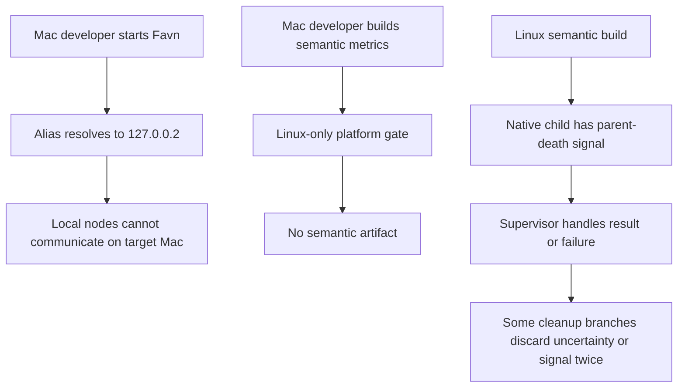
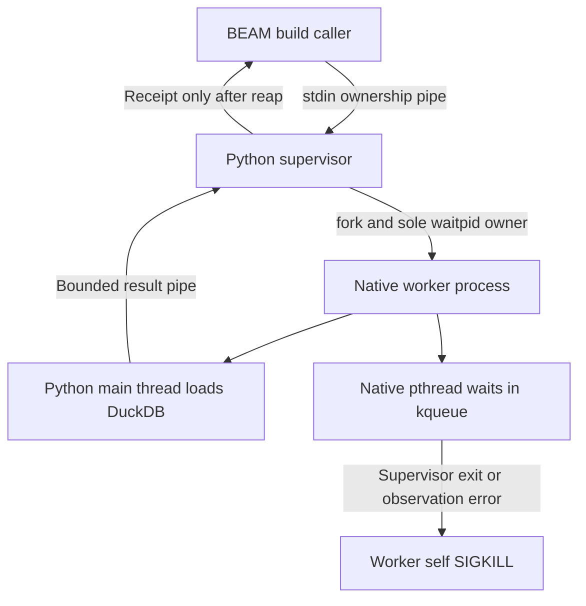
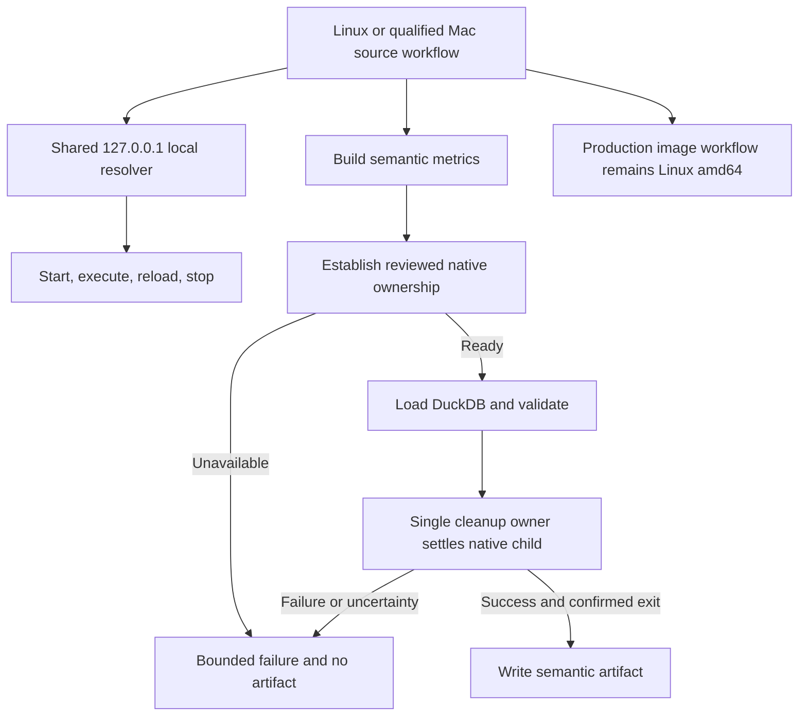

# Change Record: Native macOS arm64 development and semantic compilation

| Field | Value |
| --- | --- |
| Status | Plan reviewed |
| Type | Feature and portability hardening |
| Primary issue | Intentionally omitted with the repository owner's explicit authorization |
| Pull request | Pending |
| Related work | [Semantic compiler baseline](issue-718-pr-723-semantic-model.md); [production release boundary, issue 522](https://github.com/eirhop/favn/issues/522) |
| Affected areas | `favn_local`, `favn_duckdb_adbc`, qualification scripts and CI, public and contributor documentation |
| Approved plan commit | This reviewed planning commit; hash recorded in implementation outcome |
| Last updated | 2026-09-22 |

The owner requested full native semantic compilation as part of this work after
the first independent review. This record omits the issue filename segment;
rename it to `pr-<number>-macos-arm64-development.md` when a PR exists.
The first draft was not approved. These revisions therefore update the proposed
plan directly; an approved implementation baseline has not yet been established.

## One-minute summary

Favn needs a complete native development workflow on Apple Silicon, including
building semantic metric artifacts. Two verified barriers stand in the way:
local BEAM discovery uses a loopback address that does not work on the target
Mac, and semantic validation uses Linux-specific process ownership. Review also
found common supervisor cleanup defects that must be corrected before extending
the semantic worker to another operating system.

This change fixes local communication, qualifies PostgreSQL and DuckDB execution,
implements safe native macOS semantic compilation, and adds Apple Silicon CI.
Production releases remain Linux/amd64. Work proceeds in independently testable
slices, with a bounded design experiment for Darwin process ownership before
that implementation is approved. Native semantic compilation is a required
outcome; running that step on Linux is not completion of this plan.

## Impact

Developers will be able to compile the project, start the local UI and runner,
execute SQL work, reload code, stop the stack, and build semantic artifacts on
their Mac. For example, `mix favn.build.semantics` will validate a metric such as
`SUM(revenue) / SUM(units)` using the installed macOS DuckDB library and publish
an artifact only after validation and confirmed native cleanup.

Developers still supply PostgreSQL 18 and native prerequisites. Existing Linux
development, persisted data, and production image contracts retain their owners.
No new persistence backend, public DSL, or deployment topology is introduced.

## Problem analysis

### Verified blockers

1. **Local distribution is not portable today.** `FavnLocal.Distribution`
   maps `favn-local.test` to `127.0.0.2` in both the current BEAM and the runner
   resolver. Astra's independent socket probes on this Mac found that binding
   this address fails with errno 49, and connecting through it to a wildcard
   TCP listener times out. The same checks succeed through `127.0.0.1`.
   Resolver-content tests do not prove that two nodes can communicate.
2. **Semantic compilation explicitly rejects Darwin.** Its Python supervisor
   forks a native child that uses Linux `PR_SET_PDEATHSIG` before loading DuckDB.
   macOS requires a different mechanism to stop blocked native work when its
   owner dies. Removing the platform check alone breaks the lifecycle contract.
3. **Common cleanup needs correction.** On owner loss the supervisor discards
   `terminate(pid)`'s result. Exception cleanup can similarly lose an
   unconfirmed outcome. Successful termination can leave `live` true, causing
   the finalizer to signal again after reaping. A stale numeric PID can be
   reused. These are source-verified defects, not Darwin-specific requirements.

The first draft prescribed a Python daemon watchdog before proving its lifetime
or topology. A Python thread is not sufficient merely because ordinary `ctypes`
calls release the GIL: loading a library can hold it, including while a native
initializer blocks. A separate process also needs a precise reaping and identity
story. This revision makes that unresolved design an explicit gate.

### Evidence

| Evidence | What it establishes | Limit |
| --- | --- | --- |
| [Distribution implementation](../../../apps/favn_local/lib/favn_local/distribution.ex) and [tests](../../../apps/favn_local/test/distribution_test.exs) | Both resolvers hardcode `127.0.0.2`; tests check file contents | No native Mac two-node proof |
| Astra xhigh loopback probes on 2026-09-22 | `127.0.0.1` works; bind to `127.0.0.2` fails and wildcard-listener connection through it times out | Ephemeral TCP evidence, not a full BEAM lifecycle test |
| [Source release verifier](../../../apps/favn_runner/lib/favn_runner/release_verifier.ex) | Darwin and arm64 source identity already exist; production requires Linux/amd64 | Target classification does not prove execution |
| [Semantic compiler](../../../apps/favn_duckdb_adbc/lib/favn_duckdb_adbc/semantic_compiler.ex) | Linux-only prerequisite gate | No Darwin ownership implementation |
| [Worker supervisor](../../../apps/favn_duckdb_adbc/lib/favn_duckdb_adbc/semantic_compiler/worker.py) | Linux parent-death mechanism and the common cleanup defects above | Requires fault-injection regressions |
| Astra in-memory supervisor probes | Owner loss can report ordinary failure with cleanup unconfirmed; successful cleanup can invoke termination twice | No assertion that an unrelated real process was signaled |
| [Existing lifecycle tests](../../../apps/favn_duckdb_adbc/test/semantic_compiler_lifecycle.py) | Linux success, timeout, caller loss, and supervisor death coverage | Linux `prctl` and `/proc` assertions cannot prove Darwin behavior |
| [CPython 3.9.6 loader](https://github.com/python/cpython/blob/v3.9.6/Modules/_ctypes/callproc.c#L1388) | Library loading cannot be assumed to release the GIL | Other Python versions must be inspected and qualified separately |
| [CI](../../../.github/workflows/ci.yml) | Existing native qualification runs on Ubuntu with Linux DuckDB downloads | No Apple Silicon coverage |
| [Local-development guide](../../../apps/favn/guides/local-development.md) | External PostgreSQL, host-native runner, no DNS or hosts-file setup | This is the intended contract, not proof that the current Mac path works |

The target host inventory is macOS 26.5.1 arm64, Elixir 1.20.4, OTP 29,
Python 3.9.6, Homebrew, and Docker Compose 5.1.2. PostgreSQL and DuckDB were not
found in the inspected installation paths or tool inventory. No umbrella server
was available for Tidewave inspection; application runtime qualification remains
outstanding.

### Proposed qualification profile

- Initially qualify macOS 26 on native arm64, with the target MacBook's 26.5.1
  run recorded separately. Earlier macOS versions and Intel Macs are outside
  the initial claim.
- Use the repository pins Elixir 1.20.4 and OTP 29.0.6 in CI. Record the exact
  local OTP patch version when qualifying the developer machine.
- Use CPython 3.12 for the initial Darwin semantic path. Install it explicitly
  and ensure `python3` resolves to that interpreter. The Mac's existing Python
  3.9 is inventory evidence, not a qualified runtime; other versions require
  qualification rather than an open-ended support claim.
- Qualify DuckDB 1.5.5 on Darwin through the official universal shared library.
  Preserve Linux's existing accepted 1.5.2 and 1.5.5 profiles. A Darwin 1.5.2
  support claim is outside this initial matrix and must fail clearly.
- Include local DuckLake execution using a PostgreSQL metadata catalog, so the
  qualified fixture covers DuckLake and PostgreSQL scanner together. Pin and
  supply only extensions required by that fixture and the selected local sample;
  distinguish extensions bundled with DuckDB from separate downloads. Include
  JSON where the sample requires it. Cloud-specific extensions and
  managed-provider qualification are outside this change.
- Use a temporary native PostgreSQL 18 cluster in macOS CI, including restricted
  runtime and schema-owning migrator roles. Document Homebrew installation and
  link the existing optional Compose workflow. Favn runtime installs neither.
- Select an explicit native arm64 macOS 26 runner label during CI setup and
  assert OS and architecture at runtime. If unavailable, use a dedicated runner
  matching this profile; do not substitute Intel or emulated evidence.

These are proposed support choices. Exact interpreter, database patch, library,
extension, and CI image versions and checksums must be recorded during
qualification. Existing Linux platform acceptance must not be narrowed by
introducing Darwin prerequisite checks.

## Current behavior

## Proposed plan

### 1. Fix local communication and qualify ordinary execution

Use `127.0.0.1` consistently for `favn-local.test` in the operator, generated
runner resolver, and CLI locator. Prefer one shared constant over OS detection
or address probing. Verify OTP long-name resolution and EPMD discovery in real
separate BEAM processes on both platforms before retaining that choice.

Preserve the no-root/no-hosts-file contract and existing listener exposure.
Do not solve this by adding a system loopback alias. Rewrite generated resolver
state at normal startup and require stop/start when adopting the address change;
an already running local stack must not mix old and new resolver addresses.

Qualify source startup, activation, real SQL execution, reload, locator commands,
owner death, stop, and restart against PostgreSQL 18 and pinned native DuckDB.
After baseline approval, implement and test this slice before integrating native
semantic ownership. Before approval, only isolated feasibility probes are in
scope; the separate-node application changes wait for the approved baseline.

### 2. Correct common supervisor cleanup

Preserve Linux's `PR_SET_PDEATHSIG` mechanism while correcting the shared
supervisor state machine. Give one control path sole ownership of signaling and
reaping. Track the unreaped-child state explicitly; record a successful reap
before any finalizer runs. No path may signal after reaping, and
`ChildProcessError` must not be treated as permission to signal a cached PID.

Owner loss, protocol errors, oversized output, and unexpected exceptions must
retain the cleanup result. Unconfirmed cleanup takes precedence over an ordinary
failure. Cleanup is idempotent, all TERM/KILL waits remain bounded, and no native
operation is retried. Tests must prove both uncertainty propagation and signal
counts, including completion racing with cleanup.

### 3. Resolve and implement Darwin ownership

Native macOS semantic compilation is required within this change. Its exact
ownership mechanism is not yet approved. First perform a bounded feasibility
experiment outside production code and update this section with the selected
design and evidence for independent re-review. Do not simply lift the Darwin
platform gate or ship the first draft's ambiguous daemon watchdog.

Evaluate the smallest mechanism that can observe owner death independently of
the native loading and query thread, including while `dlopen` or an initializer
blocks. Darwin kernel process-exit observation is a candidate, not proof of
cleanup. A small compiled launcher or native watcher is permitted for evaluation
when Python alone cannot establish the guarantee; it adds build and packaging
work and requires a revised budget before adoption.

The design gate must settle all of the following in a concrete process diagram
and a resource-ownership table:

- Every process and thread, its parent, which one loads DuckDB, and which one
  observes owner death without requiring the Python GIL.
- Ownership of every pipe end and process watch; the order of setup,
  acknowledgement, native loading, normal completion, and teardown.
- Protection against owner death before, during, and after watcher registration.
- Watcher failure after readiness, including observation errors; native work
  must not silently continue without its ownership protection.
- The sole reaping owner for each child and behavior when that owner is killed.
  Distinguish confirmed reaping by a living supervisor from bounded worker exit
  and OS reaping after supervisor death.
- Safe signal targeting throughout teardown. Prefer signaling a still-owned,
  unreaped direct child or self-termination; an initial `pgid == pid` check is
  not enough to authorize delayed signals to a cached process group.
- Completion racing with owner death, native crashes, blocked initializers,
  ignored TERM, blocked queries, malformed receipts, and unconfirmed cleanup.
- Finite startup and teardown budgets including every helper; no unbounded
  detached process or silent fallback to in-process validation.

If the experiment cannot satisfy these conditions, record that result, revise
the design and estimate, and re-review. Do not redefine native semantic support
as optional or relax the guarantees to close the change.

Keep platform mechanics in `favn_duckdb_adbc`. Preserve semantic grammar,
artifact format, and public result shapes unless a reviewed design requires a
specific change. An unavailable ownership mechanism fails before native work;
unconfirmed cleanup returns the bounded existing failure and no artifact.

### Darwin design experiment and selected mechanism

The isolated macOS experiment passed on 2026-09-22: a native C pthread waiting
on `kqueue` killed its own worker within three seconds of supervisor SIGKILL
while the Python main thread was blocked inside a shared-library initializer.
The probe used a deliberately non-returning constructor, not an ordinary query.
This establishes feasibility, not completion of the failure matrix below.

Select that native watcher instead of a helper process. Compile one small
Darwin-only dylib with the system C compiler through an explicit `elixir_make`
build dependency. Package its C source and Makefile; write generated output to
`MIX_APP_PATH/priv` and resolve it from the installed application's priv directory
at runtime. Linux's Make target is a no-op and retains `prctl`. Xcode Command
Line Tools become an explicit Mac build prerequisite. The helper and build
integration remain inside slice 3's production budget; no launcher framework or
additional process is introduced.

| Resource | Owner and teardown |
| --- | --- |
| Caller stdin | Supervisor observes EOF; worker closes its inherited copy before native loading |
| Result pipe | Supervisor owns read end; worker owns write end; both close unused ends immediately after fork |
| Worker PID | Supervisor alone signals and reaps its unreaped direct child; never signals after reap |
| kqueue descriptor | Arming function owns it until pthread creation succeeds, then watcher owns it for worker lifetime; setup errors close it |
| Native watcher thread | Worker-owned detached pthread; it cannot return into Python, always self-kills on observation completion/error; process exit destroys it and closes its descriptor |
| DuckDB handles | Worker main thread only; close normally, or process teardown reclaims them |

Before loading DuckDB, reject an invalid parent, verify `getppid`, create and
register `EVFILT_PROC/NOTE_EXIT`, verify `getppid` again, and create the native
thread. Registration or thread failure aborts before native work. Parent death
before registration is caught by registration failure or the second parent
check; death after registration is queued for the thread. The watcher retries
only interrupted observations and self-kills on every other outcome. It never
signals a cached external PID or process group and never needs the Python GIL.
The supervisor kills/reaps startup that exceeds ten seconds. Existing expression
and TERM/KILL budgets remain unchanged; the helper has no separate startup or
teardown lifetime. Supervisor death leaves worker reaping to the OS, not a
nonexistent receipt from the dead supervisor.

Retain the loaded helper reference for the worker lifetime; never unload it or
close its transferred descriptor while the thread is running. A whole-worker
`SIGSTOP` or debugger suspension also freezes this thread: self-termination can
resume only when the process is scheduled again. The guarantee covers blocked
native loading/query calls, not externally suspended processes; do not claim
unconditional equivalence with Linux kernel parent-death signaling.

Test setup failures and owner death at registration boundaries using a separately
compiled fault-injection harness; production exposes no injection switches.
Also test post-readiness watch errors, blocked load and query, ignored TERM,
normal completion, and no repeated signals after reap. Observation failure
terminates the worker rather than continuing without protection.

### 4. Add prerequisites, CI, and canonical guidance

Provide checksum-verified setup for the qualified macOS DuckDB library and
extensions. Native runtime receives an explicit `libduckdb.dylib` path;
application startup never downloads it. Test ADBC and semantic validation
separately because they load the same library through different interfaces.

Add native Apple Silicon CI with the qualification profile above. Run focused
local lifecycle, ADBC/DuckLake, semantic functional, and process-failure suites.
Keep existing Linux coverage, adding the common cleanup regressions there.
Compare semantic artifact bytes using the same source revision, fixture, and
DuckDB version on both hosts, without filtering fields. Different DuckDB
versions may legitimately produce different artifact identities because runtime
version is part of semantic evidence.

Audit commands reached by supported Mac entrypoints. Change only confirmed host
portability failures, such as GNU `date -d` in the security check, or checksum
commands missing from the documented host profile. Keep Linux-container commands
inside their existing platform boundary. Reuse explicit tool selection rather
than adding a general platform framework.

The local-development guide owns setup and the source loop; the semantic guide
owns supported native validation and failures; contributor docs own repository
tests. Update generated sample hints, public moduledocs, `Favn.AI` routing, and
Features when qualified behavior changes. This record remains historical review
evidence rather than a second installation guide.

### Contracts and invariants

- Source identity is `darwin/arm64` on the qualified Mac; production remains
  `linux/amd64`. Exact runner/manifest identity binding is preserved.
- Local operator, runner, and CLI share one usable loopback mapping, with no
  root privileges, hosts-file edits, or broader listener exposure.
- PostgreSQL 18 remains mandatory, with separate runtime and migration roles.
  No automatic migration, database reset, or installation is added.
- Native semantic validation remains outside the BEAM and customer databases.
  Ownership protection covers library loading as well as parsing and binding.
- Linux retains kernel parent-death signaling. Common cleanup defects are
  repaired and tested on Linux and Darwin.
- Each child has one cleanup owner. Signals cease after reap. Unconfirmed
  cleanup overrides ordinary failure and never triggers automatic retry.
- A living build caller receives success only after a valid bounded result and
  confirmed cleanup. If the caller or supervisor dies, no artifact is written
  and owned native work must exit within the reviewed bound.
- Watcher failure after readiness is part of the required failure model.
- No speculative native process-group signaling, new public result shape,
  persistence change, or artifact format change is approved by this draft.
- Errors and logs exclude SQL, data, credentials, environment dumps, and
  arbitrary exception text. Bounded failure classes and known process identities
  are sufficient for cleanup diagnostics.

### Scope and non-goals

Scope includes portable local BEAM communication, common semantic cleanup
repairs, native Darwin semantic builds, PostgreSQL 18 and DuckDB/DuckLake local
execution, native CI, targeted host-script portability, and canonical guidance.

Native production releases, Linux/arm64 images, Intel macOS qualification,
Windows qualification, cloud-extension qualification, broad shell rewrites, a
new persistence backend, and semantic language changes are outside this change.
A Linux container may test deployment images on a Mac but does not satisfy the
native semantic acceptance criterion.

### Implementation slices and complexity budget

Production includes application code, worker code, and supported operational
scripts. Supporting includes tests, fixtures, CI, examples, and canonical docs.
Exclude this record, generated artifacts, lockfiles, downloaded or vendored code,
and formatter-only changes. These are provisional ranges pending the Darwin
design gate, not permission to build an unspecified launcher.

| Slice | Outcome and owner | Depends on | Production added | Production deleted | Supporting added | Supporting deleted |
| --- | --- | --- | ---: | ---: | ---: | ---: |
| 1 | Portable local distribution and source lifecycle, `favn_local` | None | 10-50 | 5-30 | 100-240 | 5-40 |
| 2 | One cleanup owner and truthful outcomes, DuckDB worker | None | 40-110 | 25-90 | 100-240 | 10-60 |
| 3 | Reviewed Darwin ownership and native semantic functionality, DuckDB plugin | Design gate and slice 2 | 90-250 | 10-50 | 220-450 | 10-60 |
| 4 | Pinned native execution, CI, host scripts, and docs | Slices 1-3 | 20-80 | 5-35 | 220-450 | 15-60 |
| **Total** | | | **160-490** | **45-205** | **640-1,380** | **40-220** |

Lifecycle failure proof drives the test budget. Reuse existing fixtures and
tests rather than building a new cross-platform test framework. After approval,
explain each slice/category overrun exceeding 25 percent or 100 lines, whichever
is smaller, and materially fewer deletions, following the
[change-record process](../README.md). Before approval, revise this provisional
budget as the experiment resolves the design. After approval, preserve the
original budget and record any revised estimate as a reviewed deviation before
adopting a compiled helper or materially different ownership topology.

Estimate **12-20 engineering days**, with lower confidence until the Darwin
experiment is complete: 1-2 days for that experiment, 2-3 for loopback and local
execution, 1-2 for common cleanup repairs, 4-7 for Darwin implementation and
failure tests, and 4-6 for native CI, integration, docs, and final review.
The slices may overlap; their individual upper bounds are contingency ranges.
Re-estimate from experimental evidence rather than treating the total as a
commitment.

### Implementation map

| Area | Responsibility |
| --- | --- |
| `apps/favn_local/lib/favn_local/distribution.ex` | One portable mapping for current-node and generated runner resolvers |
| Local launcher, locator, distribution and acceptance tests | Separate-node communication, resolver regeneration, reload/stop/restart and adoption |
| `apps/favn_duckdb_adbc/lib/favn_duckdb_adbc/semantic_compiler.ex` | Platform-specific prerequisites, version profile, bounded failures |
| `apps/favn_duckdb_adbc/lib/favn_duckdb_adbc/semantic_compiler/worker.py` | Common cleanup ownership and reviewed platform ownership strategy |
| Semantic lifecycle, compiler, artifact and ADBC integration tests | Failure injection, native execution, extension loading, deterministic artifacts |
| CI and targeted host scripts | Native arm64 profile, temporary PostgreSQL, pinned prerequisites and portable host commands |
| Public guides, sample generation, `Favn.AI`, contributor docs and Features | Canonical workflows, qualification boundary, accurate diagnostics |

## Operational design

### Failure, recovery, and diagnostics

Retain the existing startup/expression/TERM/KILL budgets as the starting point;
the design gate must account for any additional helper startup and teardown in
the overall deadline. There must be no hidden unbounded wait.

Prerequisite failures identify the missing tool, unsupported version or
architecture, or unavailable ownership strategy. Cleanup failures preserve
known supervisor/worker identity and the cleanup-unconfirmed classification.
Report once per invocation or validation; do not add continuous diagnostic
polling. Do not automatically rerun validation after timeout or uncertain exit.

If a guard or native child cannot be confirmed stopped, fail the build and
require investigation before another attempt. Platform acceptance includes
bounded exit after supervisor death; no receipt can be expected from a dead
supervisor. Normal builds require confirmation from the living cleanup owner.

PostgreSQL upgrade failures retain the current explicit partial-work semantics.
No OS compatibility fix authorizes blind retries of database or data-plane writes.

### Adoption and rollback

Stop the local stack before upgrading the loopback mapping. Startup rewrites
generated resolver state; restart runner and CLI processes that cached the old
mapping. Credentials and database state are retained. Acceptance must exercise
adoption from an existing local state directory, including the locator.

There is no schema or wire migration. If Darwin semantic qualification fails,
keep its admission gate closed while completing the design; native support is
not declared complete. After release, disabling that path restores the previous
Linux-only build restriction while already validated artifacts remain usable.
Retain common cleanup fixes when reverting Darwin-specific code. Production
image targets and security qualification are unaffected.

## Verification plan

| Acceptance criterion | Required evidence | Owner |
| --- | --- | --- |
| Usable loopback with no system setup | Real separate BEAM nodes resolve, connect and call through `favn-local.test` on Linux and Mac; test locator and generated resolver | Local |
| Existing local state adopts the mapping | Stop/start with old resolver state; CLI discovery and reload reach the new runner | Local |
| Complete source workflow | Compile, asset build, restricted-role PostgreSQL setup, doctor, dev, real run, reload, owner loss, stop and restart | Local/CI |
| Correct source and production identity | Native Darwin identity assertion and unchanged production rejection tests | Runner |
| One cleanup owner | Deterministic signal-count/reap tests for timeout, owner loss, EOF, exceptions and completion races; no signal after reap | DuckDB worker |
| Uncertainty takes precedence | Owner-loss and protocol/exception paths with unsuccessful termination return cleanup-unconfirmed | DuckDB worker |
| Darwin ownership remains effective during native startup and execution | Block library initializer and query separately; kill caller/supervisor at setup boundaries; prove bounded exit | Darwin design gate and plugin |
| Guard failure after readiness is handled | Inject guard exit/watch errors and prove native work cannot continue unprotected | Darwin design gate and plugin |
| Safe resource teardown | Prove descriptor closure, each child's reaping owner, no leaked helpers, no delayed signaling after completion, and completion-versus-owner-death behavior | Darwin design gate and plugin |
| Semantic functionality | Existing grammar, offsets, type, limit, unsupported-runtime, and artifact suites against qualified `.dylib` | Plugin/authoring |
| Ordinary SQL and DuckLake work | ADBC query/write/teardown plus pinned extension load and local DuckLake catalog integration | Plugin |
| Platform-neutral artifacts | Same revision, fixture and DuckDB 1.5.5 on Linux and Darwin; compare exact bytes and identity with no field filtering | Authoring/CI |
| Linux guarantees remain intact | Linux parent-death tests and common cleanup regressions; retain accepted Linux version profiles | Plugin/CI |
| Honest native coverage | Assert Darwin arm64, exact runtime versions and prerequisite checksums in CI; no silent native-test skips | CI |
| Documentation and script accuracy | Relevant host command checks, sample tests, link review, Markdown review and whitespace checks | Public/contributor docs |

Run owning-layer checks first, then the relevant repository suites under the
existing app-scoped `cmd mix test` rules. Static checks, automated platform
qualification, and manual target-Mac evidence must be reported separately.
Linux image CI remains the production release authority. A Mac container-engine
smoke build is optional supporting evidence.

## Risks and design gate

| Risk | Required response |
| --- | --- |
| `127.0.0.1` interacts differently with OTP long names or existing local state | Prove real nodes, locator and adoption on both hosts before retaining the shared mapping |
| Darwin observation cannot act while native loading is blocked | Evaluate a GIL-independent mechanism and inject a blocked initializer; do not infer correctness from ordinary queries |
| Guard failure, owner death or completion races leave work alive | Resolve precise topology, watch and descriptor lifetimes, reaping and deadlines at the design gate |
| Cached PIDs or groups can be reused | Single cleanup owner; never signal after reap; require a lifetime-safe targeting proof for each helper |
| A native helper is needed | Record exact build/distribution requirements, update complexity and effort, and obtain design re-review |
| Universal DuckDB loads through ctypes but fails through ADBC | Qualify both interfaces and the matching extension builds |
| Support claims exceed evidence | Publish only the explicit OS/Python/DuckDB profile tested; record earlier Mac and Intel support as unqualified |
| CI cannot supply the chosen native architecture | Use a matching dedicated runner or report missing qualification; never substitute emulation silently |

The experiment resolved feasibility of the selected native-thread mechanism.
Its full lifecycle and packaging matrix remains required implementation evidence,
not an assumption supplied by the isolated probe.

## Plan review

| Field | Result |
| --- | --- |
| Reviewer | Independent Astra (`gpt-6-astra`), xhigh reasoning |
| Initial verdict | Changes required |
| Blocking findings | Missing local-distribution blocker; underspecified Darwin watchdog; common cleanup uncertainty and repeated signaling |
| Additional findings | Missing budget cells; unspecified qualification profile and DuckLake scope; cross-host comparison must use matching runtime pins |
| Author response | Added loopback fix/adoption tests, common cleanup repair, mandatory Darwin design gate, complete budgets, concrete qualification profile, DuckLake scope, and exact same-pin artifact comparison |
| Recheck | Astra xhigh accepted the revised Planning record with non-blocking notes: clarify preapproval probes versus implementation, preserve the eventual approved budget, and limit extension downloads to the selected fixture |
| Recheck corrections | Clarified probe/implementation sequencing and budget history; selected PostgreSQL-backed local DuckLake and only its required extension artifacts. Astra xhigh rechecked these corrections and approved the revised Planning record with no remaining documentation findings. |
| Implementation approval | Astra xhigh independently reran the constructor-handshake probe with CPython 3.12.14 and approved the implementation baseline on 2026-09-22 with no blocking findings. Full qualification remains implementation work. |

The owner subsequently authorized implementation, final Astra xhigh review,
and then PR creation. Preserve a reviewed plan commit before implementation;
defer PR creation and GitHub rendering until after final review as explicitly
requested. This is a timing exception to the usual draft-PR-first process, not
an exception to independent review or baseline preservation. Work starts from
freshly fetched `origin/main` at `3a44bc61` (RC17).

## Implementation outcome

Pending. No implementation changes have been made in this task. Actual scope,
per-slice additions/deletions, canonical-doc updates, and operational impact must
be recorded here before final review.

## Deviations from the approved plan

No approved baseline exists. The revisions above address review findings before
approval; later deviations must be recorded against the eventual baseline.

## Decision log

| Date | Decision | Reason |
| --- | --- | --- |
| 2026-09-22 | Omit primary issue | Explicit repository-owner exception |
| 2026-09-22 | Include native macOS semantic compilation in this change | Explicit owner direction after discussing a smaller development-only milestone |
| 2026-09-22 | Replace prescribed watchdog with a gated design experiment | Independent review found unresolved lifetime and GIL constraints |
| 2026-09-22 | Repair shared supervisor cleanup while preserving Linux parent-death mechanism | Independent review identified discarded cleanup uncertainty and repeated termination |
| 2026-09-22 | Create PR after implementation review | Explicit owner request; preserve the reviewed planning commit first |

## Verification evidence

| Check | Result | Boundary |
| --- | --- | --- |
| Target host inventory | Versions recorded in problem analysis | Tool presence, not application qualification |
| Self-contained umbrella runner tests | 2 passed during initial analysis | No fetched dependencies or database |
| Legacy DSL and runner architecture guards | Passed during initial analysis | Static contracts |
| Shell syntax | Passed during initial analysis | Does not prove host-command portability |
| Independent loopback probes | `127.0.0.1` succeeds; `127.0.0.2` fails on target Mac | Ephemeral TCP, not BEAM integration |
| Independent mocked supervisor probes | Lost cleanup uncertainty and duplicate termination reproduced | In-memory behavior, not real PID-reuse damage |

### Not verified

Dependency compilation, live PostgreSQL setup, complete BEAM lifecycle, native
ADBC/DuckLake behavior, the full Darwin failure matrix, cross-host artifacts,
native CI, and production image builds on this Mac remain unverified. Mermaid
rendering on GitHub awaits publication of a reviewed plan.

## Final review

| Field | Result |
| --- | --- |
| Reviewer | Pending independent reviewer |
| Comparison required | Approved baseline, implementation, actual complexity, deviations, docs, Linux evidence and native Mac evidence |
| Findings and recheck | Pending implementation |
| Verdict | Pending implementation |
