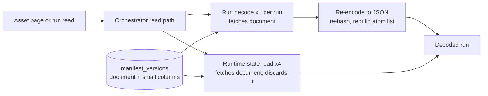
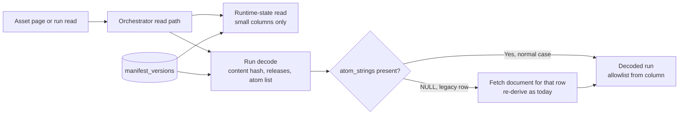

# Change Record: Stop reading and re-verifying the manifest document at runtime

| Field | Value |
| --- | --- |
| Status | Implemented |
| Type | Bug fix and performance improvement |
| Primary issue | None — the user requested this record directly on 2026-08-31 |
| Pull request | Pending |
| Related work | None |
| Affected areas | PostgreSQL registry and run stores, run snapshot decoding, orchestrator run snapshot codec |
| Approved plan commit | c7b51ef1 |
| Last updated | 2026-08-31 |

## One-minute summary

A manifest is immutable, content-addressed, and fully verified when it is
published. Three runtime read paths nevertheless fetch the complete manifest
document from PostgreSQL on every call, and the run decoder additionally
re-serializes and re-hashes it to rebuild an atom allowlist that publication
already stored in its own column. On the local development stack this makes
every run read pay about 14 ms of avoidable work and every asset detail page
fetch the document five times; the cost grows linearly with manifest size, at
roughly 120 ms per megabyte per run read. This change makes those paths read
only the small columns they use, so the manifest document leaves the database
only at publication, on manifest-cache fill, and for legacy rows that predate
the stored atom inventory. It needs a record because it changes persistence
read behavior and deliberately removes a per-read integrity re-check.

## Impact

Operators feel this as slow pages wherever runs are read. Opening one asset
detail page fetches the full manifest document five times; opening a run,
switching between runs, and paging the runs list each decode run snapshots, and
every decoded run re-serializes and re-hashes the manifest. With the 30 kB
example-workload manifest this is tens of milliseconds per page; a production
manifest of a few megabytes turns each decoded run into hundreds of
milliseconds of pure CPU, multiplied by page size on list views.

## Problem analysis

Publication already does everything the read paths repeat. `register_manifest`
verifies the version envelope, computes the canonical content hash, extracts
the complete atom-string inventory, and stores all of it in dedicated columns
of `favn_control.manifest_versions` (`content_hash`, `runner_releases`,
`atom_strings`, counts) beside the `manifest` jsonb document. The table is
insert-only (`on_conflict: :nothing`; no application `UPDATE` touches
`manifest` or `content_hash`), and the row is addressed by
`mv_` + content hash, so the identity, the stored hash, and the document are
three copies of the same fact in one row.

Three read paths ignore the small columns and use the document:

1. **Workspace runtime-state reads fetch the document and discard it.**
   `get_runtime_state` in the registry store selects `manifest.manifest` in its
   join and binds it to `_manifest_payload`. Nothing uses it: the result struct
   has no manifest field. Every workspace-scoped read resolves runtime state,
   so one asset detail page pays this four times.
2. **Run decoding fetches the document, then re-derives stored values from
   it.** `Runs.Decoder` selects the full `manifest` column, re-encodes it to a
   JSON string, and passes that string to the run snapshot codec. Because the
   codec's atom extraction matches the JSON form first, it decodes the string,
   recomputes the canonical SHA-256 to compare against `content_hash`, and
   walks every asset, pipeline, schedule, and graph edge to rebuild the atom
   allowlist — the exact list sitting unread in `atom_strings`. The codec then
   decodes the same JSON string a second time to read `runner_releases`, which
   is also its own column and already loaded.
3. **Run creation loads the full row to compare two small columns.** The run
   store loads the entire `ManifestVersion` row inside the run-creation
   transaction and uses only `content_hash` and `runner_releases`.

The per-read hash re-check in path 2 verifies a row against itself, on an
insert-only table, in a database with page checksums enabled, after the same
check already ran at publication. It is also a latent correctness trap: the
stored hash was computed from the pre-storage canonical form, while the
re-check recomputes it after a round trip through PostgreSQL `jsonb`, which
normalizes key order, duplicate keys, and numeric literals. A manifest whose
serialization is changed by that normalization would make every one of its runs
permanently undecodable. Today's manifests happen not to trigger it.

The one genuinely load-bearing part of the pipeline is the atom allowlist
itself: converting stored strings to atoms without an allowlist can exhaust the
atom table and crash the node. The allowlist is kept; only its source changes.

### Assumptions

- `manifest_versions` rows written before migration
  `optimize_manifest_and_run_plans_v2` may have `atom_strings` NULL. Rows
  written by any current publication path always populate it. Needs
  confirmation in long-lived environments; the plan keeps a fallback either
  way.
- No consumer of workspace runtime-state reads expects a manifest payload.
  Verified against the result struct and its construction; it carries only
  summary fields.
- PostgreSQL `data_checksums` remain the storage-corruption defense. Verified
  `on` in the development stack; production provisioning is not changed by
  this plan.

### Evidence

Measurements taken 2026-08-31 on the development stack at commit `8dbea359`
(example workload: 23 assets, 30 kB manifest, PostgreSQL in the dev container).

| Evidence | What it proves | What it does not prove |
| --- | --- | --- |
| Repo query telemetry during one `active_asset_detail` call | 19 queries, of which 5 fetch the full manifest document (4 runtime-state joins, 1 run decode) | Production query counts, which depend on page composition |
| Runtime-state join benchmark, 300 iterations | 2.15 ms/call with the document in the select, 0.36 ms/call without — 6x at 30 kB | Larger-manifest cost (measured separately below) |
| Atom extraction benchmark, identical output both ways | 12.4 ms/call re-deriving from JSON vs 0.015 ms/call reading `atom_strings` — the fast clause exists and returns the same set | Cost of rows where `atom_strings` is NULL |
| Scaling benchmark on synthetically grown manifests | Re-derivation grows linearly: 7 ms at 76 kB, 129 ms at 1.1 MB, 391 ms at 3.3 MB per run decode | Exact production manifest sizes |
| Source inspection of `register_manifest` | Publication already verifies the envelope and stores `content_hash`, `runner_releases`, and `atom_strings` | Nothing — this is the authoritative write path |
| `psql` inspection of `manifest_versions` | Insert-only in the application; `data_checksums = on`; version id equals `mv_` + content hash | State of other environments |
| Source inspection of the runner manifest path | The runner independently re-verifies every manifest it compiles: `fetch_manifest` serves the version from the cache-backed manifest store and checks its hash against the task's recorded hash, and the runner's own store runs full `Version.verify` (canonicalize and recompute the hash) before compiling. The runner never reads `atom_strings` and never uses the run snapshot codec. | Runner behavior at runtime scale |

## Current behavior

Opening an asset page or reading any run makes the orchestrator fetch the full
manifest document from PostgreSQL even though the values it needs are stored in
small dedicated columns of the same row. Reading a run additionally re-verifies
the document's hash and rebuilds the atom allowlist from scratch.

## Approved plan

Runtime read paths stop selecting the manifest document and read the dedicated
columns instead. The document leaves the database only at publication, when the
manifest cache fills for the one consumer that needs the decoded manifest (the
catalogue and freshness planner, unchanged), and as a per-row fallback for
legacy rows whose `atom_strings` is NULL — which preserves today's behavior
exactly for those rows.

### Contracts and invariants

- The atom allowlist gate on snapshot decoding is preserved unchanged: no
  stored string becomes an atom unless it is in the allowlist. Only the source
  of the allowlist changes, and the stored inventory was proven identical to
  the derived one.
- The cross-record check that a run's recorded `manifest_content_hash` matches
  the manifest row's `content_hash` is preserved. It links two independently
  written records and costs a string comparison.
- Publication-time verification (`Version.verify`, canonical hashing, atom
  extraction) is unchanged.
- The self-referential per-read re-hash of the manifest document is removed
  from the run decode path. This is a deliberate integrity-semantics decision:
  silent in-place corruption of a manifest row would no longer be detected on
  every run read. PostgreSQL page checksums, the insert-only write path, and
  publication-time verification remain.
- Execution-time verification is unaffected and remains the strongest check in
  the system: before a runner compiles a manifest, the orchestrator matches the
  manifest row's hash against the task's independently recorded hash, and the
  runner recomputes the canonical hash itself via `Version.verify`. A corrupted
  manifest row therefore still cannot execute work; the removed check only
  guarded control-plane display paths.
- Result shapes do not change. Workspace runtime state, decoded runs, and run
  creation return exactly what they return today.
- A legacy row with NULL `atom_strings` re-derives the atom allowlist from the
  document exactly as today, including the re-derivation cost and the
  publication-time hash re-check. One source changes for those rows: runner
  releases resolve from the `runner_releases` column (NOT NULL and written from
  the same verified source in the same transaction) instead of being decoded
  out of the document. Explicit failure semantics are unchanged: a row with
  neither `atom_strings` nor a decodable document fails the read; nothing is
  retried.

### Scope

- `get_runtime_state` in the registry store: remove the manifest document from
  the select.
- `Runs.Decoder`: select `content_hash`, `runner_releases`, `atom_strings`
  instead of the document; build the codec manifest record from those columns;
  fetch the document for a row only when `atom_strings` is NULL.
- Run snapshot codec: accept a manifest record without `manifest_index_json`
  when `atom_strings` is present; read `runner_releases` from the record field
  when present instead of decoding JSON; update the `manifest_record` typespec
  accordingly.
- Run creation in the run store: select only the columns the comparison uses.

### Non-goals

- Deduplicating the four runtime-state resolutions inside one asset detail
  call. With the document out of the select each costs ~0.4 ms; the redundancy
  becomes an ordinary refactor, not a performance defect.
- A data migration backfilling `atom_strings` for legacy rows. The fallback
  keeps them working; a backfill can retire the fallback later if wanted.
- Any change to the manifest cache, publication, deployment, or the
  catalogue's decoded-manifest usage.
- Removing publication-time verification or the cross-record run/content-hash
  check.

### Implementation slices

| Slice | Outcome | Owner or area | Depends on |
| --- | --- | --- | --- |
| 1 | Runtime-state reads no longer fetch the manifest document | `apps/favn_storage_postgres` registry store | None |
| 2 | Run creation compares against narrow columns, not the full row | `apps/favn_storage_postgres` run store | None |
| 3 | Run decoding uses stored columns; codec accepts column-backed records; legacy NULL rows fall back to today's path | `apps/favn_storage_postgres` decoder and `apps/favn_orchestrator` codec | None |

### Complexity budget

Estimates exclude this record. No migrations, no new modules.

| Slice | Production added | Production deleted | Supporting added | Supporting deleted | Main reason for the size |
| --- | ---: | ---: | ---: | ---: | --- |
| 1 | 2-6 | 2-6 | 0-20 | 0-5 | Select-list change only |
| 2 | 4-10 | 2-6 | 0-25 | 0-5 | Narrow select in one transaction step |
| 3 | 40-80 | 20-40 | 80-160 | 0-20 | Two query shapes in the decoder, one codec clause, tests for both paths and their equivalence |

### Implementation map

| Concept | Expected code area | Responsibility |
| --- | --- | --- |
| Runtime-state read | `apps/favn_storage_postgres/lib/favn_storage_postgres/registry/store.ex` (`get_runtime_state`) | Return runtime summary without fetching the document |
| Run snapshot decoding | `apps/favn_storage_postgres/lib/favn_storage_postgres/runs/decoder.ex` | Load narrow manifest columns; fall back per row when `atom_strings` is NULL |
| Snapshot codec contract | `apps/favn_orchestrator/lib/favn_orchestrator/storage/run_snapshot_codec.ex` and `run_snapshot_codec/manifest_atoms.ex` | Accept column-backed manifest records; keep the atom allowlist gate and cross-record hash check |
| Run creation check | `apps/favn_storage_postgres/lib/favn_storage_postgres/runs/store.ex` | Compare submitted run against manifest columns |

## Operational design

### Failures and recovery

No new failure classes. A legacy row with NULL `atom_strings` takes the
existing re-derivation path with its existing failure semantics. A record that
carries neither `atom_strings` nor a document fails decoding explicitly, as an
invalid manifest record does today. Nothing is retried; no outcome becomes
unknown.

### Logs and diagnostics

No new log events. The existing decode error surfaces are unchanged. The
fallback path is expected to be rare; if live evidence later shows it is hot,
a counter can be added in a follow-up.

### Deployment, migration, and compatibility

No schema change and no migration. The change is read-path only and
backward-compatible with all existing rows; rollback is reverting the commit.
Rows published by any current release already carry `atom_strings`.

## Verification plan

| Acceptance criterion | Planned evidence | Owning layer |
| --- | --- | --- |
| Decoded run is identical whether the allowlist comes from `atom_strings` or from the document | Focused decoder test decoding the same persisted run through both paths and comparing results | `favn_storage_postgres` |
| A row with NULL `atom_strings` still decodes | Focused decoder test with a legacy-shaped row | `favn_storage_postgres` |
| A run whose recorded content hash mismatches the manifest row still fails decoding | Existing codec test retained; add one if coverage is missing | `favn_orchestrator` |
| Runner-release binding mismatch still fails decoding | Codec test for the column-backed record shape | `favn_orchestrator` |
| Runtime-state result shape unchanged | Existing registry store tests pass unchanged | `favn_storage_postgres` |
| No runtime read path selects the manifest document | Repo query telemetry assertion around `active_asset_detail` and a run read, or reviewed query inspection | `favn_storage_postgres` |
| No regression across owning suites | `favn-test` app-scoped suites for `favn_storage_postgres` and `favn_orchestrator`, then the umbrella fast suite | CI |
| Measured improvement | Re-run the session's profile: full-document reads per asset detail 5 → 0; per-run decode overhead ~14 ms → ~0 at 30 kB | Local runtime proof |

## Risks and open questions

| Risk or question | Impact | Mitigation or decision needed |
| --- | --- | --- |
| Dropping the per-read re-hash removes detection of silent in-place corruption of a manifest row | Corrupted document could be served to the catalogue path without a decode-time alarm | Accepted deliberately: the check is self-referential (row addressed by its own hash), the table is insert-only, page checksums are on, publication verifies, and the runner still recomputes the canonical hash before executing any work. Reviewer must confirm acceptance. |
| Stored `atom_strings` could theoretically diverge from the document | Allowlist too narrow or too wide for that manifest | Both are written in one publication transaction from one verified source; equivalence proven empirically; the equivalence test pins it |
| Long-lived environments may hold NULL `atom_strings` rows | Those rows keep today's slow path | Fallback preserves behavior; optional backfill noted as follow-up |
| The jsonb-normalization trap remains for legacy fallback rows | A normalized-on-storage manifest would make its runs undecodable on the fallback path only | Unchanged from today and shrunk to legacy rows; a backfill would eliminate it |
| Unknown production manifest sizes | Benefit estimate could be off | Scaling was measured across 30 kB–3.3 MB; the fix removes the size-dependence entirely |

## Plan review

| Field | Result |
| --- | --- |
| Reviewer | Eirik Hop (repository owner) |
| Reviewed against | Current code, session profiling evidence, and this plan |
| Findings | None raised; the owner directed implementation to proceed with a final review before the pull request |
| Findings addressed and rechecked | Not applicable |
| Verdict | Approved 2026-08-31 |

## Implementation outcome

Implemented as planned. Runtime-state reads, run decoding, and run creation now
read only the dedicated manifest columns. The run decoder builds the codec
manifest record from `content_hash`, `runner_releases`, and `atom_strings`; a
row whose `atom_strings` is NULL triggers a per-row fetch of the document and
takes exactly today's re-derivation path. The codec accepts both record shapes:
with `atom_strings` present and no `manifest_index_json`, the atom allowlist
comes from the stored inventory and `runner_releases` from the record field;
with `manifest_index_json` present, the legacy decode-and-re-hash path runs
unchanged. The cross-record run/content-hash and runner-release binding checks
are preserved for both shapes.

### Actual scope and complexity

- Files and ownership areas changed:
  `apps/favn_storage_postgres/lib/favn_storage_postgres/registry/store.ex`
  (runtime-state select), `apps/favn_storage_postgres/lib/favn_storage_postgres/runs/store.ex`
  (run-creation narrow select), `apps/favn_storage_postgres/lib/favn_storage_postgres/runs/decoder.ex`
  (column-backed records and legacy fallback),
  `apps/favn_orchestrator/lib/favn_orchestrator/storage/run_snapshot_codec.ex`
  (record typespec and release resolution), plus tests in both apps.
- Ownership boundaries affected: none crossed; the storage decoder already
  consumed the orchestrator codec contract, which widened compatibly.
- Implementation complexity: Low — select-list changes plus one new record
  shape with an explicit fallback clause.
- Operational complexity: Low — no schema change, no new failure classes, no
  new configuration.
- Canonical documentation updated: none required; no public DSL or guide
  contract changed.
- Actual additions, deletions, and supporting lines per approved
  complexity-budget slice: slice 1: 2 added, 3 deleted, 0 supporting (budget
  2-6/2-6/0-20); slice 2: 10 added, 3 deleted, 0 supporting (budget
  4-10/2-6/0-25); slice 3: 43 added, 37 deleted production across decoder and
  codec, 96 supporting added (budget 40-80/20-40/80-160).

## Deviations from the approved plan

| Planned | Implemented | Reason | Impact | Reviewer verdict |
| --- | --- | --- | --- | --- |
| The legacy NULL-`atom_strings` fallback preserves today's behavior exactly | Decoded results are identical, but a legacy row now costs one extra document query per decoded run (single and batched reads alike, where the batch previously fetched the document once per unique manifest version), and runner releases resolve from the column instead of the document | The manifest loads no longer select the document, and the fallback is a per-row branch; the column is NOT NULL and written from the same verified source | Affects only legacy rows, which no current publication path produces; the dominant re-derivation cost was already per row | Approved by the final reviewer |
| The codec keeps a JSON path for resolving runner releases from `manifest_index_json` | The JSON resolution clause was removed after final review; releases resolve only from the record's `runner_releases` field, with an explicit error otherwise | Every caller supplies the NOT NULL column, so the JSON clause was unreachable and untested; the repository prefers removing stale code | A hypothetical record without `runner_releases` now fails decoding explicitly instead of falling back to the document | Proposed as an optional correction by the final reviewer; verified by re-running the codec suite |

## Decision log

| Date | Decision | Reason | Review needed |
| --- | --- | --- | --- |
| 2026-08-31 | `manifest_runner_releases` resolves only from the record's `runner_releases` field, with an explicit error for records without it; the record typespec marks the field required | The column and the document are written from one verified source in one transaction; every caller supplies the NOT NULL column, so a JSON fallback would be unreachable stale code, and the fallthrough keeps the failure explicit instead of a function clause crash | Reviewed and approved by the final reviewer |

## Verification evidence

| Acceptance criterion | Evidence | Result |
| --- | --- | --- |
| Decoded run identical from `atom_strings` and from the document | `core_authority_test.exs` "decodes runs from stored manifest columns and identically from the legacy document fallback": persists a run, decodes it, NULLs the row's `atom_strings`, decodes again, asserts equality | Passed |
| A row with NULL `atom_strings` still decodes | Same test — the second decode exercises the fallback | Passed |
| Content-hash mismatch still fails decoding | Existing codec test "rejects run manifest content hash mismatch" retained; new "rejects a content hash mismatch against a column-backed manifest record" covers the new shape | Passed |
| Runner-release binding mismatch still fails decoding | New codec test "rejects a runner release mismatch against a column-backed manifest record" | Passed |
| Column-backed and JSON-backed records decode identically | New codec test "decodes a column-backed manifest record identically to the JSON-backed record" | Passed |
| Runtime-state result shape unchanged | Existing registry-store tests in `core_authority_test.exs` pass unchanged | Passed |
| No regression across owning suites | `favn-test` fast suites on 2026-08-31: `favn_storage_postgres` 352 passed, 0 failed; `favn_orchestrator` 754 passed, 0 failed; `MIX_ENV=test mix compile --warnings-as-errors` clean | Passed |

### Not verified

- The repo-query-telemetry assertion that no runtime read path selects the
  manifest document was verified by reviewed query inspection of the three
  changed selects, not by an automated telemetry test.
- The measured page-level improvement was not re-profiled after the change; the
  removed work was measured before the change and the removal is structural.
- Behavior of genuinely old production rows with NULL `atom_strings` is covered
  by the synthetic legacy-row test, not by data from a long-lived environment.

## Final review

| Field | Result |
| --- | --- |
| Reviewer | Independent Claude review agent, spawned 2026-08-31 with the plan baseline (c7b51ef1) and the implementation diff |
| Reviewed against | The approved plan baseline, the implementation diff, the current files, and the codebase (clause tracing, delete-path and constraint verification, repository-wide document-read grep) |
| Findings | Five non-blocking notes: the fallback's `Repo.one!` raise is unreachable in practice and mapped to an error tuple at the store boundary; the release-source change for legacy rows needed stating; the JSON release clause was dead and untested; record metadata needed completion; the deviation wording needed to cover single-run decode |
| Findings addressed and rechecked | All addressed: invariant and deviation wording corrected, metadata completed, dead clause removed with the codec suite re-run green; the reviewer confirmed the atom gate, both cross-record checks, unchanged result shapes, and that no runtime read path outside publication, cache fill, and the legacy fallback selects the document |
| Verdict | Approved with corrections, 2026-08-31; corrections applied |
