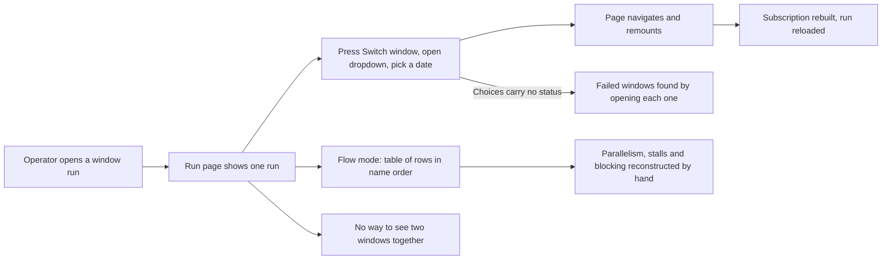
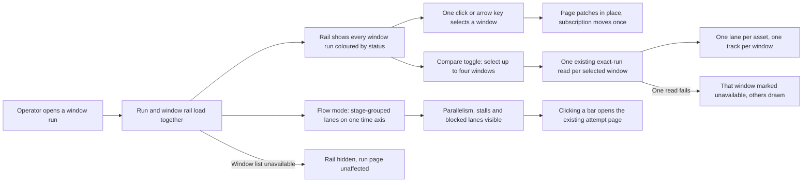

# Change Record: Run window navigation, stage timeline, and window comparison

| Field | Value |
| --- | --- |
| Status | Plan reviewed |
| Type | Bug fix and feature |
| Primary issue | Not filed. The repository owner authorized proceeding without an issue for this record. |
| Pull request | Pending |
| Related work | Follows PR 660 (`issue-658-pr-660-simple-run-detail-reads.md`), which simplified the run detail reads and regressed the page experience. Plan review deferred two read optimizations to issues 672 and 673. |
| Affected areas | Run detail page in `favn_view`; five lean fields added to existing operator read contracts in `favn_orchestrator` and `favn_storage_postgres`; three SQL-only statement rewrites and one additive partial-index migration in `favn_storage_postgres` |
| Approved plan commit | This commit. The reviewed plan cannot name its own ID; it is recorded in the immediate PR-number update. |
| Last updated | 2026-08-25 |

Because no issue exists, the file omits the `issue-<n>-` segment the naming
scheme assumes. After GitHub assigns the PR number the record is renamed to
`pr-<number>-run-detail-window-experience.md`.

## One-minute summary

PR 660 made the run detail reads lean and bounded, which was needed, but it
regressed the operator experience in two ways: switching between the window runs
of a backfill now takes three clicks and a full page remount per window, and the
timeline that showed how assets resolved over time was replaced by a plain
table that destroys the run's shape.

This change restores the experience on top of the lean reads. A window rail
gives one-click movement between window runs and shows the status of every
executed window run at a glance. The timeline returns as stage-grouped lanes drawn entirely from data the
page already loads. A compare mode overlays up to four windows on one timeline,
one lane per asset. It records here because it changes operator-visible
navigation and LiveView lifecycle, adds fields to two persistence read
contracts, adds one additive index migration, and introduces a new bounded
operator workflow.

## Impact

An operator investigating a failed monthly backfill asks three questions in
order. "Which months failed?" — today the window dropdown lists dates with no
status, so every month must be opened to find out. "Why was this month slow?" —
today forty start and finish timestamps in asset-name order must be compared by
hand to reconstruct what ran in parallel and what blocked. "Is this month
different from the others?" — today two windows can never be seen together, so
the comparison happens from memory.

After this change: every month that has executed shows its status in the rail
before any click, so failed months are red at a glance; the timeline shows the
stall and the blocking failure as a picture; compare mode puts May, June and
July on the same lanes and the divergent asset is visible by looking. Windows
the backfill has not yet started have no run to open; the rail covers executed
window runs and says when the backfill is still producing more.

## Problem analysis

The user need is fast, informed movement between window runs, a truthful
picture of how one run resolved over time, and comparison across windows. The
current limitations have distinct causes, all traceable to PR 660's
simplification.

**The window list is lazy behind a button.** `handle_event("load_windows", ...)`
in `apps/favn_view/lib/favn_view/run_detail_live.ex` runs only when the
operator presses "Switch window". The button exists because the choices were
assumed expensive. They are not: `list_run_windows` in
`apps/favn_storage_postgres/lib/favn_storage_postgres/operator_reads/store.ex`
is a bounded CTE over the runs table plus two indexed joins returning three
small columns per row, with a one second statement timeout and, when the result
is empty, one existence probe.

**Switching navigates instead of patching.** `handle_event("switch_window", ...)`
calls `push_navigate/2`. The target route is served by the same LiveView, so
this tears down and rebuilds the process, re-runs mount, and re-establishes the
run event subscription for no benefit.

**The choices carry no state.** `RunWindowChoice` holds only `run_id`,
`window_start_at` and `window_end_at`, so the selector cannot show which
windows failed. The underlying `backfill_windows` row already holds `status`
and `window_key`; both are discarded at SQL selection.

**The timeline was deleted alongside the reads it did not need.** PR 660
removed `apps/favn_view/lib/favn_view/run_flow.ex` and the lane, axis and bar
rendering, replacing them with a `data_table`. But the current flow read in
`apps/favn_orchestrator/lib/favn_orchestrator/operator_run_view.ex` already
returns `state`, `started_at` and `finished_at` per asset — a complete input
for a time chart. The page renders those values as two table columns.

**Dependency order is persisted but not selected.** Lanes sorted by asset name
put a blocking failure anywhere on the page. The plan node persisted for every
run carries a `stage` integer (see `run_snapshot_codec.ex`), and
`favn_control.asset_attempt_overviews` has a `stage` column. The flow query
already scans both sources; neither value is selected.

**No two windows are ever visible together.** The page before PR 660 had a
window runs table, which supported scanning but not comparison — durations were
text in a column. Comparison is a new capability, not a restoration.

A further latent issue: `refresh_loaded_windows/1` re-runs the window query on
every refresh tick once the list is loaded. With eager loading this would become
a query every one to five seconds for the life of an active run, so the refresh
must be bounded as part of this change.

### Assumptions

- Window runs of one backfill are the only windows the rail must offer. Reruns
  and retries of a window are separate runs reached from the run list.
- All four window kinds must work: hour, day, month and year, plus the
  irregular `range:` key form. Confirmed against
  `apps/favn_core/lib/favn/window/key.ex`.
- A window key carries its own timezone. Calendar bucketing and labelling must
  use that timezone, not UTC and not the operator's display timezone.
- The existing 1,000 row read caps stay. Hourly backfills can exceed them and
  must degrade honestly rather than silently.
- Rendering every asset the flow read returns is acceptable: the current table
  already renders up to 1,000 rows, so lanes are not new cost.
- Stage numbers are dependency depth, not execution order. Two assets in the
  same stage may still run at different times.
- An observed attempt may exist with no matching planned node, and a planned
  node may never produce an attempt. Both must render.
- Comparison is only meaningful within one backfill, comparing by asset is the
  primary question, and four selected windows is both enough and the readable
  maximum for stacked tracks.
- Windows of different kinds may be selected together; comparison must not
  assume equal durations. Alignment to each window's own start is the useful
  default.
- The chart is a desktop surface. Small screens keep the existing card list.

### Evidence

| Evidence | What it proves | What it does not prove |
| --- | --- | --- |
| `run_detail_live.ex` `load_windows` / `switch_window` handlers | The three-click path and the full remount are in the current code | Nothing about query latency |
| `store.ex` `list_run_windows/1` SQL | The window query is a bounded CTE plus two indexed joins with a one second timeout, and an existence probe when empty | That it stays cheap far above the 1,000 row cap |
| `RunWindowChoice` struct in `persistence/operator_run_view.ex` | Status is unavailable to the view, so a status-coloured rail is impossible today | Whether adding it changes query cost |
| `favn_control.backfill_windows` schema | `status` and `window_key` are already columns on the row the query selects from | That every historical row has a decodable window key |
| `Favn.Window.Key.encode/1` | Window kind and timezone are both recoverable from the stored key | Nothing about undecodable legacy keys |
| `refresh_loaded_windows/1` | Once loaded, the window list is re-queried on every refresh tick | The real-world tick rate for a large active backfill |
| `OperatorRunView.Asset` struct | Status, start and finish are already loaded per flow row, so the chart needs no new read | That every row has a start time |
| PR 660 diffstat, `run_flow.ex` deleted | The chart was removed as part of the read simplification | That the chart depended on the removed reads |
| `run_snapshot_codec.ex` plan node encoding | Every persisted plan node carries a `stage` integer | That every historical run's plan has one |
| `asset_attempt_overviews` migration | Observed attempts carry a nullable `stage` column and a primary key led by `(workspace_id, root_run_id, ...)` | That `stage` is populated for every attempt |
| `store.ex` `exact_flow_candidates!/3` | The flow query already scans both stage sources; `stage` is one more selected column | That selecting it leaves the plan cost unchanged |
| `app.css` `favn-flow-*` keyframes | The animation for advancing a running indicator without re-render still exists | That it matches the current token set |
| Deleted `window_runs.ex` from PR 660 | The previous page scanned windows as a table but never compared them | That the table was insufficient |

## Current behavior

The run page loads one exact run. Window choices are absent until requested,
requesting them costs a click, choosing one rebuilds the page, and no status is
shown. Flow mode lists assets as a table whose timing columns carry no shape.
No two windows are ever visible together.

## Approved plan

Three capabilities, built in order, each independently verifiable. The rail is
the navigation layer, the timeline is the single-window picture, and compare
mode is the timeline applied to several windows at once.

### Part 1 — the window rail

The run page shows a window rail whenever the run belongs to a backfill,
loaded with the run rather than behind a button. Each cell is one window run,
coloured by that window run's status, labelled by its calendar position.
Clicking a cell — or pressing an arrow key, or the previous and next buttons —
selects it; the page patches in place and keeps its process. The "Switch
window" button, "Open window run" button and dropdown are removed.

**Population.** The rail shows window runs: windows the backfill has claimed
or finished, which are the rows the existing window read returns. Windows the
backfill has planned but not yet started have no run to navigate to and do not
appear as cells. The rail therefore labels itself as window runs, and while the
backfill itself has not reached a terminal status it shows an in-progress
indicator so the operator knows the set is still growing. The backfill's status
comes with the window read: the query already joins the backfill row, and the
result gains that one plain column. Its cell count may legitimately be
lower than a backfill parent's total window count; the parent page already
explains that asset work happens in the window runs.

**Eager-load gate.** The window read runs on mount only when the run is part of
a backfill: the run's submit kind marks a backfill parent or backfill window
run. If verification shows window child runs do not carry that submit kind, the
fallback gate is a windowed run whose root run differs from itself, or a
backfill parent. Scheduled or manual windowed runs outside a backfill do not
trigger the read. The connected-open statement budget qualified by PR 660 is
revised in this change to include the window read for backfill runs, and the
qualification test is updated with it rather than silently weakened.

**Ordering and truncation.** The storage query keeps its pinning of the
selected run as the first row and its newest-first order (slice 12 folds the
empty-result probe into the same statement without changing either). The
view sorts the returned rows into calendar order. Above the read cap this
keeps PR 660's invariant that the selected window remains labelable even when
it falls outside the newest 1,000 choices, and it keeps the newest — the
operationally interesting — windows. When the cap truncates, the rail states
"showing the latest N window runs; older windows exist" without claiming a
total it cannot cheaply know.

**Layout.** The rail scales by span rather than by cell count. Bucketing is by
window start in the window key's own timezone, which works for every kind
including `range:` keys and mixed lists — a range window buckets under the
calendar unit its start falls in:

| Loaded window runs | Layout | Labels |
| --- | --- | --- |
| Up to about 120 | One flat strip, one cell per window run | Hour `14:00`, day `12`, month `Aug`, year `2026`; range and mixed kinds label by start timestamp |
| More than that | Coarse band bucketed one calendar unit up, plus a fine band for the selected bucket | Coarse band names the bucket, fine band names the window run |

Bucketing is one calendar unit up: hours group by day, days by month, months by
year; years stay flat; range and mixed-kind lists group by the smallest
calendar unit that yields at most the flat threshold of buckets. Grouping
happens in the view over rows already returned — there is no aggregate query.

**Freshness.** The rail introduces no new subscription. It refreshes on the
page's existing refresh cycle, rate-limited to at most one window read per
fallback interval even when event-driven refreshes run faster, and the fallback
poll condition extends from "the selected run is active" to "the selected run
is active, or the backfill has not reached a terminal status". Gating on the
backfill's own status rather than on the loaded window runs matters: in a
sequential backfill there are moments when the selected run and every loaded
window run are terminal while the backfill is still producing, and the poll
must survive them. The staleness bound is therefore the fallback interval while
the backfill is non-terminal, and zero once it is. This replaces the current
behaviour of re-reading the loaded window list on every refresh tick. Unrelated
workspace publications continue to perform no read, preserving PR 660's
subscription invariants.

### Part 2 — the stage timeline

Flow mode draws the run as lanes on one shared time axis, built entirely from
the rows the page already loads.

- One lane per asset. Bars are positioned and sized from the loaded start and
  finish, coloured by status, with a minimum width so a short attempt stays
  visible and clickable.
- Lanes are grouped into stage bands in dependency order, so a failure in an
  early stage sits directly above the empty lanes it blocked.
- Assets with no attempt yet render as ghost tracks labelled with their state.
- The axis always fits the run: no zoom, no horizontal scroll. Exact values
  belong on the attempt page.
- While the run is active, running bars pulse and a now line advances by CSS
  animation rather than re-render.
- Clicking a bar opens the existing attempt page. No drawer, no extra read.
- The table remains as a toggle; the existing card list remains the
  small-screen representation.

Lane height derives from lane count, so a wide run stays readable without a
render cap or virtualisation:

| Lanes | Mode |
| --- | --- |
| Up to 60 | Comfortable: labels and full-height rows |
| 61 to 200 | Compact: truncated labels and reduced rows |
| Above 200 | Dense: no label column, thin strips, stage bands collapsed to summaries |

In dense mode a collapsed stage expands to compact on request while the others
stay collapsed. Status filter chips and sort-by-start within a stage support
wide runs; both are view state and issue no query.

### Part 3 — window comparison

The rail gains a compare toggle. The operator selects up to four windows; the
page reads each with the existing exact-run read, concurrently and bounded, and
draws one lane per asset with one thin track per selected window.

- Colour encodes status, position encodes window. Colouring by window would
  destroy the failed-or-succeeded signal, which is the primary reading. Track
  order is fixed and stated once beside the chart.
- An asset absent from a window renders an empty track in that position, so a
  plan difference between windows is visible rather than hidden.
- Alignment defaults to each window's own start, so lanes compare directly.
  Wall-clock alignment is a toggle offered only when the selected windows'
  spans are comparable.
- Density rules from part 2 apply, counting tracks rather than lanes.
- Deliberately no new read: four bounded calls to an existing read is a much
  smaller and safer change than a new grouped query, contract, and performance
  test. The `asset_attempt_overviews` primary key makes a single grouped query
  possible later behind the same view if measurement ever justifies it.

### Contracts and invariants

Navigation and authorization:

- The rail never renders a window the operator's workspace context did not
  authorize. Authorization stays in the existing reads.
- Selecting a window navigates only to a run id present in the loaded choice
  list; an unknown id is refused with an operator message and no read.
- Patching to a different run moves the run event subscription exactly once:
  unsubscribe the previous run, subscribe the next. A failed subscribe leaves
  the page polling the newly selected run rather than silently stale.
- A run switch resets the page to its loading state. The previous run's data
  must never render under the new run's URL, including when the new run's first
  read fails — the keep-last-good-result behaviour applies only within one run.
  Pending command attempts and any compare selection reset on switch.
- The rail is a navigation aid, never a source of run state. Every value below
  it comes from the exact-run read.
- A failed or unavailable window read hides the rail and leaves the run page
  fully functional.
- Window kind and timezone come from the stored window key. An undecodable key
  yields a timestamp-labelled cell, not an error.

Timeline:

- The chart adds no control-plane read; every value it draws is already in the
  page's assigns. Lane geometry is a pure function of the loaded rows.
- A row with no start time renders as a ghost track, never as a zero-length bar
  at the origin. An unfinished bar extends to now and is visibly distinct from
  a bar that finished at now. Out-of-range timing clamps to the axis.
- Stage is presentation only: it never changes which assets are shown, their
  status, or the counts above the chart. A row with no stage groups into an
  explicit unstaged band.

Comparison:

- Compare mode never reads more than the selection limit; the limit is enforced
  where reads are issued, not only in the rail.
- Each selected window uses the same authorized exact-run read the page already
  uses; no new authorization path.
- A failed read for one window marks only that window unavailable; a comparison
  that loses every window falls back to the single-window view with a warning.
- At most one bounded read per selected window per coalesce interval. An event
  burst triggers one coalesced refresh cycle for the selection, not one cycle
  per window, and a cycle re-reads only the windows with pending event
  sequences plus the selected run. The refresh must consume the pending
  sequences before marking the refresh done, because marking clears the whole
  pending map.
- Per-window data state — loading, unavailable or loaded — is explicit view
  state per selected window. The transport-level liveness flag stays a single
  value for the page and is not reused as per-window state.
- Leaving compare mode releases every extra subscription and returns the page
  to exactly its single-window behaviour.

### Scope

- Eager window loading gated to backfill runs, with the extended fallback poll
  condition and the revised connected-open statement budget qualification.
- The window rail: flat and two-band layouts, labels for hour, day, month, year
  and range windows, one-click selection, keyboard movement, in-place update.
- Window status, kind and timezone carried on the window-choice contract, and
  the backfill's status on the choices result. The window query's pinning and
  ordering are unchanged; the view sorts.
- An injectable unsubscribe seam beside the existing subscribe seam, so
  subscription movement is testable.
- Removal of the "Switch window" button, "Open window run" button and dropdown.
- Three bounded SQL-only efficiency changes to the reads this page issues,
  identified during plan review: folding the empty-result existence probe into
  the window query (one fewer statement on the common backfill spin-up path,
  preserving pinning and the multiple-backfills-per-root case), computing the
  observed counts in a single pass over the run's attempts instead of two, and
  selecting planned-only columns only for planned-only rows so finished runs
  stop shipping unused per-node plan JSON. No schema change, no contract change,
  no new statement.
- One additive partial index on `backfill_windows` `(workspace_id, run_id)
  WHERE run_id IS NOT NULL`, serving the run header read's per-refresh window
  lookup that no existing index covers, plus the performance-contract extension
  that keeps that read off sequential scans. The same index serves the rebind
  migration's dangling-reference checks.
- The stage timeline: axis, stage bands, lanes, bars, ghost tracks, now line,
  density modes, stage expansion, status filters, sort within stage.
- `stage` carried on the operator flow asset contract.
- Compare mode: toggle, bounded multi-selection, concurrent reads with failure
  isolation, multi-track lanes, two alignment modes.
- Design system examples and fixtures for all three parts.

### Non-goals

- Any new or aggregate control-plane query. Bucketing and comparison stay in
  the view over existing bounded reads.
- Subscribing to the workspace-wide runs topic or to sibling window runs for
  rail freshness. Freshness is bounded polling, as stated in part 1.
- Showing planned windows that have no run. The rail is a navigation aid over
  window runs; changing the window read to return run-less rows is a separate
  contract decision.
- Comparing windows across different backfills or pipelines.
- Zoom, pan, horizontal scroll or a resizable axis.
- Drawing dependency edges between lanes; stage bands convey order.
- Reviving the attempt drawer PR 660 replaced with a page.
- Changing how backfills create, schedule or execute windows.
- Raising the 1,000 row read caps or the four-window comparison limit.
- Statistical summaries or trend detection across windows.
- Persisting a comparison beyond the selected run ids.
- The two measure-first read optimizations identified in plan review: a
  single-expansion flow read merging counts into the candidates statement
  (issue 672) and a sort-covering window-listing index for very large backfills
  (issue 673). Each depends on a measurement that may conclude no change, and
  the first changes a storage contract shape; folding them here would be scope
  creep. The third review finding — the missing `(workspace_id, run_id)` index
  on `backfill_windows` — is unconditional and is included as slice 13.

### Implementation slices

| Slice | Outcome | Owner or area | Depends on |
| --- | --- | --- | --- |
| 1 | Window choices carry status, kind and timezone, and the result carries the backfill's status; pinning and ordering unchanged | `favn_orchestrator`, `favn_storage_postgres` | None |
| 2 | Window rail component: view-side calendar sort, flat and two-band layouts for all window kinds | `favn_view` | 1 |
| 3 | Gated eager load, one-click selection, keyboard movement, in-place update with reset-on-switch and correct subscription movement via a new unsubscribe seam, extended fallback poll, revised statement-budget qualification | `favn_view`, qualification test in `favn_storage_postgres` | 2 |
| 4 | Flow rows carry stage from plan and attempt sources | `favn_orchestrator`, `favn_storage_postgres` | None |
| 5 | Lane geometry as pure functions: axis fitting, bar geometry, stage grouping, density selection | `favn_view` | 4 |
| 6 | Timeline rendering: bands, lanes, bars, ghost tracks, running animation, bar selection | `favn_view` | 5 |
| 7 | Density modes, stage expansion, status filters, sort within stage | `favn_view` | 6 |
| 8 | Compare toggle and bounded multi-selection in the rail | `favn_view` | 3 |
| 9 | Concurrent bounded reads with per-window failure isolation and coalesced refresh | `favn_view` | 8 |
| 10 | Multi-track lanes: merge by asset reference, track ordering, absent-asset tracks, alignment modes | `favn_view` | 6, 9 |
| 11 | Design system examples and fixtures across all parts, densities and themes | `favn_view` | 2, 6, 10 |
| 12 | Three bounded SQL-only efficiency changes to the reads this page issues, identified in plan review: the empty-result existence probe folded into the window query, single-pass observed counts, and planned-only columns shipped only for planned-only rows | `favn_storage_postgres` | None |
| 13 | A partial index `(workspace_id, run_id) WHERE run_id IS NOT NULL` on `backfill_windows`, so the run header read stops scanning a table that grows with every backfill ever run; the operator-read performance contract keeps the header read off sequential scans | `favn_storage_postgres` | None |

### Complexity budget

Excludes this record, generated files and formatter-only changes.

| Slice | Production added | Production deleted | Supporting added | Supporting deleted | Main reason for the size |
| --- | ---: | ---: | ---: | ---: | --- |
| 1 | 20-40 | 5-15 | 40-80 | 0-10 | Four fields across a query, a result struct and a projection, each needing a storage test |
| 2 | 150-220 | 60-90 | 80-140 | 20-40 | Two layouts, five label forms and bucket grouping; deletions remove the dropdown and window buttons |
| 3 | 80-130 | 40-70 | 120-200 | 40-80 | Subscription movement on patch is the risky part; tests for move, failure and repeat selection |
| 4 | 15-30 | 0-5 | 40-70 | 0-10 | One field across a query, a struct and two projection paths, with a storage test per source |
| 5 | 120-180 | 0-10 | 150-230 | 0-10 | Geometry is the correctness surface; pure and tested densely, including boundary and missing-timing cases |
| 6 | 130-200 | 20-40 | 80-140 | 10-30 | Bands, lanes, bars, ghost tracks and the active-run animation |
| 7 | 70-120 | 0-10 | 60-110 | 0-10 | Three density modes plus expansion and two filters |
| 8 | 50-90 | 0-10 | 60-100 | 0-10 | Selection state and limit enforcement in two places |
| 9 | 80-140 | 0-10 | 110-180 | 0-10 | Concurrency, per-window failure isolation and refresh coalescing are the risk surface |
| 10 | 110-190 | 0-10 | 140-240 | 0-10 | Merge by asset reference, track ordering, absent assets and two alignment modes |
| 11 | 0-20 | 0-20 | 260-440 | 50-100 | Fixtures for four window kinds, three densities, run states and compare cases |
| 12 | 20-40 | 10-25 | 60-120 | 0-10 | SQL-only rewrites of three existing statements; the tests prove result equivalence, including the null-pinning and sibling-backfill subtleties of the probe fold |
| 13 | 25-45 | 0-5 | 40-80 | 0-10 | One additive partial-index migration; the supporting lines extend the performance contract to prove the header read uses it |

The total is large because the PR carries three capabilities; each slice
individually prefers the smallest design that meets its behaviour. Slices 5 and
9 carry the largest test estimates deliberately: geometry arithmetic and
concurrent partial failure are the two places most likely to be wrong in ways
that look correct.

Explain any category exceeding its upper estimate by more than 25 percent or
100 lines, whichever is smaller, and explain materially fewer deletions than
planned.

### Implementation map

| Concept | Expected code area | Responsibility |
| --- | --- | --- |
| Window choice contract | `apps/favn_orchestrator/lib/favn_orchestrator/persistence/operator_run_view.ex` | Status, kind and timezone on each choice |
| Flow asset contract | `apps/favn_orchestrator/lib/favn_orchestrator/operator_run_view.ex` | Stage on each flow row |
| Window and flow queries | `apps/favn_storage_postgres/lib/favn_storage_postgres/operator_reads/store.ex` | Extra selected columns plus slice 12's three SQL-only statement rewrites; pinning and ordering unchanged |
| Rail component | `apps/favn_view/lib/favn_view/components/run_detail_page/` | Layouts, labels, bucketing, multi-selection |
| Lane geometry | `apps/favn_view/lib/favn_view/` | Pure axis, bar, grouping, density and merge functions |
| Timeline rendering | `apps/favn_view/lib/favn_view/components/run_detail_page/` | Bands, lanes, bars, ghost tracks, now line, tracks |
| Page state and navigation | `apps/favn_view/lib/favn_view/run_detail_live.ex` | Eager load, selection, patching, subscriptions, compare reads, bounded refresh |
| Chart styles | `apps/favn_view/assets/css/app.css` | Running and advancing animations |
| Review surface | `apps/favn_view/dev/design_system/` | Every part reviewable without a real backfill |

## Operational design

### Failures and recovery

The window read is advisory: if it fails, the rail is hidden, a warning appears,
and the run page keeps working. It is not retried on its own timer; the next run
refresh carries it. Selecting a window that has disappeared or is not readable
is refused with the existing message and no navigation.

Subscription movement during a patch has an unknown-outcome case: the
unsubscribe may succeed while the subscribe fails. The page must then fall back
to polling the newly selected run rather than showing the previous run's data.
This is the behaviour the focused tests must prove hardest.

The timeline performs no I/O, so its risks are correctness risks contained by
pure, tested geometry. Three degenerate inputs are handled explicitly: a run
where every row lacks timing renders as ghost tracks; equal start and finish
renders a minimum-width axis; timing outside the axis clamps rather than
drawing off-canvas. When the exact-run read fails, existing behaviour is
unchanged: the last successful result stays visible with a warning.

Compare-mode reads are issued concurrently with a bounded selection, so the
worst case is four concurrent bounded reads — a compare refresh cycle is
inherently up to four times a single-run refresh, and the invariant bounds the
cycle rate, not that multiple. A slow read shows that window as loading without
blocking the others. Per-window state is explicit — loading, unavailable or
loaded — never silently stale. One coalesced cycle serves an event burst,
re-reading only the windows with pending event sequences plus the selected run,
and consumes those sequences before marking the refresh done. Leaving compare
mode, or navigating away, releases every subscription taken for it.

The window list refresh is bounded and poll-driven, as stated in part 1: the
rail refreshes with the page's refresh cycle, the fallback poll runs while the
selected run is active or the backfill is non-terminal, and no new subscription
is taken. The rail's staleness is bounded by the poll interval while the
backfill still runs.

### Logs and diagnostics

| Event or state | Level or surface | Safe fields | Rate limit |
| --- | --- | --- | --- |
| Window read failed | Warning notice on the page | Bounded reason class | Shown while the condition holds |
| Window list truncated by the read cap | Informational notice on the rail | Shown count; "older windows exist" | Shown while the condition holds |
| Backfill still producing windows | In-progress indicator on the rail | None | Shown while the backfill status is non-terminal |
| Undecodable window key | Cell falls back to timestamp label | Run id only | Not logged per cell |
| Subscription move failed during patch | Existing run refresh diagnostics | Run ids | Existing coalescing |
| Row with no stage | Grouped into an explicit unstaged band | None | Not logged |
| Row with no timing | Ghost track with its state label | None | Not logged |
| One window's compare read failed | Track marked unavailable with a bounded reason | Run id and reason class | Shown while the condition holds |
| Every compare read failed | Warning and fallback to single-window view | Bounded reason class | Shown while the condition holds |
| Selection limit reached | Inline refusal on the rail | Limit value | On interaction |
| Wall-clock alignment unavailable | Inline explanation on the control | Span ratio | Shown while the condition holds |

No window payloads, operator identifiers or raw errors reach the page.

### Deployment, migration, and compatibility

One additive migration: the slice 13 partial index on `backfill_windows`. It
adds no column, changes no data, and rolling it back drops the index and
returns the header read to its current plan. Every added field reads a column
or persisted value that already exists. No rollout ordering constraint: the
orchestrator and view deploy together in this umbrella. Rolling back the UI
restores the dropdown and the table with no data change.

Historical rows whose window key predates the current encoding degrade to a
timestamp label; runs from before stage was populated group into the unstaged
band. No data repair is needed.

## Verification plan

| Acceptance criterion | Planned evidence | Owning layer |
| --- | --- | --- |
| Window choices carry status, kind and timezone, and the result carries the backfill's status; selected-run pinning and newest-first order are unchanged | Storage tests against seeded windows of each kind, including one beyond the cap | `favn_storage_postgres` |
| Flow rows carry stage from the plan node and from the attempt row, without changing which rows are returned | Storage tests comparing row sets before and after | `favn_storage_postgres` |
| Window child runs carry the backfill submit kind, or the fallback gate is used and documented | Storage or fixture inspection before slice 3 | `favn_orchestrator` |
| The rail appears without operator action on a backfill run; the dropdown and buttons are gone | LiveView test on mount | `favn_view` |
| A windowed run outside a backfill does not trigger the window read | LiveView test counting reads on mount | `favn_view` |
| The revised connected-open statement budget holds | Updated qualification in the performance contract test | `favn_storage_postgres` |
| One click selects a window without remounting; the subscription moves once | Endpoint-mounted LiveView tests asserting process survival, plus unsubscribe and subscribe via the injectable seams | `favn_view` |
| A run switch resets to loading state; a failed first read of the new run never shows the previous run's data | LiveView test switching then injecting a read failure | `favn_view` |
| A failed subscribe falls back to polling the selected run | LiveView test with an injected subscribe failure | `favn_view` |
| Selecting an unknown run is refused with no navigation and no read | LiveView test | `favn_view` |
| All four window kinds label and bucket correctly, including a DST day and a mixed plain-and-range list | Component tests over hour, day, month, year, range and mixed fixtures | `favn_view` |
| Above the flat threshold the rail buckets one unit up; a truncated list is stated as "latest N; older exist" | Component tests over threshold and overflow fixtures | `favn_view` |
| A failed window read leaves the run page usable | LiveView test with an injected read failure | `favn_view` |
| The window read runs at most once per fallback interval, and the poll continues while the backfill is non-terminal, including when the selected run and every loaded window run are terminal | LiveView tests counting window reads across ticks: a terminal selected run with an active sibling, and a terminal selected run with all loaded runs terminal but the backfill still active | `favn_view` |
| The timeline issues no control-plane read | LiveView test counting reads across a Flow render | `favn_view` |
| Bar geometry is correct at boundaries; missing timing renders a ghost track | Pure unit tests: zero-length, run-length, unfinished, out-of-range, missing | `favn_view` |
| Lanes group into stage bands in stage order; unstaged rows get an explicit band | Pure unit tests | `favn_view` |
| Density mode follows lane count; expanding one stage leaves the others collapsed | Pure unit and component tests at threshold boundaries | `favn_view` |
| Filters and sort do not change the underlying rows or counts | Component test | `favn_view` |
| Clicking a bar opens the existing attempt page | LiveView test asserting the route | `favn_view` |
| A refresh does not replace the animated timeline elements; the now line advances by CSS, not by diff | LiveView test asserting stable element ids across refreshes | `favn_view` |
| At most four windows are ever read in compare mode; over-selection is refused | LiveView test counting reads while over-selecting | `favn_view` |
| A failed compare read isolates to its window; all failing falls back to single-window | LiveView tests with injected failures | `favn_view` |
| Lanes merge by asset reference; absent assets render empty tracks; track order is stable | Pure unit tests over windows with differing asset sets | `favn_view` |
| Normalized alignment aligns each window to its own start; wall-clock is unavailable for incomparable spans | Pure unit tests including an hour window against a year window | `favn_view` |
| A compare refresh cycle re-reads only windows with pending event sequences plus the selected run, at most once per coalesce interval | LiveView tests counting reads per window across an event burst | `favn_view` |
| Leaving compare mode releases every extra subscription | LiveView test counting unsubscribes via the seam | `favn_view` |
| Compare mode does not change the selected run's counts | LiveView test comparing counts | `favn_view` |
| The card list remains the small-screen representation | Component test | `favn_view` |
| The folded window query preserves not-found, empty, pinning and truncation semantics in one statement, including a placeholder row never displacing the pinned selected run and a windowless sibling backfill never corrupting results | Storage tests over seeded backfills, including two backfills sharing one root | `favn_storage_postgres` |
| Single-pass observed counts equal the previous two-pass counts | Storage test comparing counts over seeded runs in every status mix | `favn_storage_postgres` |
| Conditional planned-only columns decode identically for planned and observed rows | Storage test over a mixed planned-and-observed run | `favn_storage_postgres` |
| The header read uses the new partial index and stays off sequential scans | Performance-contract extension over a seeded table | `favn_storage_postgres` |
| The index migration applies and rolls back cleanly | Migration test in the existing migration tier | `favn_storage_postgres` |

Separated by evidence class:

- Source and static inspection: `mix format`, `mix compile --warnings-as-errors`.
- Focused automated tests: the pure geometry and merge tests and the
  `favn_view` and `favn_storage_postgres` tests above.
- Broader CI qualification: the umbrella fast suite.
- Live proof: a real backfill in the example stack for each window kind,
  including a multi-stage run with a blocking failure and a four-window
  comparison with one failed window; a `/design-system` review with
  `window.favn.audit()` for contrast, target size and clipping in both themes.

## Risks and open questions

| Risk or question | Impact | Mitigation or decision needed |
| --- | --- | --- |
| One PR carrying three capabilities is a large review surface | Review misses an interaction between parts | Slices are ordered and independently verifiable; the record maps each slice to its tests; parts 2 and 3 build strictly on part 1's state. The plan reviewer advised splitting compare mode into its own PR; the owner decided to keep one PR, and the advisory stands recorded |
| Rail status can lag sibling windows by up to the fallback interval | Operator sees a window as running briefly after it finished | Deliberate: bounded polling instead of new subscriptions preserves PR 660's event topology; the bound is stated in part 1 and tested |
| Patching between run ids changes LiveView lifecycle; a subscription leak would show stale data as live | Operator trusts wrong data | Focused tests for move, repeat selection and subscribe failure; fall back to polling on any doubt |
| Eager loading adds one query to every windowed run's mount | Slower first paint | One indexed join with a one second timeout; measure before and after in the example stack |
| A DST day is 23 or 25 hours, so bucketing hours by day is not arithmetic | Wrong or duplicated cells around a transition | Bucket in the window key's own timezone; test a DST day explicitly |
| Backfills beyond the 1,000 row cap cannot show a complete rail | Operator may think they see everything | State "latest N; older windows exist"; the selected run stays pinned into the result; no silent truncation |
| A chart can look authoritative while being arithmetically wrong | Operator draws a false conclusion | Geometry is pure and tested at every boundary before rendering work starts |
| Bars below the minimum width could mislead about duration | Short attempts look longer than they are | Minimum width is a floor for hit area, not drawn duration; distinguish visually |
| Dense mode may still be unreadable at 1,000 lanes | Operator gains nothing at the extreme | Review at 1,000 lanes in the design system before accepting thresholds |
| Restoring a deleted chart may reintroduce its old cost | The gain of PR 660 is lost | The chart draws only loaded values; a test asserts no read is issued |
| Four reads instead of one grouped query trades efficiency for a smaller change | Comparison could be slower than a purpose-built read | Bounded, concurrent, capped at four, only on request; the grouped query stays available later behind the same view |
| Concurrent reads with partial failure can look correct while stale | Operator compares against outdated data | Per-window state is explicit: loading, unavailable or loaded |
| Comparing four active windows could multiply refresh load | Control-plane pressure during a large backfill | Coalesced refresh asserted by test |
| Position as the window channel is weaker than colour | Operator misreads which track is which | Order stated beside the chart and consistent in every lane |
| Colour alone cannot carry status | Inaccessible to some operators | Status also carried by label and position; verified with `window.favn.audit()` |
| The flat-versus-bucketed threshold and density thresholds are guesses | Rail or chart feels wrong at the boundary | Pick from design system review; each is one constant |

## Plan review

| Field | Result |
| --- | --- |
| Reviewer | Independent review agent (Fable 5), not the author |
| Reviewed against | This plan, the PR 660 record, current code in `favn_view`, `favn_orchestrator`, `favn_storage_postgres` and `favn_core`, migrations, tests and git history |
| Findings | First round: approve with required changes. One blocker (the rail's stated refresh trigger did not exist in the event model), seven major (dropped PR 660 pinning invariant, unobtainable truncation total, run-less windows invisible to the read, unstated eager-load gate versus the connected-open statement budget, stale previous-run data after a patch, two unimplementable tests, unsatisfiable compare-load invariant), four minor and one advisory (split compare mode into its own PR) |
| Findings addressed and rechecked | All findings addressed in the first revision: freshness redesigned as bounded polling with a stated staleness bound; storage query left unchanged with view-side sorting; rail population and truncation notice restated; eager-load gate and budget revision made explicit; reset-on-switch invariant added; tests reworded and the unsubscribe seam added to scope; compare-load invariant restated with its mechanism. The split advisory was decided against by the owner and stands recorded in the risk table. The recheck confirmed all thirteen findings resolved and raised one major and two minor follow-ups: the poll-stop condition could strand a still-producing backfill, and three wording leftovers. Addressed by gating the poll and the in-progress indicator on the backfill's own status — one plain column on a table the window query already joins — and the wording fixes. The reviewer confirmed all follow-ups resolved. At the owner's request the reviewer additionally performed a bounded SQL review of the reads this page issues; its three minor SQL-only findings were incorporated as slice 12, and its three rewrite-tier findings were deferred to new issues and listed as non-goals. The reviewer confirmed the incorporation faithful, requiring two one-line harmonizations of sentences slice 12 had made stale; both were applied verbatim as pre-approval edits. The owner then chose to include the reviewer's unconditional index finding as slice 13 (one additive partial index plus the performance-contract extension, revising the no-migration claim) and to defer the two measure-first findings to issues 672 and 673. The reviewer confirmed the slice 13 incorporation faithful, requiring one metadata line to state the storage footprint including the migration; it was applied verbatim as a pre-approval edit |
| Verdict | Approve |

---

The sections below are completed during implementation and before final review.

## Implementation outcome

All thirteen slices are implemented. The run detail page now loads a backfill's
window runs eagerly and draws them as a calendar rail; Flow draws the run as a
stage timeline by default with the table one click away; and the rail's compare
toggle draws up to four windows as one lane per asset with one thin track per
window.

Three findings arrived from outside the plan and are fixed here because the
feature under test depends on them: the combined-backfill projection wrote
non-UTC anchors and stalled a completed backfill at "Running"; asset attempt
statuses decoded through the run enum and read back as "Unknown"; and the runs
list and the run detail page named the same aggregate status differently. Each
has a decision-log row.

### Actual scope and complexity

Measured against the working tree, excluding this record and generated assets.
Slices 8, 9 and 10 share `run_detail_live.ex`, so the split of that file's 324
added lines across them is apportioned by concern rather than measured.

| Slice | Production added | Budget | Supporting added | Budget |
| --- | ---: | --- | ---: | --- |
| 8 | ~170 | 50-90 | ~205 | 60-100 |
| 9 | ~150 | 80-140 | ~230 | 110-180 |
| 10 | ~680 | 110-190 | ~470 | 140-240 |
| 11 | ~235 | 0-20 production, 260-440 supporting | — | — |

Slices 1 through 7 and 12 and 13 are as previously recorded. Slices 8, 9 and 10
each exceed their estimate; the reasons are in the deviations table below. Slice
11's fixtures and examples are supporting lines and land inside their estimate.

Review fixes added roughly 60 further production lines across slices 3, 9 and
10, and roughly 400 supporting lines — most of them the three storage tests the
verification plan had asked for and slices 1 and 12 had not delivered.

## Deviations from the approved plan

| Planned | Implemented | Reason | Impact | Reviewer verdict |
| --- | --- | --- | --- | --- |
| Flow shows the run's persisted plan up front, so every anticipated asset is visible before execution admits it | Flow shows the run's asset attempts only; rows appear as steps are queued | Both statements the page issues per refresh deTOASTed and `jsonb_array_elements`-expanded the same plan JSONB, once for the counts and once for the candidates. The execution-group list has always derived its counts from attempts alone, so the run page was the only reader paying that cost | Removes the plan read, one FULL OUTER JOIN, two CTE chains and the synthesized-id join key. Loses the up-front total on a staged run: `step_queued` is emitted per stage, so a five-stage run reads "3 of 8" before later stages are admitted rather than "3 of 40" | Pending |
| Slice 4: flow rows carry stage from plan and attempt sources | Flow rows carry stage from the attempt source only | Follows from removing the plan read; `asset_attempt_overviews.stage` is the only remaining source | Halves slice 4. `stage` is `nil` for attempts predating stage persistence, which the contract already allowed | Pending |
| Slice 12, third change: select planned-only columns only for planned-only rows, so finished runs stop shipping unused per-node plan JSON | Not implemented; superseded | The optimization existed to make the plan read cheaper. No plan read remains to optimize | Slice 12 delivers two of its three changes; the third is obsolete rather than deferred | Pending |
| Non-goal: issue 672, a single-expansion flow read merging counts into the candidates statement, deferred as measure-first | Obsolete | Neither statement expands the plan any more, so there is nothing left to merge and no measurement left to take | Issue 672 should be closed as obsolete rather than carried forward | Pending |
| Part 2: assets with no attempt yet render as ghost tracks labelled with their state | Ghost tracks retained, sourced from queued attempts rather than plan nodes | An attempt row exists from the moment a step is queued, so a queued-but-unstarted asset still has no start time and still needs a ghost track | None on the timeline contract. The invariant "a row with no start time renders as a ghost track, never as a zero-length bar at the origin" is unchanged | Pending |
| Slice 5: 120-180 production lines for lane geometry | 353 lines in `FavnView.RunTimeline` | Roughly 150 of them are the moduledoc, five nested `@type` declarations for the axis, lane, bar, band and summary shapes, three `@doc` blocks and a tick-interval table. The estimate priced the arithmetic, not the published shape of a struct the comparison slices will also build against | Executable geometry is close to the estimate. Explained here because the budget requires it above 25 percent | Pending |
| Slice 6: 130-200 production lines for timeline rendering | 205 lines of component plus 156 lines of chart CSS | The budget folded chart styles into slice 6 while the implementation map lists them as their own area. The CSS carries the density variables, the bar and ghost geometry, three keyframes and a reduced-motion rule, and it is heavily commented because it is where the "no measurement, no resize handler" claim actually lives | Component markup is inside the estimate; the overage is entirely the stylesheet | Pending |
| Slice 8: 50-90 production lines for the compare toggle and bounded selection | ~170 lines across `RunWindowRail`, the rail component and the page | The estimate priced selection state and a limit check. It did not price what a cell in compare mode has to say: which track it holds, that the open window cannot be removed, why a click was refused, and a different label, `aria-pressed` and click target from the same markup that still has to navigate when compare is off. The rail component carries most of the overage and it is nearly all conditional labelling | The cell keeps one set of markup for both modes rather than two components that could drift | Pending |
| Slice 9: 110-180 supporting lines for concurrent reads and failure isolation | ~230 lines | The plan named concurrency and partial failure the risk surface and budgeted the largest test estimate for them. Eight focused tests cover the read set, the coalesced burst, per-window failure, retry after failure, the subscription move, and the fallback; each needs its own stubbed read behaviour, which is what the lines are | Production is just above its estimate; the overage is tests the plan asked for | Pending |
| Slice 10: 110-190 production lines for multi-track lanes | ~680 lines: `RunComparison` at 363, a `Comparison` component at 244, 48 lines of CSS and ~25 lines of wiring | The slice table has no rendering slice for the comparison at all — slice 6 is "timeline rendering" and slice 10 is described purely as merge, ordering, absent tracks and alignment. A comparison lane is a label column over N stacked tracks, each of which must say which kind of empty it is; that is different markup from a single-run lane, and teaching one component both would have made the single-run chart worse to read. Roughly 130 of `RunComparison`'s lines are its moduledoc and six nested `@type` declarations | The largest overage in the change. The alternative — one component with a mode flag — was rejected as a worse chart, not a smaller one | Pending |
| Part 3: the comparison would reuse the timeline's geometry | `RunTimeline.axis/2`, `bar/4`, `band/1` and `band_order/1` promoted from private to public | Reuse required the geometry to be callable from outside `build/2`. The alternative was a second axis, tick and bar implementation in `RunComparison`, which would have let the two charts disagree about what a bar means | Four functions gain documented public specs. No behaviour change; `build/2` calls the same functions it always did | Pending |
| Part 3: "the legend states the track order once" | No legend. The rail lists the compared windows against the same numbers, and every track row carries its number | Operator review: the legend sat directly under a rail that had just listed the same windows, so the page said the same thing twice. Removing it left `RunComparison.tracks` read only by tests, so that field went too | The chart is a chart rather than a chart plus a copy of the control above it. A banded rail can hide a compared window's cell, so every track's `title` names its window | Pending |
| Part 1: every backfill run shows the window rail | A combined backfill shows no rail; its run header states the coverage span | Operator review. A combined backfill executes every window it covers as one run, so the rail offered one cell leading to the page the operator was already on. `RunWindowRail` reports `combined` and the rail stands down, except while the backfill is still producing, when the rail is the only thing that says the set is still growing | One fewer panel on a combined run, and the span moves to where the run's other properties are | Pending |
| Not planned: how the operator reaches a window from the backfill parent | The parent opens its earliest window on arrival | Operator review. The parent runs no asset work of its own — its own page says so — so landing on it always cost a click through an empty chart. Issued from `handle_params`, because a live patch during mount raises | Deliberately returning to the parent still shows the parent; only arrival redirects | Pending |
| Not planned: `Surface.panel/1` header inset | The header keeps its inset at `padding={:none}` | Operator review found both of this page's panels flush against the card border. `:none` means the body owns its spacing, never that the title sits on the border, and every `padding={:none}` panel in the product had the same defect | An element fix, so `admin_page`, `account_security_page` and `schedule_detail_page` gain the inset too. All audited clean | Pending |
| Part 1: the backfill parent explains that asset work runs in its window runs | It says so only when a window run exists to open | Operator review on a real failed backfill. Every one of its 31 windows failed before a child run existed, so the parent invited the operator to open a window run and the chart repeated the instruction, on a page that had nothing to open. `windows_to_open?/2` asks the rail, which is the only thing that can offer one, and treats a still-producing backfill as having something coming | Two states where there was one. A backfill whose windows all failed now names that instead of describing navigation it does not have | Pending |
| Not planned: `Data.outcome_meter/1` is unlabelled | The bar and each segment carry a `title` | Operator review: "it should be possible to hover the red line or the 31 windows text to see what windows it is. Right now this screen gives almost no information". The meter was the only thing on the page stating the failure and it was a band of colour with no accessible name | The meter gains `role="img"` and a name product-wide, so every progress bar that uses it becomes readable | Pending |

## Decision log

| Date | Decision | Reason | Review needed |
| --- | --- | --- | --- |
| 2026-08-25 | Stop reading `run_plans` on the run detail page and build Flow from attempts alone | Measured the read shape rather than the runtime: `exact_run_counts!` and `exact_flow_candidates!` each independently deTOASTed and expanded the same plan blob on every refresh of an active run. `asset_counts_by_group` proved the attempts-only shape already works for the group list | Yes — recorded as the first deviation above |
| 2026-08-25 | Keep `counts.planned` in the counts contract and re-source it to `count(*) FILTER (WHERE attempt.status = 'planned')` | Preserving the contract shape meant `Progress` and the backfill-parent path needed no change at all. Dropping the field would have rippled into the view for no gain | No |
| 2026-08-25 | Fold the existence probe with `LEFT JOIN`s rather than a CTE and `UNION` | `ORDER BY (window_run.run_id IS NOT NULL) DESC` guarantees a placeholder row sorts last, so it can never displace the pinned selected run or the overflow sentinel. A windowless sibling backfill sharing one root yields a filtered-out null row instead of a corrupted result | No |
| 2026-08-25 | Decode window status and backfill status through explicit string-to-atom maps | The values arrive from the database as text. `String.to_atom/1` on database content creates atoms at runtime from data the view does not control | No |
| 2026-08-25 | Do not cache `Favn.Window.Key.decode/1` results despite the per-call timezone lookup | The cache key does not determine the value for a malformed key, and a thousand ETS reads are negligible beside the statement itself. The boring version is the correct one until measurement says otherwise | No |
| 2026-08-25 | Decode asset attempt statuses through their own vocabulary rather than the run enum | Pre-existing defect surfaced by this change. `decode_operator_status/1` delegated to `RunEnum`, which has no `queued`, `retrying` or `skipped_fresh`, so every such attempt read back as `:unknown`. The Flow component has tone and label branches for exactly those atoms that could never be reached. Harmless while most pre-execution rows came from the plan; with attempts as the only source, a freshly started run would have shown "Unknown" on every row | Yes — a fix beyond the approved scope, made because the new Flow contract depends on it |
| 2026-08-25 | Collapse a combined backfill's coverage windows into one rail cell | Logical windows describe coverage, child runs describe executions. A combined backfill executes several contiguous windows in one child run, so a cell per window would offer several identical destinations. The cell spans the combined coverage and carries `window_count` | Yes — arose from operator testing, not from the approved plan |
| 2026-08-25 | Give the runs list and the run detail page one status-label mapping, `LogsViewModel.status_label/1` | Both read `status` from the same execution group overview, but each carried its own label table, so one aggregate status read "Queued" in the list and "Pending" on the detail page, and `blocked`, `retrying` and `skipped_fresh` reached the list's catch-all as "Unknown". The list keeps its own atom for the dot and badge tone, because a tone is not a word. The two design-system fixtures duplicated the same tables and now delegate as well | Yes — a fix beyond the approved scope, made because the operator report required both surfaces to name one status identically |
| 2026-08-25 | Keep raw timing on the flow row beside the label it renders | The row previously replaced `started_at` and `finished_at` with formatted strings in place. The chart measures instants, so it would have had to parse its own page's strings back into times. The row now carries `started_at`/`finished_at` raw and `started_label`/`finished_label` formatted | No |
| 2026-08-25 | Give the axis headroom past now while a run is live, rather than ending it at now | With the axis ending exactly at now, the now line sits on the right edge and running bars have nowhere to advance, so "advances by CSS animation rather than re-render" could not hold. The axis reaches eight percent of elapsed past now, and `advance_ms` says how long that headroom lasts in real time so the animation crosses it in exactly that time | No |
| 2026-08-25 | Filter the rows before building the chart, so band summaries describe what is drawn | The alternative kept every band's summary whole while hiding its lanes, which meant a band could read "4 succeeded" with nothing under it. The progress panel above the chart already carries the run's true totals and is untouched by the filter, so nothing is lost by letting the chart describe only what it draws | No |
| 2026-08-25 | Label axis ticks by elapsed time rather than wall clock | The axis fits the run, so a tick answers "how far into the run", not "what time was it". Elapsed labels also keep the geometry module free of a timezone dependency, which is what lets it stay pure | No |
| 2026-08-25 | Introduce `RunTimeline.outcome/1` rather than reuse either existing status-tone mapping | A band summary answers whether a stage is done and whether anything in it went wrong, which is a different question from what colour a badge takes. `LogsViewModel.status_tone/1` and the Flow component's private mapping already disagree about `pending`, `queued` and `skipped_fresh`; reconciling badge tones app-wide is a separate change and is not attempted here | Yes — it is a fourth state classification, kept deliberately narrow |
| 2026-08-25 | Make the open run anchor its own comparison, unremovable | A comparison the page is not part of would draw windows the operator is not on, and leaving compare mode would then change which run the page shows. The anchor is added when compare mode opens and its cell says why it cannot be removed rather than silently ignoring the click | No |
| 2026-08-25 | Order tracks by the windows' own calendar order, not by the order the operator clicked | A track position has to mean the same window in every lane. Click order would renumber existing tracks when a window is added, and the rail filters its cells by open band, so the rail's own cell order cannot supply the numbering either. The page orders the selection; `RunWindowRail` reports the caller's order rather than deriving one | No |
| 2026-08-25 | Fall back to the single-window view only when a comparison loses windows it had loaded | The contract says a comparison that loses every window falls back. Applied literally to every cycle, adding one broken window collapsed the whole comparison before the operator could add a second. A window that fails as it is added has lost nothing, so it is marked unavailable in place where it can be retried or replaced | Yes — a narrowing of the stated invariant, made because the literal reading is hostile during selection |
| 2026-08-25 | Express per-window alignment as a shift applied to each window's instants | Both alignments then run through one axis implementation: wall clock shifts by zero, window alignment shifts each window onto the earliest start in the comparison. The alternative was a second, relative-time axis. The shared axis must measure a running bar against the shifted now of the window furthest into its own span, not against the clock, or the gap between windows re-enters the axis this alignment exists to remove | No |
| 2026-08-25 | Offer wall-clock alignment only when the combined span is within four times the longest single window | Across windows days apart one real timeline draws every bar as a hairline. The control states the measured ratio rather than simply disappearing, so the operator learns why | No |
| 2026-08-25 | Never collapse a band in a comparison, though the single-run chart does in dense mode | A collapsed multi-window band would have to summarise across windows, and that summary is the comparison the operator opened the chart to make. Density still selects track height | No |
| 2026-08-25 | Replace the single-run chart with the comparison rather than showing both, and hide the status filter and sort controls while comparing | Those controls narrow and reorder one window's rows. Applied to a comparison they would either narrow one track and not the others, which is untrue, or need a per-window meaning the plan does not define | No |
| 2026-08-26 | Mark a compare window whose read never answered as owed another one, rather than relying on its pending event sequence | Independent review found the staleness this invariant could not survive. `mark_refreshed/2` clears the whole pending map, so a read that timed out consumed the very sequence that would have been the only reason to read that window again: the track kept its last good result and could never be corrected. An explicit `retry?` on the window says the page owes it a read, and the fallback poll condition now stays true while any read is owed, so a page whose run and backfill are both terminal still has a cycle in which to make it | Yes — it repairs a stated invariant that the implementation did not hold |
| 2026-08-26 | Subscribe to a compared window before reading it, as mount already does for the open run | Independent review found the ordering inverted in the selection path. With no replay on subscribe, an event emitted between a window's read and its subscription is lost, and — before the fix above — nothing would ever re-read that window | No |
| 2026-08-26 | Close compare mode when the window read fails | The rail hides on a failed window read, and the control that leaves compare mode lives on the rail. Leaving the mode open would hold the operator in a comparison with no way out until a later read happened to succeed, which is not the "fully functional" page the contract promises. The same review found `windows_error` had never been assigned anything but `nil`, so the promised warning could not render at all; it now says what failed and that the page will retry | Yes — the fallback is a behaviour the plan did not specify |
| 2026-08-26 | Give each comparison track its own animation duration and draw no now line | Independent review found that sharing the chart's single advance made a lagging window's bar sweep several times faster than the work it drew, because its bar ends at its own shifted now while the remaining axis runs to the leader's. Each running bar now crosses its own remaining axis in exactly the real time that distance represents. The now line went with it: on a window-aligned axis every window's now sits at a different offset, so one shared line marks the wrong instant on every track but the leader, and a running bar's own leading edge already marks it | No |
| 2026-08-26 | Rebuild the rail out of `favn-surface-rail` and `favn-mode-item` rather than bordered chips | Operator review said the page did not look like the product, and the style guide agrees twice: a container must not hand-roll a border and background stack, and "a rail is one continuous rounded card. Its items may light up inside the group, but they are never styled as separate buttons". The cells were also `rounded-md` where the product's controls are `rounded-field`, and 36×26 where the same element elsewhere is 36 tall. Status moved to a dot so six statuses cannot tint every cell against the one that is selected | Yes — the rail was built outside the element library it should have used |
| 2026-08-26 | Name a window by the calendar period it covers, in a new `FavnView.WindowLabel` | A day window rendered as fifty-eight characters of timestamp that differed from the next window's in two of them. Whole-period detection runs on the display timezone's calendar fields rather than on elapsed seconds, so an Oslo day of 23 or 25 hours across a daylight-saving boundary is still one day and its non-midnight UTC bounds do not defeat it. The full range stays in the `title` | No |
| 2026-08-26 | Raise the charts onto the type scale | Lane labels, band labels and blank-track text were `text-xs`, below the smallest step `FavnView.UI.Typography` defines. Tick labels stay smaller as chart furniture | No |
| 2026-08-26 | Drop the "T" from the track marker and repeat the number on every track row | Operator review: "I don't understand what 17T1 means". "T1" named a track in a vocabulary the page never introduced, and it appeared only on the rail cell, so the chart still had to be read against a legend. The number alone, on the cell, and again in each lane's gutter, needs no vocabulary | No |
| 2026-08-26 | Offer compare only at `lg` and up, and say so when a comparison is already open | The comparison is `hidden lg:block`, so on a phone the toggle entered a mode that changed nothing while the card list below it looked like the answer. The style guide is explicit: a control that does nothing does not ship | Yes — a mode was silently inert on narrow screens |
| 2026-08-26 | Do not point the operator at the per-window failure reason | The first wording of the no-window-runs notice ended "The backfill records why each window failed", which is true of the ledger and false of the product: `favn_control.backfill_windows.last_error` holds the reason, `FavnOrchestrator.page_operator_backfill_windows/3` returns it, and no operator surface calls it. The parent's Events tab holds one row, "Backfill started · Succeeded". Naming a place the product does not have is worse than silence, so the sentence is gone and the gap is recorded below | Yes — it records a product gap this change does not close |
| 2026-08-25 | Convert expanded window anchors to UTC in the materialization projector | Operator testing found a completed combined `Europe/Oslo` backfill stuck at "Running" with "4 running" windows. `Anchor.expand_range/4` returns anchors in the window's own timezone; the two non-combined projection paths convert to UTC explicitly, the combined path did not, and Postgrex refuses a non-UTC `timestamptz` parameter. The batch raised, the cursor never advanced, and no completion projected. Ecto's `:utc_datetime_usec` cast converts, which is why only this raw-SQL path broke | Yes — a backend defect outside this change record's scope, fixed here because it blocks the feature under test |

## Verification evidence

| Check | Result | Evidence boundary |
| --- | --- | --- |
| `mix compile --warnings-as-errors` | Clean | Whole umbrella |
| `favn_view` suite | 706 passed, 114 doctests, 592 tests | Excludes the acceptance, container, slow and browser tiers. Run without `--no-compile`: with it, six tests broken by the visual-review changes reported as passing against a stale build |
| `mix format --check-formatted` on every changed and added file | Exit 0 | The branch's changed and added Elixir files, after converting them to LF; a repo-wide check is not a usable signal on a Windows worktree, where the whole tree is CRLF |
| `favn_storage_postgres` suite | 340 passed, 20 excluded | Same exclusions. Covers the window-choice projection, the folded window query and the header-read index contract added after review |
| Design system: "every curated example renders" | Passes over all entries | Proves the new comparison, banded rail, combined-window, compact and dense timeline examples render without raising. Looking at them is the visual review below |
| `elixir scripts/check_test_tag_tiers.exs` | Test tag tiers are covered by CI | Whole umbrella |
| `git diff --check` | Clean | Working tree |
| `mix assets.build` | Tailwind and daisyUI rebuilt | Needed because the compare toggle, the alignment control and the comparison lane introduce classes that did not previously exist in the stylesheet |

### Not verified

- The verification plan's "stable element ids across refreshes" row still has no
  test, and the visual review below could not observe it either. See the last
  entry in this list.
- The umbrella-wide suite is not a usable signal on this workstation: it fails
  on CRLF assertions in `favn`, on `env: 'bash\r'`, and on
  `FavnRunner.TestExecution` being undefined after an app-scoped run recompiles
  dependencies lib-only. None of those touch this change, which is confined to
  `favn_view` after slice 13. CI is the authority.
- Compare-mode reads are isolated against a read that returns `{:error, _}` or
  times out. They are not isolated against a read that raises or exits: those
  propagate through `Task.async_stream` and take the LiveView down, exactly as a
  raising single-run read already does. Making compare stricter than the page it
  lives on was judged inconsistent rather than safer.
- The verification plan's "stable element ids across refreshes" row has no test.
  What it asks — that a running bar's CSS animation is not restarted by a
  re-render — is a property of LiveView's DOM patching rather than of rendered
  markup, and no test at this layer can observe it. The visual review below ran
  against a finished backfill, whose bars do not animate, so it did not observe
  it either.

## Visual review, 2026-08-26

The review recorded above as not performed has now been performed, against the
`examples/basic-workflow-tutorial` workload and `/design-system`. Two local
blockers were cleared first, neither of them this change: the development
database predated the bootstrap-role split, so its `favn_migrator` was still a
superuser and the migrator refused it — the postgres volume was rebuilt and
bootstrapped through `ReleaseCLI.run!(:bootstrap)`, leaving the build and deps
volumes untouched; and every backfill child submission was failing on `main`
because `combine_windows` reached `RunSubmission.Intent` without being on its
allowlist, since fixed upstream in
[`issue-670-pr-671-combined-backfill-regression.md`](issue-670-pr-671-combined-backfill-regression.md),
which this branch is now rebased onto.

The review found the charts correct and the surface wrong. Everything it found
is in the deviation and decision tables above; in summary: the rail was built
outside the element library, at a radius and text size the product does not use;
the chart carried a second copy of the rail's window list, in timestamps four
times longer than they needed to be; both panels had their titles on the card
border; compare mode was inert below `lg`; and a backfill parent made the
operator click through an empty chart to reach any real work.

| Check | Result |
| --- | --- |
| `window.favn.audit()` on `run_detail_page` at 1440×1000 | 22 pass, 0 fail, 0 skipped, 0 render errors, on `compare_windows`, `window_rail_banded` and `combined_window` |
| `window.favn.audit()` at 390×844 | 9 pass, 0 fail |
| Horizontal overflow at 1024 wide | None; the legend row and the alignment control wrap rather than push |
| Dark and light | Both looked at on the running stack; the comparison, the rail and the timeline hold in each |
| `Surface.panel/1` header inset, product-wide | `admin_page` 99 pass, `account_security_page` 22, `schedule_detail_page` 220, `runs_list_page` 220, all 0 fail |
| Backfill parent arrival | `/runs/run_api_30660…` patches to its earliest window run; the rail marks that cell current |
| Rail cell hover | States the full window: `Jul 17, 2026 00:00:00 UTC – Jul 18, 2026 00:00:00 UTC · Succeeded` |

One defect the suite could not have caught was found by looking: the first
attempt at opening a backfill parent's earliest window issued the patch from
inside the rail build, which runs during `mount`, and LiveView raises on a live
patch while mounting. The unit test called `mount/3` directly and passed. The
test now asserts that the mount does not redirect and that `handle_params` does.

### Gap left open: no operator surface reads a window's failure reason

Reviewing a real failed backfill exposed a gap wider than this change. When a
window fails before its child run exists, the reason is written to
`favn_control.backfill_windows.last_error` and is readable through the public
facade as `FavnOrchestrator.page_operator_backfill_windows/3`. Nothing in
`favn_view` calls it. On the parent run's page the Events tab holds a single row,
`Backfill started · Succeeded`, and the only surface that states the failure at
all is the window meter's count. The reason is reachable today only from
`mix favn.backfill windows BACKFILL_ID` or from SQL.

Two contract facts stand between the page and that read:

- `OperatorReadStore.list_run_windows/1` filters `window_run.run_id IS NOT NULL`
  by design — it lists navigable window *runs*, so a window that never produced
  one is invisible to the rail.
- `Persistence.Results.ExecutionGroupOverview` carries `backfill_status` and
  `window_counts` from the compact backfill projection but not `backfill_id`, so
  the page cannot address `page_operator_backfill_windows/3`.

Closing it means returning `backfill_id` from a query that already joins
`favn_control.backfills`, then a lazy per-window failure read behind the run
page. That is a persistence-contract change across three apps and belongs to its
own change record, not to this one.

## Final review

| Field | Result |
| --- | --- |
| Reviewer | Independent review agent, 2026-08-26 |
| Compared | Approved plan, implementation, tests, diagnostics, and docs |
| Deviations complete | No at review time. Three gaps named: unimplemented verification rows, the unrenderable window-read warning, and the narrowed poll condition. All three are now either fixed or recorded |
| Findings | No blockers. Six should-fix and five nits. The alignment geometry, the coalescing invariant, the read bound, track ordering, the fallback rule, subscription release and every geometry invariant were traced and confirmed holding |
| Findings addressed and rechecked | Yes — see the table below |
| Verdict | Merge after fixes; the fixes are applied and the suites re-run |

| Finding | Severity | Resolution |
| --- | --- | --- |
| A timed-out compare read consumed the window's pending sequence, leaving the track stale forever | should-fix | Fixed. `retry?` marks the window owed a read and the poll condition keeps a cycle alive to make it. Covered by a new test that hangs a read past a shortened bound |
| A newly compared window was read before it was subscribed, losing an event in the gap | should-fix | Fixed. `update_comparison/1` and `refresh_run/1` both subscribe before reading, as mount already did |
| Three promised verification rows unimplemented, and no storage evidence recorded | should-fix | Fixed. Three storage tests added: the window-choice projection with pinning, the folded query's not-found/empty/truncated separation, and the windowless sibling backfill. A performance-contract assertion now proves the header's window lookup uses `backfill_windows_run_idx`. The storage suite is in the evidence table |
| `windows_error` was never assigned, so the promised warning could not render | should-fix | Fixed and tested. The failed read now states what happened, and closes compare mode with it |
| A lagging window's running bar animated several times faster than real time | should-fix | Fixed. Per-track advance duration; the shared now line removed as misleading on a relative axis. Covered by a test asserting equal advance rates across tracks |
| The banded rail's truncation notice counted the open bucket, not the read | should-fix | Fixed. `loaded_count` on the rail struct, with a test |
| `{:exit, _}` did not rebind `track` | nit | Fixed by the same change as the staleness finding |
| The `cell` type omitted `:timezone` | nit | Fixed |
| An unavailable window was never retried on a fully terminal backfill | nit | Fixed by the poll-condition change |
| `poll_worthy?` stopped polling after a failed window read | nit | Fixed; the poll now survives a window-read failure |
| No DST-day bucketing test | nit | Added: 125 hourly Oslo windows across the 25-hour day of 2026-10-25 |
| No "stable element ids" test | nit | Recorded as not verified; it is not observable at this layer |

One defect the review did not name was found while fixing the fourth finding:
`compare_error` was assigned by the all-windows-lost fallback and, like
`windows_error`, never threaded to the page, so that fallback happened silently.
It is fixed alongside it, with a test.
