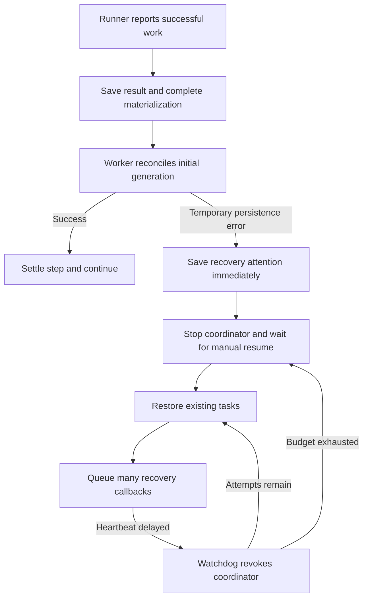
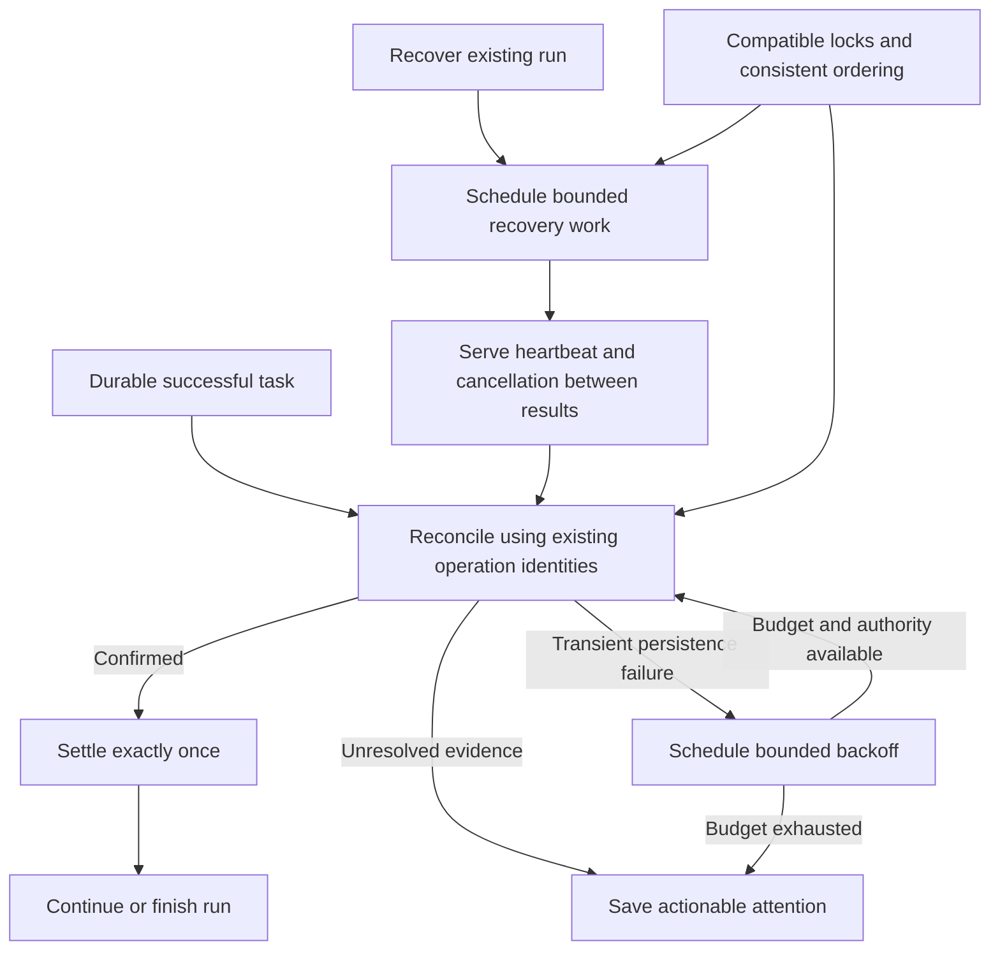

# Change Record: Recover completed work through transient control-plane failures

| Field | Value |
| --- | --- |
| Status | Plan reviewed |
| Type | Bug fix |
| Primary issue | None. On 2026-09-23 the maintainer explicitly requested this record without a GitHub issue. |
| Pull request | Pending |
| Related work | [#754](https://github.com/eirhop/favn/pull/754), [#752](https://github.com/eirhop/favn/issues/752), [#692](https://github.com/eirhop/favn/pull/692) |
| Affected areas | PostgreSQL run coordination; orchestrator registration and recovery continuations; run recovery diagnostics and detail view |
| Approved plan commit | Recorded in the immediate PR-number update after this reviewed planning commit |
| Last updated | 2026-09-23 |

## One-minute summary

Successful runner work can remain unsettled because a temporary generation
registration error immediately suspends automatic recovery. PostgreSQL run and
ownership transactions also acquire conflicting locks, while recovery can miss
responsiveness challenges despite continuing to save results. Correct the lock
protocol, automatically reconcile transient registration failures within a finite
budget, and keep recovery responsive while draining durable results. This changes
concurrency and recovery behavior across the storage, orchestrator, and View
boundaries; implementation requires this independently reviewed baseline.

## Impact

Operators repeatedly press Resume recovery for successful work. A completed
runner task can appear queued or running for over an hour while its run is
paused. The intended outcome is automatic progress after a transient control-plane
failure, with actionable attention only when bounded recovery cannot establish
safe progress. Independent runs, runners, and unrelated target writes retain
their existing concurrency.

## Problem analysis

### Assumptions and evidence boundary

- The reviewed source is RC18, `94b299df35d666b16bb1beb11fc9b706ac52f69f`,
  which was also current `origin/main` when this plan was prepared.
- Evidence comes from a saved Test investigation dated 2026-09-23. This is a
  point-in-time incident analysis, not a fresh observation of the environment.
  Customer identifiers and raw logs are omitted from this permanent record;
  the relevant observations are retained below so it is understandable without
  temporary investigation files.
- One orchestrator coordinates multiple runners. PostgreSQL 18 remains the
  durable authority. This plan does not introduce a second execution engine.
- The request authorizes planning and an independent Astra Max review.
  Inventory execution, process termination, memory sizing, and OOM investigation
  are explicitly excluded.

### Evidence

| Evidence | What it proves | What it does not prove |
| --- | --- | --- |
| Saved run events at 13:33:13 and 13:41:00 UTC | Registration attention followed retryable persistence conflicts, respectively during marker initialization and capability lookup | The precise SQL statement behind each generic conflict |
| Event at 14:46:50; state read at 14:51:41 UTC | Another registration pause followed a retryable unavailable connection; attention revision was 10 and recovery attempts were zero | Automatic attempts were exhausted on this path |
| [StageResult.finish_post_step/3](../../../apps/favn_orchestrator/lib/favn_orchestrator/run_server/execution/stage_result.ex), [RunServer](../../../apps/favn_orchestrator/lib/favn_orchestrator/run_server.ex), and [RecoveryAttention](../../../apps/favn_orchestrator/lib/favn_orchestrator/run_server/recovery_attention.ex) | A classified registration error goes directly to attention; the hardcoded 30-second diagnostic does not establish that retries happened | That every reason classified as recovery-required is safe to retry |
| PostgreSQL error export: 260 ownership NOWAIT failures, ten advisory-lock timeouts, four deadlocks | Material control-plane contention during the incident window | A task-by-task attribution of all errors; every NOWAIT rejection being an incident |
| Three deadlocks at 13:28:43, 13:29:40, and 13:31:39 UTC align with failed step-running transitions; 13:33:15 deadlock shows ownership pacing waiting for parent `runs` `FOR KEY SHARE` | The run/ownership lock cycle exists, including an implicit foreign-key lock | That every registration pause or watchdog stop was caused by that cycle |
| [Run store](../../../apps/favn_storage_postgres/lib/favn_storage_postgres/runs/store.ex) and [ownership store](../../../apps/favn_storage_postgres/lib/favn_storage_postgres/run_ownership/store.ex) | Transitions lock run then ownership; renewal holds ownership before pacing; checkpoint validation can lock ownership then run | A one-line lock change covers every affected transaction |
| Four unresponsive revocations with about 45 seconds since the last response and over 111 seconds of lease headroom | Responsiveness was lost while independent database renewal continued | The exact coordinator stack or mailbox contents |
| Nine step-finished events from 13:45:33 through 13:45:51, followed by revocation at 13:45:52 UTC | Progress continued within the watchdog interval | One synchronous call blocked for the whole interval |
| [Execution.start_pipeline_awaits/2 and start_await/3](../../../apps/favn_orchestrator/lib/favn_orchestrator/run_server/execution.ex) | Recovery queues a callback for every restored task; callbacks perform synchronous reads and settlement | That this backlog was the incident's exact starvation mechanism; reproduce it before claiming causation |
| Four sampled tasks succeeded at 13:32–13:40 but their overviews caught up around 14:46 UTC | Durable runner results can precede visible run settlement by a long interval | The delay is an independent projection defect rather than stalled reconciliation |

The existing registration worker already keeps runner inspection waits out of
the coordinator. Moving that same operation into another worker is not a fix.
The existing tests explicitly expect transient registration failures to return
recovery-required; change those expectations while preserving their proofs that
accepted results are neither lost nor recorded twice.

## Current behavior

The database also permits a cycle: a transition holds the run row while waiting
for ownership, and renewal holds ownership while its foreign-key check waits
for the run row. Waiting transactions can retain the per-run advisory lock,
delaying generation helper admission and other progress for that run.

## Approved plan

This section is the independently reviewed baseline. Implementation remains a
later step.

### 1. Make run coordination locks compatible

Define and test one lock protocol for existing run mutations. Existing
cancellation-owner/run advisory and history guards come first where the command
requires them; then acquire ownership before explicitly locking the run row.
Use `FOR NO KEY UPDATE` for run state changes that preserve the referenced run
identity, so foreign-key `FOR KEY SHARE` checks can proceed. Keep full exclusion
for deletion and identity-changing operations. Preserve the history guard that
excludes retention from active execution.

Audit transition, attention, checkpoint (with and without an embedded
transition), claim, batch recovery claim, renewal, release, resume, cancellation,
helper admission, and target maintenance transactions. The audit must include
implicit foreign-key checks and nested transaction entry points. Creation has
no pre-existing ownership row; retain its atomic creation contract. Keep
multi-run lock ordering deterministic. Do not reject an already committed exact
replay merely because its original fence is old; preserve existing receipt
semantics and validate current authority before any new mutation.

Renewal keeps its separate two-connection repo, NOWAIT ownership acquisition,
two-second operation bound, and bypass of the broad run advisory lock. Calculate
expiry and recovery eligibility in one renewal update using one database-time
observation; remove the subsequent pacing update on that path. Replaying the
same renewal identity must preserve both expiry and recovery eligibility.
Claim and release pacing retain their current durable meaning.

Keep the existing total transaction bounds. The regression must show the
specific lock cycle is removed and unrelated runs progress while one run is
contended. Audit advisory-lock hold time for this path; do not compensate by
increasing pool sizes, timeouts, leases, or globally serializing all work.

### 2. Retry registration through its existing continuation

The orchestrator owns one explicit internal registration continuation per
unsettled successful node. Extend the current post-step continuation with a
stable identity, attempt counter, first-failure time, absolute retry deadline,
timer token, and bounded last error. The coordinator owns this state; a
registered worker performs reconciliation. Waiting continuations still count as
in-flight work and prevent premature stage completion.

Classify nested persistence errors explicitly. A retryable conflict, unavailable
connection, or persistence timeout may schedule another reconciliation attempt.
Do not turn the broad `recovery_required?/1` predicate into a blanket retry
predicate: corrupt/unavailable task evidence, identity mismatch, unsupported
operations, worker crashes, and unresolved external outcomes retain their
existing explicit recovery or failure semantics. A lost fence stops the old
generation; it cannot obtain new authority by retrying.

The automatic retry window is 30 seconds from the first retryable failure, with
at most eight retry slots in addition to the original attempt. Before
dispatching a retry, save a versioned,
compact `registration_retry_scheduled` run event using the normal fenced,
idempotent transition path. It names the original node/attempt and registration
identity, retry ordinal, first failure, absolute UTC deadline, and next eligible
time. Saving the intent consumes its slot, even if the coordinator crashes before
dispatch. These events preserve the original budget and consumed-slot count across
coordinator restart and ownership replacement; their reducer is bounded by the
planned nodes and retry cap. An explicit revision-checked operator resume starts
a new recovery epoch; an automatic restart does not.

A replacement first reconciles the original task, marker, and command evidence
without admitting new work. Confirmed completion can settle the node directly.
An interrupted slot stays consumed; any further reconciliation attempt that may
admit missing helper work reserves the next ordinal within the original deadline.
A lost intent acknowledgement is reconciled by its existing command identity,
so it cannot allocate the same slot twice. This conservatively spends a slot
when dispatch is uncertain, instead of claiming to know whether it executed.

Derive the local monotonic deadline from the saved deadline and current time;
it may shorten but never extend an existing local deadline. Persisting the
retry intent must succeed or reconcile its original receipt before another
worker is dispatched. If the intent cannot be confirmed within the remaining
budget, stop for bounded ownership recovery/diagnosis. Do not invent a new
retry identity after losing that acknowledgement.

Schedule delays of 1, 2, 4, then at most 5 seconds, with bounded 20 percent
jitter, always clamped to the remaining deadline. The coordinator returns to its
mailbox during every wait. Normal initial runner inspection keeps its existing
wait policy; once retrying, pass remaining time into runner waits and give the
continuation an independent deadline timer. Expiry stops new retry dispatch and
the local worker; it does not establish rollback or cancel an external write.
Any durable task still in progress or with an uncertain result remains retained
for reconciliation. Persistent failure produces attention under current authority.

Each attempt uses the original asset step, materialization, target generation,
manifest, task domain identity, marker operation identity, and command receipt.
Read existing durable tasks before admission; a failed read is not absence.
Completed inspection/capability results are reused. A lost marker reply requires
the existing marker reconciliation path and exact identity check. An active
matching binding after a lost final database reply completes reconciliation.
Never create a replacement asset attempt or reinterpret an unknown marker write
as a rejected write.

Cancellation, fence loss, terminalization, and coordinator shutdown invalidate
timers and worker references. Late replies cannot settle or reopen a cancelled
continuation. Crash recovery reconstructs unsettled work from existing events
and tasks; it does not trust an old worker's in-memory state. Existing durable
run recovery pacing also bounds repeated coordinator failures. Reconstruct the
remaining registration budget from its events before scheduling recovery work.
Reuse the run event stream; no new retry table or schema migration is planned.

### 3. Keep recovery callbacks responsive

First reproduce the 45-second missed-response behavior with many already
completed tasks and controlled persistence delay. Measure callback duration,
mailbox length, pending recovery count, and heartbeat response age. Exercise
both a backlog of individually short callbacks and an individually slow store
call. Distinguish this from initial registration, which is already asynchronous.

Replace eager scheduling of every restored task with a bounded continuation
queue owned by `RunExecutionState`: process one recovery phase at a time and
return to the mailbox before scheduling its next phase or another task. Starting
a registration worker releases this processing slot immediately; its pending
post-step continuation still counts as in-flight work. Independent completed
siblings can reconcile and settle while that worker awaits a runner or backoff.
Do not serialize whole recovered tasks through their registration waits. Keep
event ordering and settlement in the coordinator. Split recovery reads,
reconciliation, and settlement into explicit phases so a chain of database calls
cannot occupy one callback for the whole watchdog window.

If a measured individual persistence operation can still prevent timely
responses, execute that operation in an existing registered run helper with a
bounded command and reply. Keep at most one state-mutating recovery operation
outstanding per run, retain its command identity, and apply its reply only to
the matching generation and continuation. Do not copy the entire execution
state into a worker or add a second state owner.

Reuse and extend the existing `execution_persist_pending` gate across every
coordinator transition that can advance the same run sequence: sibling results,
retry-intent events, checkpoints, and cancellation settlement included. While a
helper mutation or its receipt is unresolved, defer these transitions using the
existing execution-event gate. Its current deferred list is not a proven bound:
account retained events against execution memory limits, safely coalesce duplicate
wakeups, and drain through the bounded phase queue rather than reposting the
whole list at once. Never drop unique result or mutation evidence. Continue answering heartbeat
challenges and observing/latching cancellation intent immediately. A durable
cancellation command may win independently; reconcile that authoritative change
before applying a late helper reply or advancing the sequence. Resume deferred
work only after the original command receipt or conclusive rejection is known.
Unknown command completion and worker cancellation cannot be treated as rollback.

The acceptance target is a heartbeat response within five seconds while test
recovery work is delayed, no revocation across more than one real watchdog
interval, responsive cancellation, and eventual settlement of every confirmed
result. Merely increasing the watchdog, sending fabricated heartbeats from a
helper, or treating result activity as authority is unacceptable. Reproduce
`target_maintenance_lost` alongside contention; preserve target-lock deadlines
and held-write protection. Any required change to target-lock ownership policy
is a deviation requiring review, not part of this plan.

### Make recovery diagnostics accurate

This is the operator presentation of the three fixes above. Inventory/OOM work
remains excluded.

Keep persisted run status semantics. The existing orchestrator run-detail read
contract should provide a presentation state of recovery attention when
authoritative ownership says attention, taking terminal/cancellation precedence
into account. The View renders that state through the public facade rather than
querying ownership itself. Limit the UI work to the run detail header and notice;
do not redesign every run listing or introduce a new persisted run status.

Expose bounded operation and persistence reason codes plus consumed registration
retry slots, elapsed retry time, and exhaustion reason when available. Label the
persisted count as scheduled retries, not confirmed worker executions. Observed
worker-start/completion measurements are separate telemetry and may be incomplete
after a crash. Keep both separate from the existing automatic coordinator-recovery
count. Remove the
unconditional claim that every attention path used a 30-second retry budget.
Old snapshots lacking these fields display unknown/not recorded, never zero
attempts inferred from missing data. Existing attention revision checks and
resume authorization remain unchanged.

### Contracts and invariants

- The coordinator is the only execution-state owner. Workers have explicit
  lifecycle ownership and bounded replies.
- PostgreSQL ownership, sequence, cancellation, retention, and task identities
  remain authoritative. New mutations require valid current authority.
- Accepted asset results survive retry, cancellation, and restart. Result and
  settlement events are not duplicated by reply replay.
- Unknown external writes retain their claims and target holds; no new asset
  execution is authorized by a metadata failure or local timeout.
- No new work is admitted during authority degradation. Reconciliation uses
  existing identities and follows current cleanup permissions.
- This changes internal recovery continuation and operator read behavior, not
  runner wire payloads, the DSL, adapter write semantics, or concurrency limits.

### Scope and non-goals

Included: the three recovery defects, their focused diagnostics, canonical
documentation, and regression evidence. Excluded: inventory processing, runner
termination diagnostics, OOM or memory tuning, Landing recovery, SQL retries,
increasing retry/watchdog limits, global write serialization, and cloud actions.

### Implementation slices and complexity budget

Ranges exclude this record, generated files, dependency locks, and formatting-only
changes. Supporting lines include tests, fixtures, and canonical documentation.

| Slice | Outcome and owner | Depends on | Production added | Production deleted | Supporting added | Supporting deleted |
| --- | --- | --- | ---: | ---: | ---: | ---: |
| 1 | Lock protocol and real concurrency regression; PostgreSQL | None | 70–150 | 40–100 | 180–320 | 10–40 |
| 2 | Finite registration reconciliation; orchestrator | 1 | 160–280 | 30–80 | 260–440 | 20–60 |
| 3 | Responsive recovery continuation; orchestrator | Reproduction, then 1 | 100–220 | 40–110 | 200–350 | 20–60 |
| 4 | Accurate recovery detail and documentation; orchestrator, storage, View | 2 and 3 | 50–100 | 15–45 | 90–160 | 10–30 |
| Total | Focused correction using existing lifecycle owners | | 380–750 | 125–335 | 730–1,270 | 60–190 |

The substantial supporting budget buys real concurrent transactions, durable
lost-reply proof, and watchdog timing coverage. Extend existing fixtures. Do not
build a generic retry framework or a replacement run manager. Explain overruns
above the upper bound by more than 25 percent or 100 lines, whichever is smaller,
and materially fewer deletions, as required by the [record process](../README.md).

### Implementation map

| Concept | Expected code area | Responsibility |
| --- | --- | --- |
| Run lock protocol | `favn_storage_postgres` run, ownership, cancellation, admission and task stores | Compatible ordered locking, bounded transactions and exact replay |
| Registration continuation | `RunServer.Execution`, `StageResult`, `RunExecutionState`, `InitialTargetGenerationReconciler` | Retry lifecycle and use of existing durable evidence |
| Recovery scheduling | `Execution.Restore`, `RecoveredTask`, `RunServer` | Bounded work and single-owner state transitions |
| Authority | `RunLeaseKeeper`, `RunHelper`, `RunTargetMaintenance` | Existing lease, worker ownership and target protection; regression coverage |
| Operator detail | `OperatorReadStore`, PostgreSQL operator reads, View run detail components | Bounded authoritative presentation and diagnostics |
| Canonical documentation | [Run ownership and recovery](../../architecture/run-ownership-and-recovery.md), [operator runbook](../../production/postgresql_operator_runbook.md), [generation architecture](../../architecture/target-generations-and-rebuilds.md) | Explain the changed contracts once in their owning pages |

## Operational design

### Failures and diagnostics

| Condition | Behavior | Diagnostic |
| --- | --- | --- |
| Transient registration persistence error | Reconcile original identity within remaining budget | Operation, allowlisted error code, scheduled retry ordinal, elapsed/remaining time |
| Deadline or repeated failure | Stop local continuation and save attention | Consumed retry slots, elapsed time and stop reason; preserve original failure |
| Lost acknowledgement | Read original task, marker, binding or command receipt | Reconciliation outcome; never claim a rejected write without proof |
| Cancellation or lost fence | Stop new attempts; follow existing cancellation/ownership recovery | Stable cancellation/fence category |
| Slow recovery | Continue serving control messages while work is outstanding | Callback duration, bounded queue count and heartbeat age |

Use existing operational-event/telemetry boundaries. Log the first retry at
warning, intermediate attempts at debug, and one final recovery or exhaustion
event. Allowlist SQLSTATE/reason codes; never expose raw SQL, parameters, arbitrary
exception terms, customer data, or credentials. Store bounded diagnostics through
the shared JSON-safe codec. Avoid per-task high-cardinality metric labels.

### Deployment, migration, and compatibility

No schema or runner wire change is planned. Deploy the qualified control-plane
binary through the existing single-orchestrator replacement procedure. Already
paused runs remain paused: upgrading does not silently resume operator attention.
After the cause is corrected, the operator may use the current revision-checked
resume action; existing tasks are reconciled first. No status/fence edits,
claim deletion, data rewrite, or live resume is part of this change.

Old snapshots remain readable and additional diagnostic fields are optional,
but the new retry events carry behavior: RC18 ignores their deadline and slot
cap. Ordinary rollback with an active new retry continuation is unsupported.
Before replacing the binary with RC18, verify every run containing these events
has either completed settlement/terminalization or is durably in attention with
all local helpers stopped. Keep affected attention runs paused until a compatible
binary is restored; resuming them on RC18 would abandon the saved retry policy.
If that precondition cannot be met through supported commands, use a forward fix.
Do not repair compatibility by editing statuses or deleting event history.

Test older-codec readability and the rollback eligibility check separately from
new-version budget enforcement. If implementation needs a schema, wire, or
ownership-policy change, record a deviation and obtain review before proceeding.

## Verification plan

| Acceptance criterion | Planned evidence | Owning layer |
| --- | --- | --- |
| The observed lock cycle cannot recur | Deterministically interleave real transition and renewal transactions on independent PostgreSQL connections; exercise implicit FK checks and prove both complete | PostgreSQL concurrency |
| All entry paths follow the protocol | Transition, checkpoint with/without embedded transition, resume, cancellation, claim/recovery batch, release, helper admission and target maintenance matrix; stale fences still reject new writes | PostgreSQL integration |
| Independent renewal is preserved | Broad advisory lock held, ordinary pool saturated, ownership row busy, exact renewal replay, and unrelated run progressing | Existing lease reliability suite |
| Transient registration errors recover | Inject nested conflict/unavailable/timeout at binding read, helper ensure, and final reconcile; recover without attention and without a new asset attempt | Orchestrator |
| Lost replies cannot duplicate side effects | Commit enqueue/marker/final binding then lose acknowledgement; assert original IDs, one asset execution, matching marker and one settlement; unknown mismatch retains holds | PostgreSQL plus orchestrator |
| Retry is bounded and revocable | Persistent error, deadline while worker is waiting, crash before dispatch and after dispatch before acknowledgement, replacement retaining consumed slots/deadline, cancellation during backoff/work, lost fence, duplicate/late worker replies and stale timers | Orchestrator lifecycle |
| Helpers cannot race the run sequence | Delay or lose a helper mutation reply while sibling completion, retry intent, checkpoint and cancellation arrive; prove one ordered outcome, cancellation precedence and responsive heartbeats | Orchestrator plus PostgreSQL |
| Registration waits preserve sibling progress | Hold one recovered node's registration worker through backoff/runner wait while independent completed siblings settle; the run still waits for unresolved continuation before finalizing | Orchestrator continuation |
| Recovery remains responsive | Many durable terminal tasks, slow calls and callback backlog; heartbeat within five seconds, cancellation handled, no false revocation across a real 45-second interval, all outcomes eventually settled | Orchestrator; slow tier for wall-clock proof |
| Real stuck work remains revocable | A coordinator that genuinely stops responding is still revoked; late responses cannot reopen it | Lease keeper lifecycle |
| Target maintenance remains safe | Concurrent recovery/registration load; no unknown-write hold released or expired lease silently reacquired | PostgreSQL and orchestrator |
| Operator detail is truthful | Attention header, nested bounded reason, scheduled-versus-executed count distinction, old snapshot fallback, terminal/cancellation precedence and resume revision conflict | Operator read contract and focused LiveView test |
| Rollback respects durable retry policy | Old-reader compatibility plus rejection of rollback with active retry continuations; terminal/settled or attention-stopped runs satisfy the documented precondition | Storage contract and operator procedure |

Start with the owning tests using `mise exec -- mix` and app-scoped `cmd mix test`.
Use the documented disposable PostgreSQL 18 `favn_test` setup and both test
database URLs; never use the normal development workspace. After focused checks,
run formatting, warnings-as-errors compilation, affected fast/acceptance/slow
tiers, and the tag guard. Require the relevant CI checks on the exact PR head.
Plan-only verification is Markdown link/diagram review and `git diff --check`.
Tests do not prove a live rollout fixed the historical run; that requires a
separately authorized observation after deployment.

## Risks and open questions

| Risk or question | Impact | Mitigation or decision |
| --- | --- | --- |
| An implicit/nested lock remains in reverse order | Deadlocks persist | Enumerate entry paths and test real independent connections; do not stop at mocked locks |
| Registration retry repeats an uncertain mutation | Duplicate or conflicting effects | Exact durable identities, receipt reads, marker reconciliation and nonempty hold regression |
| The watchdog cause is broader than a recovery backlog | Proposed scheduling change alone is insufficient | Reproduce backlog and slow-call cases before selecting helper boundaries; record additional causes and deviations |
| A worker reply races cancellation or a new generation | Old work mutates current execution state | Reference/generation checks, cleanup and durable cancellation precedence |
| Diagnostics overstate proof or grow snapshots | Operators retry incorrectly or persistence degrades | Actual measured budget fields, bounded allowlisted codes and legacy fallback |

## Plan review

| Field | Result |
| --- | --- |
| Reviewer | Independent Astra agent, `gpt-6-astra`, reasoning effort `max` |
| Reviewed against | Maintainer scope, saved incident evidence, RC18 source, existing tests and this record |
| Findings | Four P2 findings: transition gating, scheduled-versus-executed retry counts, sibling progress during registration waits, and rollback policy for durable retry events |
| Findings addressed and rechecked | All four clarified in the plan and verification matrix; Astra Max independently rechecked the corrections on 2026-09-23 |
| Verdict | Approved. No remaining actionable plan findings or material scope creep; complexity budget accepted. Design approval only. |

## Implementation outcome

Implementation has not started. The request covers this plan and its independent
review. No production code, tests, cloud configuration, or run state were changed.

## Deviations and decisions

The maintainer explicitly exempted this record from the GitHub-issue requirement
and excluded inventory/OOM work. The draft PR contains the reviewed plan only,
so its status stays `Plan reviewed` until implementation begins. No implementation
deviations exist yet.

## Verification evidence

| Check | Result | Evidence boundary |
| --- | --- | --- |
| Source and incident review | Completed against RC18 | Saved Test evidence and static source; no fresh live inspection |
| Markdown links and whitespace | Passed: all repository-relative links resolve; whitespace check is clean | Documentation only |
| Mermaid diagrams | Both parsed and rendered successfully with Mermaid 11.12.0 in a local headless browser | Local render; GitHub rendering still requires verification before implementation |
| Independent plan review | Approved by Astra Max after correction and recheck of four P2 findings | Design review; no implementation qualification |

Not verified: implementation, concurrency regressions, retry behavior under
fault injection, recovery latency after changes, CI qualification, deployment,
or recovery of an existing paused run. Final implementation review is deferred
until code exists and can be compared with the approved planning commit.
