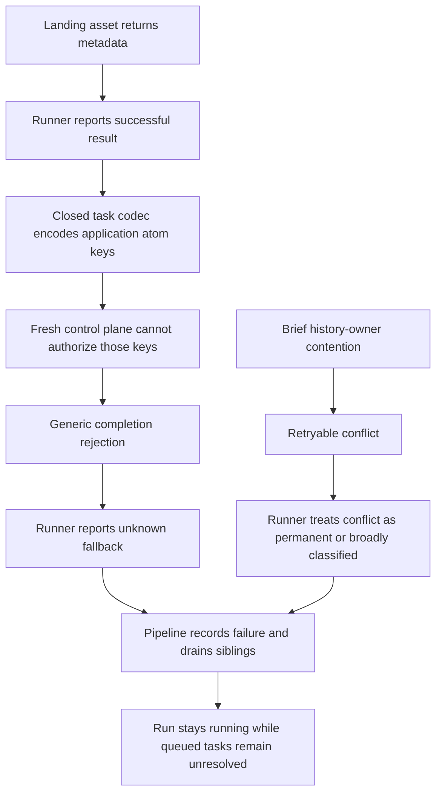
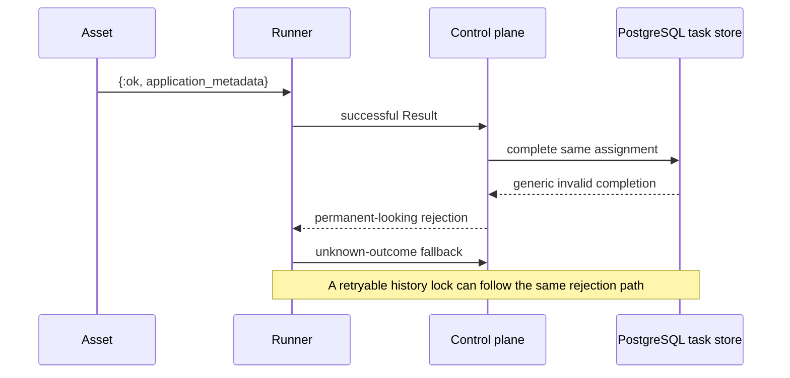
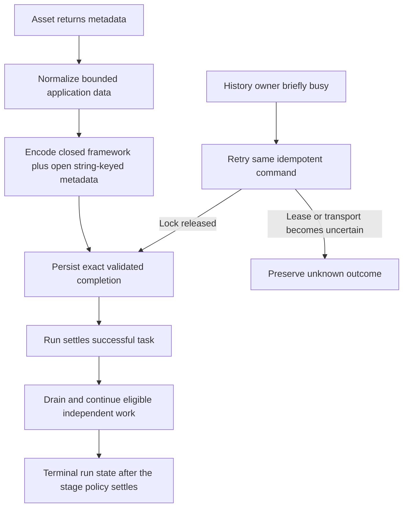

# Change Record: Restore runner result persistence and lifecycle progress

| Field | Value |
| --- | --- |
| Status | Plan reviewed |
| Type | Bug fix and lifecycle hardening |
| Primary issue | None; the user explicitly requested a direct repair without an issue |
| Pull request | Pending |
| Related work | [#703](https://github.com/eirhop/favn/pull/703), [#711](https://github.com/eirhop/favn/pull/711), [#714](https://github.com/eirhop/favn/pull/714), [#716](https://github.com/eirhop/favn/pull/716) |
| Affected areas | Core runner-task result contract; runner retries and diagnostics; orchestrator completion; PostgreSQL task/history coordination; pipeline failure draining; asset-authoring metadata |
| Approved plan commit | Pending independent review |
| Last updated | 2026-09-16 |

## One-minute summary

Successful Elixir assets may return application metadata, while SQL assets and
runner lifecycle code place typed framework evidence in the same result
envelope. The closed runner-task codec introduced in #703 treats every atom in
both classes as a framework atom, so a fresh control plane rejects valid Landing
results whenever an application key is absent from the registry. #716 expanded
the framework registry and proved dispatch, but did not execute an asset with
application metadata through completion. Separately, #714 introduced a
retryable history-owner conflict while the runner still treats every conflict
as permanent during preparation and result delivery. This change defines the
mixed result boundary path by path, preserves typed SQL/lifecycle contracts,
normalizes only open application and adapter data, preserves precise validation
failures, retries transient ownership conflicts without replaying completed
asset work, and proves that a failed pipeline drains to a terminal state after
queued siblings finish.

## Impact

A backfill can perform its external Landing writes successfully and then have
the control plane reject the result. The task becomes `unknown`, the run records
a failure, queued siblings can stop making progress during repeated claim
failures, and the run remains `running` while it waits for its recorded drain
set. Operators currently see only a broad claim failure category and cannot tell
that a retryable execution-history lock is blocking progress.

## Problem analysis

### Assumptions

- The reported task and run states come from a deployment containing merged
  #716. No live production database is available in this workspace, so the plan
  will reproduce the behavior from current source and isolated PostgreSQL tests.
- Landing metadata is an ordinary Elixir asset return value under the documented
  `{:ok, metadata}` contract. It is application data, not a framework extension
  point that should require additions to `PersistenceData.@atoms`.
- A retryable history-owner conflict means no runner command committed. Retrying
  the same idempotent command is safe. A timeout, disconnect, or uncertain reply
  remains unknown and must not cause the asset body to execute again.
- Failure draining is expected to keep a run `running` only while already
  submitted siblings have unresolved outcomes. It must terminate after those
  tasks settle or their existing bounded deadlines expire.

### Evidence

| Evidence | What it proves | What it does not prove |
| --- | --- | --- |
| Current `PersistenceData.encode/2` followed by `decode/2` for a `RunnerAssetResult.meta` containing `manifest_uri`, `landing_run_id`, `favn_run_id`, `pages_written`, and `load_mode` returns `{:error, :invalid_runner_task_data}` | Current code reproduces the reported result rejection | The exact deployed result payload or every application metadata shape |
| `PersistenceData` uses one closed atom dictionary for task contracts and all nested maps | Application map keys are incorrectly coupled to framework registration | That the closed vocabulary is wrong for framework-owned structs and enums |
| `Store.validate_completion!/2` maps codec atom errors to `invalid runner task completion` | The specific validation reason is lost at the storage boundary | The source of every possible invalid completion |
| `Maintenance.History.guard!/2` returns a retryable `execution history owner is busy` conflict; it was introduced in #714 | The observed conflict is designed to be transient and nonblocking | That it caused every reported claim failure |
| `RunnerAgent.permanent_control_rejection?/1` treats all `:conflict` errors as permanent before examining `retryable?` | A transient history conflict can become a preparation failure or an unknown result fallback | That changing classification alone is sufficient for every command phase |
| Runner claim failures back off, but runner diagnostics expose registration failures rather than claim retry state and the history error has no stable reason code | The reported broad diagnostic is not actionable | The exact shape observed across every deployment transport |
| #716's backfill integration completes a framework-shaped result with empty application metadata | Enqueue/readback was proven but Landing-style completion was outside the test | That the #716 tests were otherwise invalid |
| #703 tested all task kinds and fresh readers using curated framework fixtures | Atom safety and supported framework contracts were tested | Public `{:ok, metadata}` compatibility with arbitrary application keys |

### Root cause and regression chain

1. #703 combined two different trust domains in one serializer: a closed
   framework contract and application-owned metadata. Its fresh-process tests
   proved the closed registry but used only registered metadata.
2. #711 and #716 exposed successive missing framework atoms. #716 audited current
   framework producers, but adding more names to the registry repeated the
   original design assumption instead of separating application data.
3. #716's end-to-end backfill test stopped after a synthetic completion whose
   result metadata was empty. It did not invoke or model the documented Landing
   return shape.
4. #714 added a new retryable conflict at the history-retention boundary. Runner
   tests covered permanent conflicts and generic claim backoff, while retention
   tests covered locking. No test composed those behaviors.
5. The generic completion validator and claim diagnostics hid the concrete
   reason, making the two independent failures appear as one broad storage
   problem.

## Current behavior

### Current call sequence

## Approved plan

Treat framework contracts and open application/adapter data as separate data
classes even where they share one map. Framework structs, enum atoms, identity,
lifecycle fields, SQL assurance evidence, and generation capabilities remain
closed and typed. Only the explicitly open leaves in the matrix below normalize
to bounded data with string keys and string representations for non-boolean atom
values. Open data supports scalar/list/map values plus the existing explicitly
supported date, time and decimal values; unsupported structs and terms fail
before persistence. This retains every supported application field without
teaching the framework each key or creating atoms, while preserving consumers
that require typed framework values.

Classify persistence errors by both kind and retryability. Retryable conflicts
reuse the same command and assignment while the lease remains valid. Permanent
validation failures remain terminal, and uncertain transport/results preserve
the existing unknown-outcome safeguards. Claims keep bounded exponential
backoff, and diagnostics expose a stable safe reason class, retry count, and
next retry time.

### Contracts and invariants

- Persisted names must never create atoms or select arbitrary modules.
- Framework-owned structs, field names, enums, task identities, manifest pins,
  package identities, and write fences remain closed and validated.
- Elixir asset result metadata supports bounded scalar, temporal, decimal,
  list and map values. Atom/string map keys normalize to strings; non-boolean
  atom values normalize to strings. Duplicate keys after normalization are
  rejected rather than overwritten.
- SQL result metadata is a mixed map. Its fixed controls, `RelationRef`,
  `CheckResult`, `GroupReplacementResult`, and `ContractValidation` values stay
  typed. Only documented open leaves such as runtime-input metadata and check
  metrics use the open-data rules.
- `RunnerResult.metadata` remains closed lifecycle metadata. Window, node,
  policy, tuple, generation, and retry values must survive unchanged.
- Generation capabilities remain a closed eight-field framework contract;
  `:supported` and `:unsupported` values must not become strings.
- Normalize `RunnerAssetResult.meta` and each attempt's `meta` according to its
  source, `RunnerError.details`, and the adapter-owned inspection leaves listed
  below. Do not globally stringify maps or silently normalize control fields.
- Completion reports the stable reason code from codec/schema validation while
  keeping arbitrary result contents out of errors and logs.
- A retryable conflict never becomes a rejected-result fallback or a completed
  preparation failure. Started, runtime-input acknowledgement, and completion
  retries reuse the same command ID; runtime-input retries preserve the exact
  payload fingerprint and do not rerun the resolver; completion retries do not
  run the asset body again.
- A permanent invalid/conflict/fence retains existing rejection behavior.
  Deterministic local normalization/codec errors are also permanent delivery
  rejections: the runner reports one bounded unknown/do-not-retry fallback
  rather than reconnecting forever.
- A lost or ambiguous completion reply remains unknown. Completed external
  writes are never blindly replayed.
- Claim retries remain bounded and tokenized. Wakeups and registration do not
  bypass their backoff.
- Lease expiry, assignment supersession, or a stale fence while a retry is
  pending stops the retry and follows the existing unknown/stale ownership
  behavior.
- Generation operations keep `RunnerTask.classify_failure/2` semantics,
  including reconcile-before-retry outcomes; generic transport retry handling
  must not flatten per-kind result policy.
- Pipeline failure draining preserves the existing policy that may refill
  deferred work and schedule safe retries for independent branches after a
  sibling fails. It does not start work that the stage classifier marks
  dependent on the failure. The run reaches its terminal failure after every
  task allowed by that policy settles or existing deadlines produce durable
  terminal outcomes.
- Existing/unknown task ownership, materialization claims, and target-operation
  locks are not released without durable evidence.

### Scope

- Runner-task result serialization and safe application metadata normalization.
- Completion validation error preservation.
- Runner classification/retry behavior for retryable control-plane conflicts in
  claim, preparation, runtime-input acknowledgement, and completion.
- Safe runner claim diagnostics.
- PostgreSQL history-lock contention at task claim/start/complete boundaries.
- Pipeline drain progression and terminalization after mixed failure/success.
- Canonical asset-authoring, runner operations, and PostgreSQL task-contract
  documentation.
- A source and test audit of every task kind, result map, and lifecycle command
  that crosses this persistence boundary.

### Result boundary matrix

| Path | Producer and provenance | Durable treatment | Required consumer proof |
| --- | --- | --- | --- |
| `RunnerAssetResult.meta` and `attempts[].meta` for Elixir assets | Public `:ok` or `{:ok, map()}` callback return | Normalize the complete callback map as bounded open data after redaction | Landing keys and nested values round-trip; run detail retains every supported field |
| Source asset result `meta` | `Worker.execute_source_asset/1` fixed `%{observed: true, relation: RelationRef}` output | Keep the envelope and relation closed and typed | A real source result round-trips with `RelationRef` unchanged |
| SQL asset result `meta` fixed envelope | `SQLAsset.Runtime.runtime_output/4` | Keep fixed keys and typed `RelationRef`, `CheckResult`, `GroupReplacementResult`, and `ContractValidation` subtrees closed | A real SQL result round-trips with controls and structs unchanged |
| SQL runtime-input `input_metadata` | Application runtime-input resolver through `RuntimeInputResolver.lineage/1` | Normalize only this nested open map after sensitive-value redaction | Resolver metadata with an unregistered key persists without changing identity/fingerprint |
| `CheckResult.metrics` | Bounded SQL query columns | Keep the existing string-key scalar/temporal/decimal contract | Metrics retain values and do not admit control atoms |
| `RunnerError.details` | Runner, adapter, exception, and application diagnostics | Normalize as bounded open diagnostic data after existing redaction; protocol classification fields stay on the typed envelope | Unknown detail keys persist; retry/outcome/type/phase behavior is unchanged |
| `RelationInspectionResult.sample` row values, `table_metadata`, and `error` | SQL adapter inspection | Normalize the adapter-owned nested values as bounded open data | Unknown adapter keys round-trip and API DTO remains redaction-safe |
| `Favn.SQL.Relation.metadata` and `Favn.SQL.Column.metadata` inside inspection results | SQL adapters | Normalize adapter extensions while preserving the typed `contract_nullability` control and its enum | Target recovery and contract nullability decisions remain unchanged |
| Inspection `warnings[].code` and fixed sample/column envelope keys | Runner inspection code | Keep closed and typed while open adapter row values use the preceding rule | Warning and column contract tests reject unknown control atoms |
| `RunnerResult.metadata` | `RunnerWork.lifecycle_metadata/1` | Keep closed and typed | Window, node key, policy, retry, backfill, and generation lifecycle values survive a fresh reader |
| `GenerationCapabilitiesResult.capabilities` | Fixed `Favn.SQL.GenerationCapabilities` projected to a map | Keep all eight keys and capability enums closed | Rebuild capability decisions still compare against `:supported` |
| `RunnerWork.params`, `trigger`, and custom run metadata | Run submission/snapshot path | No contract change in this repair. Prove the real snapshot-to-work boundary, which already JSON-normalizes open run input while selectively hydrating typed metadata | Real persisted submission reads and task enqueue round-trip; the standalone codec remains closed |
| `Favn.RuntimeInput.Pin` payload/fingerprint | Dedicated encrypted payload codec | No normalization or fingerprint change | Existing pin confidentiality and exact-replay tests remain green |

### Non-goals

- Automatically retry an asset body after an unknown external write outcome.
- Repair or reinterpret already persisted `unknown` outcomes without external
  evidence.
- Change history-retention eligibility or replace its nonblocking lock design.
- Add a new queue, lock service, or persistence format compatibility layer.
- Redesign unrelated run scheduling, backfill selection, or SQL execution.

### Implementation slices

| Slice | Outcome | Owner or area | Depends on |
| --- | --- | --- | --- |
| 1 | Explicit mixed-result contract: bounded open leaves plus preserved typed SQL/lifecycle values | `favn_core`, `favn_runner`, authoring guide | None |
| 2 | Exact completion-validation reason survives the orchestrator/storage boundary | `favn_core`, `favn_orchestrator`, `favn_storage_postgres` | Slice 1 |
| 3 | Retryable history conflicts retry Started, RuntimeInputsResolved, and Result with the same command/fingerprint; diagnostics identify the blocker | `favn_runner`, runner gateway contract | None |
| 4 | Deterministic PostgreSQL contention and pipeline drain tests prove recovery and terminalization | `favn_storage_postgres`, `favn_orchestrator` | Slices 1-3 |
| 5 | Full producer/consumer test audit and canonical operational documentation | All affected owners | Slices 1-4 |

### Complexity budget

| Slice | Production added | Production deleted | Supporting added | Supporting deleted | Main reason for the size |
| --- | ---: | ---: | ---: | ---: | --- |
| 1 | 100-180 | 0-30 | 120-220 | 0-30 | Bounded recursive normalization and contract tests |
| 2 | 20-60 | 0-20 | 50-100 | 0-20 | Preserve typed reasons at two validation boundaries |
| 3 | 100-180 | 20-70 | 140-260 | 10-40 | Phase-aware retry plus bounded diagnostics |
| 4 | 0-80 | 0-30 | 220-380 | 0-40 | Real transactions, runner commands, and drain lifecycle proof |
| 5 | 0-30 | 0-20 | 40-100 | 0-20 | Documentation and missing matrix cases |

A production slice exceeding its range or supporting code exceeding it by more
than 100 lines requires an outcome explanation. This budget excludes this
record, generated files, dependencies, and formatter-only changes.

### Implementation map

| Concept | Expected code area | Responsibility |
| --- | --- | --- |
| Safe open result data | `apps/favn_core/lib/favn/contracts/runner_task/` and result contracts | Bounded normalization for explicitly open leaves without weakening the closed codec |
| Asset and SQL result construction | `apps/favn_runner/lib/favn_runner/worker.ex`, SQL runtime and runtime-input resolver | Normalize source/application leaves and preserve typed SQL result subtrees before delivery |
| Inspection result construction | `apps/favn_runner/lib/favn_runner/inspection.ex` | Normalize adapter extensions while preserving inspection controls |
| Completion boundary | `apps/favn_orchestrator/lib/favn_orchestrator/runner_tasks.ex`, PostgreSQL runner-task store | Preserve stable validation reasons and persist exact normalized results |
| Retry classification | `apps/favn_runner/lib/favn_runner/runner_agent.ex` | Distinguish retryable contention from permanent rejection and uncertainty |
| History coordination | PostgreSQL maintenance/run identity/task store | Supply stable retryable reason without changing lock order or retention exclusion |
| Drain lifecycle | orchestrator run execution and stage-result modules | Prove submitted sibling settlement reaches the recorded terminal failure |

## Operational design

### Failures and recovery

- Supported open application/adapter data normalizes and persists. If a completed asset
  returns unsupported metadata and the result cannot be encoded, the runner
  reports one bounded unknown/do-not-retry fallback. It never calls that a safe
  failure because the asset's external write may already have completed.
- A retryable history-owner conflict is retried with the same command identity
  and existing claim/assignment. Claim retries keep exponential backoff;
  preparation/result retries respect the assignment lease.
- A permanent invalid completion is rejected with a stable reason code.
- A transport timeout or ambiguous completion keeps the pending result and
  follows existing reconnect/unknown-outcome behavior.
- Rollback is the prior image. No schema migration or data rewrite is planned.
  Already unknown writes still require the existing explicit reconciliation
  path.

### Logs and diagnostics

| Event or state | Level or surface | Safe fields | Rate limit |
| --- | --- | --- | --- |
| Claim retry | Warning event and `FavnRunner.diagnostics/0` | failure class, stable reason code, retryable flag, retry count, next retry time | First, class change, then every 30 seconds |
| Completion rejection | Returned persistence error and runner log | task ID already owned by protocol, stable reason code; no result metadata | Once for the original result and once only if its bounded fallback is also rejected |
| Stage draining | Durable run event/read model | stage, attempt, failed asset ref, bounded pending task IDs | One transition and existing progress updates |

### Deployment, migration, and compatibility

No database migration is expected. Control plane and runner should be deployed
together because retry semantics and diagnostics change on the runner while
normalization/validation changes at the shared contract. Old already-persisted
valid results remain readable. No automatic repair is attempted for tasks
already recorded as `unknown`.

## Verification plan

| Acceptance criterion | Planned evidence | Owning layer |
| --- | --- | --- |
| Landing metadata persists without framework key registration | Fresh-process round trip for arbitrary atom/string keys, nested maps/lists, atom values, collision and bound failures through the source-asset result path | Core/Runner |
| The real source producer composes with persistence | An owning Worker/TaskExecutor test invokes an Elixir asset returning unregistered Landing-style metadata, captures the emitted `RunnerResult`, and feeds that exact value through the persistence codec | Runner/Core |
| SQL, source, and lifecycle metadata stay typed | Actual SQL and source producers, runtime-input metadata, lifecycle window/node/policy values, check/contract evidence, and generation capabilities round-trip through a fresh reader | Core/Runner |
| Inspection adapter data persists safely | Inspection result with unknown table/sample/relation/column metadata keys round-trips while `contract_nullability` and warning codes stay typed | Core/Runner |
| Closed framework data stays closed | Unknown control atom and unsupported struct rejection tests for payload, context, result controls, inspection controls, and capability controls | Core |
| Backfill enqueue through Landing completion | Actual dispatcher/submission/run/task path, claimed task, populated normalized result, persisted readback, terminal child/backfill state; producer composition is proved separately by the owning Worker test | PostgreSQL integration |
| Specific completion reason | Real invalid encoded result passed through `RunnerTasks.complete/1` and store; exact safe reason code asserted | Orchestrator/PostgreSQL |
| Repeated claims recover after history contention | Hold the exact history advisory lock on a separate database connection, observe retryable claim failure, release it, then claim with the same command | PostgreSQL integration |
| Preparation conflicts retry safely | Runner-agent test makes `Started` return retryable history conflict then success; asset executes once | Runner |
| Runtime-input acknowledgement conflicts retry safely | Runner-agent test makes `RuntimeInputsResolved` return retryable history conflict then success; same resolution and fingerprint are resent and resolver executes once | Runner |
| Completion conflicts retry safely | Runner-agent test makes result persistence return retryable conflict then success; original result is delivered unchanged and no unknown fallback is created | Runner |
| Retry ownership remains fenced | Started, runtime-input, and completion retry tests expire the lease or supersede the assignment and prove the pending retry does not cross that fence | Runner |
| Deterministic local result errors do not reconnect forever | Runner-agent tests return raw normalization/codec errors and assert one unknown fallback, bounded rejection diagnostics, and no asset replay | Runner |
| Diagnostics are actionable | Runner diagnostics/event test asserts stable history-busy class, count and next retry without payload leakage | Runner |
| Failure drain terminates | Mixed pipeline test: one task fails, one completed result contends transiently, deferred independent work still refills, queued tasks are subsequently claimed/completed, dependent work stays blocked, and the run ends failed with no queued/active tasks or leaked claims/leases | Orchestrator/PostgreSQL integration |
| Unknown outcomes stay protected | Completion timeout/disconnect and unresolved-write tests continue to preserve ownership and avoid asset replay | Runner/PostgreSQL slow tests |
| Surrounding contracts are covered | Matrix lists every task result type and every open map field with a representative non-framework key or an explicit closed classification | Core and owning apps |

Static verification will include formatting, warnings-as-errors compilation,
Dialyzer, diff checks, and the test-tier guard. Focused tests run first in Core,
Runner, Orchestrator, and PostgreSQL. Final qualification includes fast,
acceptance, slow, production-shaped HTTP, runner image, and control-plane image
CI. Live deployment behavior is outside this PR's automated proof and will be
listed honestly in the outcome.

## Risks and open questions

| Risk or question | Impact | Mitigation or decision needed |
| --- | --- | --- |
| Normalizing atom keys/values changes their in-memory type after the result boundary | Consumer code might assume atom keys | Define string-keyed metadata as the durable contract; audit every consumer and use key-tolerant readers only where framework fields are intentionally accepted in both forms |
| Treating every retryable error alike could loop on a bad server classification | Assignment could remain busy | Require explicit `retryable?: true`, retain lease/deadline bounds and capped retry intervals, and test permanent conflicts separately |
| A drain stall may have another cause beyond claim contention | Run could still remain running | Use an end-to-end mixed-stage PostgreSQL test and inspect every durable task/lease/claim/run transition before deciding whether drain production code must change |
| Open result maps exist beside typed fields in the same envelope | Global normalization would break SQL, rebuild, retry, or lifecycle consumers | Enforce the path/provenance matrix above and require source, SQL, inspection, and generation-capability persistence tests |
| Same-process tests can hide atom dependence | Regression may recur only after restart | Use separate OS-process/fresh-reader tests for normalized metadata and keep unknown control atom rejection |

## Plan review

| Field | Result |
| --- | --- |
| Reviewer | Astra xhigh independent agent |
| Reviewed against | Current merged source, #703/#714/#716 history and records, reproduction, public asset contract, tests, and this plan |
| Findings | Four P1 categories: post-execution metadata was initially classified as a safe failure; the first drain plan incorrectly stopped eligible independent refill; deterministic local codec errors could reconnect forever; and the result plan did not distinguish open leaves from typed SQL, source, inspection, lifecycle, and generation metadata. Supporting gaps covered real producers, runtime-input retries, and lease fences. |
| Findings addressed and rechecked | The plan now uses one bounded unknown fallback after unsupported post-execution data, preserves the existing independent drain policy, classifies deterministic local delivery failures, defines every mixed result path, and requires actual producer, same-fingerprint retry, and stale-ownership tests. Astra rechecked the final matrix and invariants against source `f4e0f4d8`; reviewed record SHA-256 `74f10e9ea980783d948bcbf2f76c1a1d3bdc389e5dfc750d977b46395259bbe0`. |
| Verdict | Approved for implementation with no unresolved plan findings. |

---

## Implementation outcome

Pending implementation.

### Actual scope and complexity

- Files and ownership areas changed: Pending.
- Ownership boundaries affected: Pending.
- Implementation complexity: Pending.
- Operational complexity: Pending.
- Canonical documentation updated: Pending.
- Actual additions, deletions, and supporting lines per approved complexity-budget slice: Pending.

## Deviations from the approved plan

Pending implementation.

## Decision log

| Date | Decision | Reason | Review needed |
| --- | --- | --- | --- |
| 2026-09-16 | Use a change record without a primary issue | The user explicitly requested a full implementation record and said an issue is unnecessary | No |

## Verification evidence

| Check | Result | Evidence boundary |
| --- | --- | --- |
| Current-code Landing metadata reproduction | `PersistenceData.decode/2` returned `{:error, :invalid_runner_task_data}` | Local source reproduction, not a deployed run |

### Not verified

- A live deployment containing this change.
- Repair of the already affected runs and external Landing writes.
- The exact source of the reported broad `storage` claim category; the current
  source exposes insufficient claim detail, so deterministic contention tests
  and improved diagnostics are part of the plan.
- A separate drain-scheduler defect. Current source preserves eligible
  independent refill and terminalizes after pending tasks settle; the mixed
  integration test will decide whether production drain code needs any change.

## Final review

| Field | Result |
| --- | --- |
| Reviewer | Astra xhigh independent agent |
| Compared | Approved plan, implementation, tests, diagnostics, and docs |
| Deviations complete | Pending |
| Findings | Pending |
| Findings addressed and rechecked | Pending |
| Verdict | Pending |
