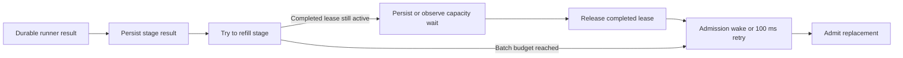
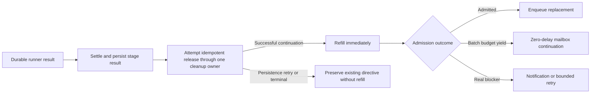

# Change Record: Short-task pipeline admission throughput

| Field | Value |
| --- | --- |
| Status | Plan reviewed |
| Type | Bug fix and performance improvement |
| Primary issue | None — the user explicitly requested implementation without a GitHub issue on 2026-08-28 |
| Pull request | Pending |
| Related work | [#650](https://github.com/eirhop/favn/issues/650) |
| Affected areas | Orchestrator pipeline result settlement, execution-admission lease release, deferred stage refill, PostgreSQL-backed orchestration tests, elastic-runner architecture documentation |
| Approved plan commit | Pending reviewed planning commit |
| Last updated | 2026-08-28 |

## One-minute summary

Wide stages with short independent tasks leave runner slots idle even though eligible work remains. After a durable runner result arrives, the owning run process settles the result and attempts to refill the stage before releasing the completed task's execution-admission lease, so the refill can observe false exhaustion and wait. Separately, admission that stops only because its four-node or 25-millisecond work budget was reached uses the same 100-millisecond retry path as genuinely blocked work. This change will preserve ordered durable run state while releasing confirmed completed capacity before the next refill and immediately continue budget-yielded admission on a new mailbox turn.

## Impact

With eight one-slot runners and a wide stage, a completed task can currently leave its slot unused for several hundred milliseconds while the Orchestrator performs a false blocked admission and waits to retry. The local PostgreSQL benchmark on `v0.5.0-rc.13` measured 447 milliseconds p95 from durable completion acknowledgement to replacement claim, while runner wake to claim was only 26 milliseconds p95. Faster safe refill should keep runners busy without changing pipeline, execution-pool, global, circuit-breaker, or materialization limits.

## Problem analysis

The owning `RunServer` must serialize authoritative state changes for one run, but it should not add avoidable waiting between a confirmed completed task and its replacement. Two independent ordering choices currently add that waiting:

1. Pipeline result settlement calls stage-progress/refill before the `after` cleanup in `handle_await_result/4` releases the completed entry's execution lease.
2. `StageAdmission` returns deferred node keys both when it voluntarily yields its bounded batch and when work is genuinely blocked. The execution loop cannot distinguish those outcomes and schedules the bounded 100-millisecond deferred retry whenever active awaits remain.

Increasing the four-node batch alone does not address the second problem because PostgreSQL work commonly reaches the 25-millisecond budget first.

### Assumptions

- The performance problem is pipeline-mode throughput for independent nodes in one wide stage. Sequential-mode execution is not part of this change.
- A result passed to pipeline settlement is already a durable terminal runner-task result. An unconfirmed task termination retains its task identity and capacity. A durable terminal result whose side-effect outcome is `unknown` settles conservatively without retrying the side effect, then releases compute capacity.
- A successful stage-result transition is authoritative before the completed execution lease is released.
- A zero-delay self-message yields back to the run process mailbox and therefore preserves the existing per-turn admission budget.
- PostgreSQL notification remains a hint; persisted leases, waiters, task identities, and run transitions remain authoritative.

### Evidence

| Evidence | What it proves | What it does not prove |
| --- | --- | --- |
| Local Docker PostgreSQL benchmark at `v0.5.0-rc.13`: 64 independent tasks, eight one-slot runners, 1/2/4-second task durations | Reproduces an avoidable replacement gap: 447 ms p95 completion acknowledgement to claim versus 26 ms p95 wake to claim; runner utilization was 78.7% | Exact production behavior under a 0.5-vCPU cgroup |
| `RunServer.Execution.handle_await_result/4` and pipeline settlement | Pipeline progress currently runs inside result processing, while the execution lease is released only afterward | The size of every production CPU cost inside settlement |
| `StageAdmission` batch limit and `Execution.schedule_deferred_retry/1` | A four-node or 25-ms voluntary yield can lead to a 100-ms timer | PostgreSQL lock and connection-pool contention under many independent runs |
| Diagnostic release-before-settlement benchmark variant | Cutting the false waiter path reduced admission calls from 185 to 92 and queued transitions from 39 to 14 | That early release is safe; it worsened tail latency and is explicitly rejected |
| Existing PostgreSQL issue-650 concurrency and recovery tests | Current limits, recovery, and duplicate-prevention behavior have focused regression coverage | The new ordering until dedicated assertions are added |

## Current behavior

The completed task remains counted against capacity while its settlement immediately tries to refill. A voluntary admission yield then waits on the same backstop used for real blockers.

## Approved plan

Pipeline settlement will first produce an explicit internal settlement directive without continuing stage scheduling. One normal-path cleanup owner will attempt the completed entry's idempotent execution-lease release after that settlement attempt. Only then will a successful continuation run stage progress and refill. A persistence-retry or terminal directive will preserve its existing behavior and will not start new work. When a persistence retry later succeeds, its already-settled continuation may refill without repeating the original cleanup attempt.

`StageAdmission` will also return a closed deferred-refill cause: `:batch_budget` for a voluntary bounded yield, `:blocked` for capacity, materialization, retry, or any other real blocker, and `nil` when no deferred nodes remain. Work deferred only because the bounded batch yielded will schedule the existing token-fenced refill message with zero delay while the stage-admission deadline remains. An expired deadline terminalizes through the existing path. Blocked work keeps its notification and bounded-delay behavior. Whenever deferred keys change, the cause is replaced with the new result; reconstructed/recovered state defaults conservatively to `:blocked`.

### Contracts and invariants

- A pipeline replacement must never be admitted before the completed runner result has been durably settled or placed on the existing persistence-retry path.
- One normal-path cleanup owner attempts the confirmed completed entry's idempotent execution-admission release before successful stage progress attempts another admission. Duplicate/replayed release remains safe; storage release errors retain their current best-effort handling.
- Unconfirmed task termination continues to retain the active task identity and capacity lease. A durable terminal `unknown` runner result is settled as a non-retryable side-effect outcome and then releases compute capacity normally.
- Pipeline, execution-pool, global, circuit-breaker, materialization, and runner-release compatibility limits remain enforced by their existing authoritative stores.
- Batch-budget continuation remains bounded to four admitted nodes or 25 milliseconds per mailbox turn. It must not recurse synchronously through an unbounded stage.
- Only a voluntary batch-budget yield receives zero delay. Actual admission waiters, materialization conflicts, retry delays, and other blockers retain their existing wake and timeout rules.
- Zero-delay continuation is allowed only while the stage-admission deadline remains. Deadline exhaustion follows the existing timeout/terminalization path.
- Deferred refill cause is a closed `:batch_budget | :blocked | nil` contract, is replaced whenever deferred keys change, and defaults to `:blocked` for recovery or any unclassified path.
- Stale or duplicate continuation messages remain harmless through the existing timer-token and task-id fencing.
- A crash after a stage outcome is durable, including after lease release but before refill, remains fail-closed as `uncertain_runner_recovery`. Resumable post-outcome recovery is a separate design. Recovery cleans leases for confirmed terminal work without creating duplicates; leases for unconfirmed active tasks remain retained.
- Release-error handling, resource-circuit permits, materialization-claim settlement, cancellation, and persistence-unknown behavior remain unchanged unless implementation evidence proves a change is required and the deviation is reviewed.

### Scope

- Separate successful pipeline settlement from subsequent stage progress.
- Release confirmed completed execution capacity before pipeline refill.
- Distinguish voluntary StageAdmission batch yield from genuine blocking.
- Continue voluntary yields on a zero-delay, token-fenced mailbox message.
- Add focused Orchestrator and PostgreSQL regression coverage.
- Update the canonical elastic-runner architecture description.

### Non-goals

- Parallel mutation of one run's authoritative state or event sequence.
- Redesigning sequential-mode execution.
- Increasing the fixed four-node or 25-ms admission budget.
- Adding a ready-task backlog or changing capacity-permit semantics.
- Moving transition logs, projections, snapshot encoding, or freshness evaluation off the current path.
- Changing PostgreSQL schemas, migrations, public APIs, runner protocols, deployment configuration, or database-pool sizing.
- Broad telemetry work beyond any minimal diagnostics required to prove these two changes.

### Implementation slices

| Slice | Outcome | Owner or area | Depends on |
| --- | --- | --- | --- |
| 1 | Confirmed pipeline settlement releases its execution lease before successful stage progress/refill | `favn_orchestrator` run execution lifecycle | None |
| 2 | Admission reports voluntary batch yield and the execution loop continues it on the next mailbox turn without 100 ms delay | `favn_orchestrator` stage admission and attempt state | Slice 1 only for combined end-to-end proof |
| 3 | PostgreSQL-backed regression and canonical documentation prove preserved limits, recovery, and duplicate prevention | Orchestrator tests, `favn_storage_postgres` tests, elastic-runner architecture | Slices 1 and 2 |

### Complexity budget

| Slice | Production added | Production deleted | Supporting added | Supporting deleted | Main reason for the size |
| --- | ---: | ---: | ---: | ---: | --- |
| Settlement-release-refill ordering | 20-55 | 5-30 | 60-140 | 0-30 | Introduce one explicit internal continuation boundary and prove cleanup ordering |
| Immediate budget-yield continuation | 35-90 | 5-35 | 80-180 | 0-40 | Carry a typed refill cause through stage state and preserve token-fenced mailbox fairness |
| PostgreSQL regression and canonical docs | 0-15 | 0-10 | 45-120 | 0-25 | Durable concurrency/recovery proof and one canonical behavior update |

Explain any category exceeding its approved upper estimate by more than 25 percent or 100 lines, whichever is smaller.

### Implementation map

| Concept | Expected code area | Responsibility |
| --- | --- | --- |
| Settlement continuation | `apps/favn_orchestrator/lib/favn_orchestrator/run_server/execution.ex` | Keep persistence and cleanup ordered; resume pipeline progress only after release |
| Refill cause | `apps/favn_orchestrator/lib/favn_orchestrator/run_server/execution/stage_admission.ex` and `stage_attempt_state.ex` | Distinguish voluntary fairness yield from genuine blocking |
| Refill scheduling | `apps/favn_orchestrator/lib/favn_orchestrator/run_server/execution.ex` | Schedule zero-delay or bounded-delay token-fenced continuation |
| Durable regression | `apps/favn_storage_postgres/test/storage_v2/core_authority_test.exs` | Prove compatible work fills capacity without duplicate tasks or leases |
| Canonical behavior | `docs/architecture/elastic-runners.md` | State settlement, release, refill, and fairness ordering |

## Operational design

### Failures and recovery

- If stage-result persistence fails, the existing persistence-retry directive remains authoritative. The one cleanup owner attempts the current confirmed-result lease release, but no refill starts before persistence succeeds. Successful persistence retry resumes progress without repeating the original normal-path cleanup attempt.
- If lease release returns an error, existing best-effort/idempotent cleanup behavior remains unchanged; this PR does not redefine release failure handling.
- If the run process crashes after a stage outcome is durable, including between release and refill, current recovery fails closed with `uncertain_runner_recovery`, reconciles cleanup, and must not enqueue a duplicate task. Resuming that run is not introduced here.
- External cancellation and unconfirmed task termination retain the current conservative behavior: no capacity is freed merely because local waiting ended. A durable terminal `unknown` result is different: it is not retried, but its compute lease is released after settlement.
- Rollback restores the prior scheduling order. There is no data migration or compatibility window.

### Logs and diagnostics

This change does not add high-cardinality logs. Tests may observe internal refill causes, but production diagnostics must use bounded atoms such as `batch_budget` and `blocked`; they must not include task payloads, SQL, customer data, or arbitrary exception terms.

### Deployment, migration, and compatibility

The change is internal to the Orchestrator execution lifecycle. It requires no schema migration, manifest change, runner release change, public API change, or coordinated rollout. Existing persisted runs and tasks remain compatible. Normal immutable release and rollback procedures apply.

## Verification plan

| Acceptance criterion | Planned evidence | Owning layer |
| --- | --- | --- |
| Refill observes capacity only after confirmed completed lease release | Focused lifecycle test records settlement, release, and refill/admission order | `favn_orchestrator` |
| Persistence retry never starts replacement work early | Forced transition-persistence failure test asserts one normal cleanup attempt, no refill before persistence succeeds, and refill after retry success without repeated cleanup | `favn_orchestrator` |
| Unconfirmed and durable terminal unknown outcomes remain distinct | Focused tests prove unconfirmed termination retains task/lease while durable terminal `unknown` settles without side-effect retry and releases capacity | `favn_orchestrator` |
| Terminal and externally cancelled settlement do not refill | Focused result tests prove cleanup followed by terminalization without replacement admission | `favn_orchestrator` |
| Batch-budget yield continues without the 100-ms backstop | Focused stage-admission result and timer-token test proves zero-delay continuation | `favn_orchestrator` |
| Real capacity/materialization blockers retain bounded waiting | Focused blocker tests assert existing delayed/notification path | `favn_orchestrator` |
| Immediate continuation respects the stage deadline | Focused deadline-exhaustion test proves timeout/terminalization instead of another zero-delay refill | `favn_orchestrator` |
| Stale or duplicate immediate continuation is harmless | Focused token-fencing tests deliver stale and duplicate zero-delay messages | `favn_orchestrator` |
| Shared sequential cleanup behavior is unchanged | Focused sequential-mode regression covers a confirmed result because the cleanup wrapper is shared | `favn_orchestrator` |
| Wide PostgreSQL-backed stage fills compatible capacity without duplicates | Extend the existing slow-admission integration test to prove all slots fill and task/lease identities stay unique | `favn_storage_postgres` |
| Concurrency one remains serial and global/pool limits remain exact | Existing PostgreSQL limit regressions remain green | `favn_storage_postgres` |
| Crash after durable outcome/release before refill remains fail-closed | PostgreSQL-backed recovery regression proves `uncertain_runner_recovery`, lease cleanup, and no duplicate task or lease | `favn_storage_postgres` |
| Replacement latency materially improves | Repeat the same local 64-task/eight-runner benchmark and compare p95 completion-to-claim, initial fill, admission-operation count, and utilization with the recorded baseline | Local benchmark |
| Canonical behavior is accurate | Link and render review plus `git diff --check` | Documentation |

Static qualification will run formatter, warnings-as-errors compilation, focused Orchestrator tests, and `git diff --check`. PostgreSQL qualification will use a uniquely named disposable database in the repository PostgreSQL 18 container, never `favn_dev`. Broader qualification will run the owning app suites and the normal fast umbrella suite. Live 0.5-vCPU or production proof remains separate and will not be claimed from local tests.

## Risks and open questions

| Risk or question | Impact | Mitigation or decision needed |
| --- | --- | --- |
| Release accidentally moves before durable settlement | Capacity could be reused while outcome is not authoritative | Explicit settlement directive and order-recording regression; reject the diagnostic early-release variant |
| A successful settlement path makes multiple normal release attempts | Extra database work or counter conflict | Keep one cleanup owner, assert one normal-path release command, and preserve idempotent replay semantics |
| Zero-delay refill becomes an unbounded loop | One run could starve cancellation or other completions | Preserve four-node/25-ms budget and always cross a mailbox turn with a token |
| A real blocker is misclassified as a voluntary yield | Hot retry loop and PostgreSQL pressure | Closed refill-cause type and focused capacity/materialization blocker tests |
| Immediate continuation ignores an exhausted stage deadline | Run can outlive its admission budget | Check remaining deadline before scheduling and test terminal timeout |
| Crash occurs between release and refill | Run outcome is uncertain and capacity may be temporarily unused | Preserve current fail-closed recovery, reconcile lease cleanup, and prove no duplicate task |
| Sequential mode has a similar ordering opportunity | Sequential replacement may retain its existing gap | Explicit non-goal; revisit separately rather than broadening this concurrency change |

## Plan review

| Field | Result |
| --- | --- |
| Reviewer | Independent sub-agent `/root/plan_review` |
| Reviewed against | Current `v0.5.0-rc.13` code, local PostgreSQL benchmark evidence, issue-650 regressions, canonical elastic-runner contract, and this plan |
| Findings | Correct fail-closed post-outcome recovery; distinguish unconfirmed termination from durable terminal `unknown`; describe one idempotent release owner instead of exactly-once release; preserve admission deadlines; close the refill-cause contract; expand lifecycle, token, recovery, sequential, and benchmark verification |
| Findings addressed and rechecked | Yes — the reviewer rechecked the corrected recovery cleanup wording after all earlier findings were resolved |
| Verdict | Approved; no findings remain |

---

## Implementation outcome

Pending.

## Deviations from the approved plan

Pending implementation.

## Decision log

Pending implementation.

## Verification evidence

| Check | Result | Evidence boundary |
| --- | --- | --- |
| Focused tests | Pending | Automated qualification, not live proof |

### Not verified

- Live production runner utilization and 0.5-vCPU behavior.

## Final review

| Field | Result |
| --- | --- |
| Reviewer | Pending independent review |
| Compared | Approved plan, implementation, tests, diagnostics, and docs |
| Deviations complete | Pending |
| Findings | Pending |
| Findings addressed and rechecked | Pending |
| Verdict | Pending |
