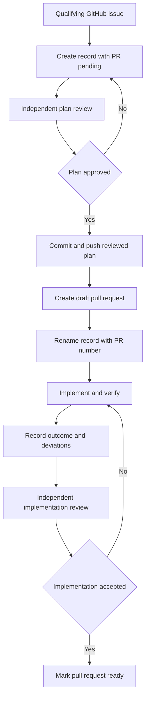

# Change Records

Change records make substantial code changes understandable before, during, and
after implementation. They explain the problem, show the current and proposed
behavior visually, preserve the reviewed plan, and record what actually changed.

A developer should be able to understand the change record without first
learning the codebase.

Use [`TEMPLATE.md`](TEMPLATE.md) to create a record.

## What a change record is

A change record is:

- the reviewed implementation plan for one pull request;
- the context a code reviewer reads before reviewing the diff;
- a permanent comparison between the approved plan and actual implementation;
- point-in-time evidence of tests, operational checks, and known limitations.

A change record is not:

- a replacement for the GitHub issue or pull request;
- a changelog or release note;
- the canonical description of current product behavior;
- an architecture document that must remain current forever.

When behavior changes, update the owning canonical documentation in the same PR.
After merge, code, executable contracts, migrations, and canonical documentation
remain authoritative.

An **independent reviewer** is a different person or agent from the author. The
reviewer inspects the issue, primary evidence, plan, and later the implementation
instead of relying only on the author's summary. An author cannot approve their
own plan or supply their own final review verdict.

## When a record is required

Require a change record when any of these are true:

- the change crosses application or ownership boundaries;
- it changes a public API, wire contract, persistent data, or migration;
- it changes security, authentication, concurrency, lifecycle, recovery,
  unknown-outcome, or deployment behavior;
- it introduces new operator-visible states, diagnostics, or failure handling;
- it needs rollout, rollback, compatibility, or data-repair planning;
- it has several implementation phases or would be difficult to review safely
  from the code diff alone.

A record is normally not required when all of these are true:

- the change is localized to one clear owner;
- it does not alter a contract, persistence, security, concurrency, recovery, or
  deployment behavior;
- the implementation is small and explained by focused tests;
- it is documentation-only, test-only, formatting, or mechanical cleanup.

Risk matters more than line count. A five-line authentication change can require
a record; a larger mechanical rename may not.

### Examples

| Change | Record? | Why |
| --- | --- | --- |
| Fix a typo in one guide | No | Documentation-only and local. |
| Add one null guard and one focused test | Usually no | Small, local, and no contract change. |
| Change runner connection lifecycle | Yes | Concurrency, lifecycle, recovery, and operations change. |
| Add a PostgreSQL migration | Yes | Persistent data and rollback behavior change. |
| Change authentication in five lines | Yes | Security risk overrides size. |
| Rename internal modules mechanically | Usually no | Size is large, but behavior is unchanged. |
| Add a feature across Core, Orchestrator, and View | Yes | Several owners and public behavior are affected. |

If classification is unclear, state the uncertainty before implementation.
Prefer a record when missing context could make review unsafe.

## Record lifecycle



### 1. Create the planning record

Substantial work needs a GitHub issue before the record is created. If no issue
exists, ask for authorization to create one; do not invent an issue ID.

Create a branch from current `origin/main`. Copy [`TEMPLATE.md`](TEMPLATE.md) to:

```text
docs/change-records/<year>/issue-<issue>-pr-pending-<short-slug>.md
```

Example:

```text
docs/change-records/2026/issue-633-pr-pending-runner-connectivity.md
```

Use one primary issue and one record per PR. List related issues, an epic, or
stacked PRs in the metadata instead of putting every ID in the filename.
Use a short lowercase ASCII slug with hyphens. Remove instructional text,
placeholder rows, and examples that do not apply to the copied record.

Use these status values:

| Status | Meaning |
| --- | --- |
| Planning | The plan is being investigated or written. |
| Plan reviewed | An independent reviewer accepted the plan. |
| Implementing | The draft PR exists and implementation is in progress. |
| Implemented | The record reflects the final reviewed implementation. |
| Superseded | Another record or PR replaced this plan. |

### 2. Establish the approved plan

Before implementation:

1. Verify the problem against current code, tests, logs, or runtime evidence.
2. Write the impact, assumptions, boundaries, proposed behavior, risks,
   diagnostics, and verification plan in simple terms.
3. Include valid Mermaid diagrams for current and proposed behavior.
4. Ask an independent reviewer to compare the issue, evidence, current code, and
   plan.
5. Address the findings and record the review result.
6. Ask the reviewer to recheck the corrections and supply the verdict.
7. Set the status to `Plan reviewed`.
8. Commit and push the reviewed planning record.

The review must challenge the root cause, scope, ownership, failure semantics,
and test plan. It must not approve the plan only because the prose is clear.
The reviewer reports findings and does not edit the record or implementation.

The reviewed planning commit becomes the **approved baseline**. It cannot name
its own commit ID. Record that ID in the immediate PR-number update described
below. Do not silently rewrite the baseline later to match the implementation.

### 3. Create the draft PR

Create a draft PR after the plan is reviewed and pushed. The PR body must link to
the rendered change record.

After GitHub assigns the PR number:

1. rename the file to include the issue and PR;
2. replace `Pending` in the metadata with the PR link;
3. set the status to `Implementing`;
4. record the approved planning commit ID in the metadata;
5. verify the diagrams in the initial pushed plan;
6. push any non-semantic diagram correction and the rename;
7. update the PR body link and verify the final rendered record before
   implementation starts.

After baseline approval, direct diagram corrections may fix syntax or layout
only. Record the correction and have the reviewer confirm that meaning did not
change. A correction that changes behavior, scope, or ownership is a plan
deviation and requires plan re-review.

Example final name:

```text
docs/change-records/2026/issue-633-pr-656-runner-connectivity.md
```

### 4. Implement against the baseline

Use the approved plan as a guide, not as permission to hide new facts. When
implementation reveals a better or necessary design:

- keep the approved plan intact;
- add the decision to the deviation table;
- explain why the original plan changed;
- state the impact on risk, tests, operations, and scope;
- request review when the deviation materially changes the solution.

Update canonical product documentation as the implementation changes current
behavior. A change record alone is not enough.

### 5. Finalize before normal code review

Before marking the PR ready:

1. describe the actual implementation in plain language;
2. add the final behavior diagram;
3. complete the deviation and decision tables;
4. replace planned checks with actual evidence;
5. separate static checks, CI qualification, and live proof;
6. list anything not verified;
7. ask an independent reviewer to compare the approved baseline, final record,
   code, tests, and documentation;
8. address findings;
9. ask the reviewer to compare every resulting code or record change again and
   supply the final verdict;
10. compare the actual diff with the approved complexity budget and explain
    material overruns;
11. set the status to `Implemented`.

The final reviewer reports findings and does not edit the record or code.

The reviewer should be able to answer:

- Does the implementation solve the verified problem?
- Does it preserve every stated invariant?
- What changed from the approved plan, and is each deviation justified?
- Do tests prove the important failure and recovery paths?
- Are logs and diagnostics safe and useful?
- Is the change record honest about what was not verified?
- Did each implementation slice stay within its complexity budget, and are any
  overruns justified by required behavior rather than scope creep?

## Keep the baseline and outcome separate

Do not edit the approved plan into a description of the finished code. Readers
must be able to compare the two without reconstructing Git history.

Use the final sections of the template:

| Planned | Implemented | Reason | Reviewer verdict |
| --- | --- | --- | --- |
| Separate EPMD failure classes | One aggregate failure class | OTP exposes the same result for both cases | Justified |

Small corrections made before plan approval can edit the plan directly. After
approval, record material changes as decisions or deviations.

## Write for understanding

Lead with the outcome and use system concepts before module names. Prefer:

> The runner stays unavailable until the control plane accepts registration.

over:

> `RunnerAgent.handle_info/2` calls `Lifecycle.mark_accepting/1`.

Include an implementation map later for reviewers who need code ownership.

## Set a complexity budget

Every implementation plan must include a rough line-count budget for each
implementation slice. The purpose is not to reward short code. It is to make the
expected shape of the work visible before implementation and to expose scope
creep or accidental over-engineering during review.

For each slice, estimate separately:

- production lines added;
- production lines deleted;
- test, fixture, example, and canonical-documentation lines added;
- those supporting lines deleted.

State what is included in the estimate. Do not count the change record itself,
generated files, dependency locks, vendored code, or formatter-only changes.
Use ranges rather than false precision. A plan should prefer the smallest design
that meets the behavior and verification requirements; large estimates must say
what real constraint drives the size.

During implementation, keep the approved estimate unchanged. Before final
review, use Git's additions and deletions to report the actual diff size per
slice. Explain any category that exceeds its upper estimate by more than 25
percent or 100 lines, whichever is smaller. Also explain materially fewer
deletions than planned, because that can mean a replaced path was left behind.
Treat an unexplained variance as a scope or design finding. If new behavior
caused it, record a plan deviation and obtain review before continuing.

Tests are essential, but their size does not make production complexity
invisible. Final review compares production code, tests, examples, and deletions
separately and asks whether a simpler implementation would preserve the same
behavior.

Use concrete examples, short paragraphs, stable terms, and explicit failure
behavior. Avoid large code excerpts. Link to code or canonical documentation
instead.

## Mermaid rules

Use diagrams only when they materially improve understanding. Good choices are:

- `flowchart` for ownership and decision flow;
- `sequenceDiagram` for calls across processes or services;
- `stateDiagram-v2` for lifecycle and recovery;
- `erDiagram` for persistent relationships.

Rules:

- keep each diagram focused on one question;
- use plain labels that do not require code knowledge;
- show failure or retry paths when they are part of the change;
- include prose before or after the diagram;
- do not put secrets, credentials, private paths, or customer data in diagrams;
- review Mermaid syntax before plan approval;
- verify that every diagram renders on GitHub after the draft PR exists and
  again before final review.

One current-state diagram and one proposed-state diagram are normally enough.
Add a final diagram only when implementation materially differs.

## Bug fixes and features

The same template supports both:

| Section | Bug fix | Feature |
| --- | --- | --- |
| Problem analysis | Symptoms, evidence, and verified root cause | User need, current limitation, and desired outcome |
| Current behavior | Failure path and misleading outcome | Existing workflow and missing capability |
| Proposed behavior | Smallest safe correction | New workflow and contract |
| Risk focus | Regression and recurrence | Compatibility, adoption, and rollout |
| Verification | Regression and recovery proof | Acceptance scenarios and boundary proof |

Delete unused prompts from the copied template. Do not keep empty sections.

## Special cases

- **Several PRs for one feature:** create one record per PR and link the parent
  issue or architecture document.
- **Several issues in one PR:** choose one primary issue for the filename and
  list the others in metadata.
- **A PR is split:** create a record for each new PR and mark the old record
  superseded if it remains in a merged branch.
- **A draft PR is abandoned:** do not merge its record only to preserve an
  abandoned plan. GitHub retains the closed draft and branch history.
- **Urgent production repair:** write the smallest safe record before code when
  possible. If immediate containment cannot wait, record why the normal gate was
  bypassed and require review before merge.

## Final checklist

- [ ] The change qualifies for a record, or the exemption is clear.
- [ ] The issue, impact, and evidence are understandable without code knowledge.
- [ ] Each implementation slice has a rough additions and deletions budget for
      production and supporting files.
- [ ] Assumptions, non-goals, and affected boundaries are explicit.
- [ ] Current and proposed Mermaid diagrams render on GitHub before implementation.
- [ ] An independent reviewer approved the plan before implementation.
- [ ] The reviewed plan commit is recorded as the baseline.
- [ ] The draft PR and final filename contain the PR number.
- [ ] Canonical documentation changed where current behavior changed.
- [ ] Actual implementation and operational behavior are documented.
- [ ] Every material deviation is listed and explained.
- [ ] Verification evidence distinguishes static checks, CI, and live proof.
- [ ] An independent reviewer compared the final implementation with the plan.
- [ ] The reviewer rechecked all changes made in response to final findings.
- [ ] Actual diff size was compared with the approved complexity budget and all
      material overruns were explained.
- [ ] No placeholder or `Pending` value remains in the final record.
