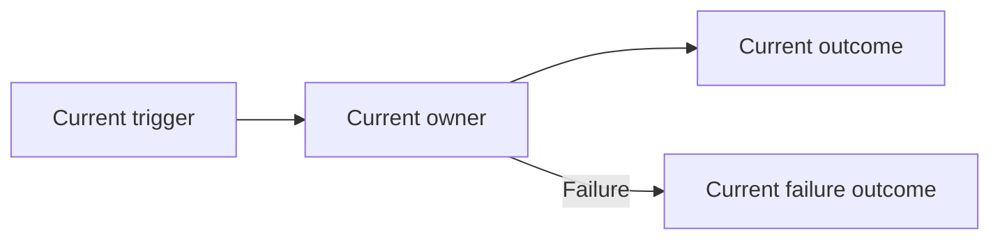
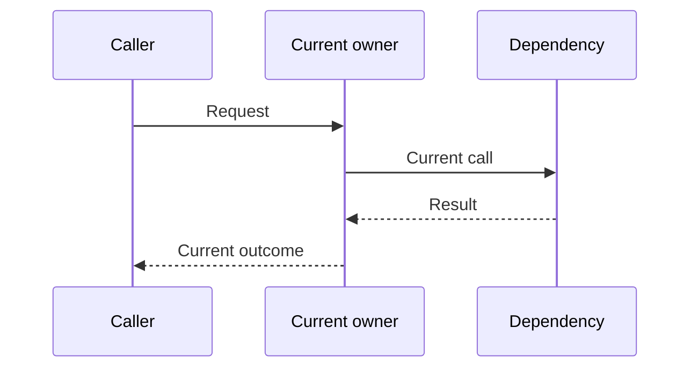
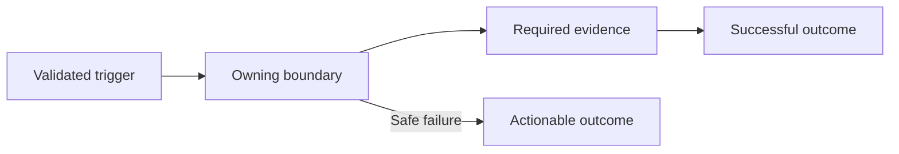
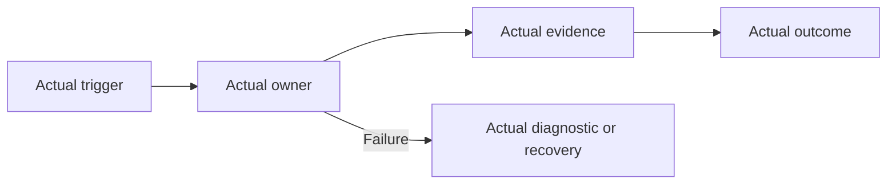

# Change Record: CHANGE_TITLE

Copy this file into the year directory. Replace every placeholder and remove
instructional text or examples that do not apply.

| Field | Value |
| --- | --- |
| Status | Planning |
| Type | Bug fix, feature, refactor, or migration |
| Primary issue | Replace with the GitHub issue link |
| Pull request | Pending |
| Related work | None |
| Affected areas | Name the applications, boundaries, or operator workflows |
| Approved plan commit | Pending independent review |
| Last updated | YYYY-MM-DD |

## One-minute summary

Explain in three to five sentences:

- what is wrong or missing;
- who or what is affected;
- what outcome this change will provide;
- why the change is substantial enough to need a record.

## Impact

Describe the user, developer, operator, security, data, or deployment impact.
Use a concrete example.

> Example: A runner process can appear healthy while it cannot claim queued
> work, so operators investigate scaling instead of the invalid hostname.

## Problem analysis

For a bug, describe the symptoms, evidence, and verified root cause.

For a feature, describe the user need, current limitation, and desired
capability. Delete the prompt that does not apply.

### Assumptions

- State each assumption that affects the design.
- Mark anything that still needs confirmation.

### Evidence

| Evidence | What it proves | What it does not prove |
| --- | --- | --- |
| Current test, log, query, or source path | Concrete finding | Remaining uncertainty |

## Current behavior

Explain the current flow in plain language.

### Current call or event sequence (optional)

Keep this diagram only when ordering, process boundaries, or concurrency matter.
Otherwise, the current-flow diagram is enough.

## Approved plan

Explain the proposed behavior without requiring the reader to know module names.

### Contracts and invariants

- State what must always be true.
- State what must never happen.
- Include failure, retry, idempotency, and unknown-outcome semantics where
  relevant.

### Scope

- List the behavior and ownership areas included.

### Non-goals

- List tempting adjacent work that this PR will not do.

### Implementation slices

| Slice | Outcome | Owner or area | Depends on |
| --- | --- | --- | --- |
| 1 | First independently verifiable outcome | Application or boundary | None |

### Complexity budget

Give rough ranges, not exact promises. Exclude this record, generated files,
dependency locks, vendored code, and formatter-only changes. Explain why a large
slice cannot be simpler.

| Slice | Production added | Production deleted | Supporting added | Supporting deleted | Main reason for the size |
| --- | ---: | ---: | ---: | ---: | --- |
| 1 | 50-100 | 0-25 | 50-100 | 0-25 | Required contract and behavior proof |

State the variance that requires explanation under the rules in
[`README.md`](README.md). Keep this approved budget unchanged during
implementation; report actuals under the outcome.

### Implementation map

Use this only after the plain-language design is clear.

| Concept | Expected code area | Responsibility |
| --- | --- | --- |
| Example owner | `apps/example/` | What this area will own |

## Operational design

### Failures and recovery

Describe failures, retry limits, timeouts, reconciliation, rollback, or manual
recovery. State which outcomes may be unknown.

### Logs and diagnostics

| Event or state | Level or surface | Safe fields | Rate limit |
| --- | --- | --- | --- |
| Example failure | Warning log and diagnostics | Stable IDs and bounded class | First and periodic |

Never include secrets, tokens, credentials, certificate contents, private paths,
customer data, or arbitrary exception terms.

### Deployment, migration, and compatibility

Describe rollout order, compatibility window, data migration, rollback, and
operator action. Remove this section only when none apply.

## Verification plan

Map each acceptance criterion to evidence.

| Acceptance criterion | Planned evidence | Owning layer |
| --- | --- | --- |
| Required behavior | Focused test or operational check | Application or boundary |

Separate:

- source and static inspection;
- focused automated tests;
- broader CI qualification;
- live deployment or runtime proof.

## Risks and open questions

| Risk or question | Impact | Mitigation or decision needed |
| --- | --- | --- |
| Example risk | What could fail | How the plan reduces or resolves it |

## Plan review

| Field | Result |
| --- | --- |
| Reviewer | Independent agent or person |
| Reviewed against | Issue, current code, evidence, and this plan |
| Findings | Pending |
| Findings addressed and rechecked | Pending |
| Verdict | Pending |

After review, address findings and commit the approved plan. Record that commit
ID in the immediate PR-number update. From that point, keep the approved plan
stable.

---

The sections below are completed during implementation and before final review.

## Implementation outcome

Explain what was actually built and its effect in plain language.
If it matches the approved plan exactly, say so and remove this extra diagram.
Keep the diagram when the actual flow materially differs.

### Actual scope and complexity

- Files and ownership areas changed:
- Ownership boundaries affected:
- Implementation complexity: Low, Moderate, or High — give one plain-language reason.
- Operational complexity: Low, Moderate, or High — give one plain-language reason.
- Canonical documentation updated:
- Actual additions, deletions, and supporting lines per approved complexity-budget slice:

## Deviations from the approved plan

Do not rewrite the approved plan to hide these differences.
If there are no deviations, delete the table and write:
`None. The implementation matched the approved plan.`

| Planned | Implemented | Reason | Impact | Reviewer verdict |
| --- | --- | --- | --- | --- |
| No deviation yet | Pending | Pending | Pending | Pending |

## Decision log

If implementation introduced no new decisions, delete the table and write:
`None. Implementation introduced no new decisions.`

| Date | Decision | Reason | Review needed |
| --- | --- | --- | --- |
| YYYY-MM-DD | Decision made during implementation | New evidence or constraint | Yes or no |

## Verification evidence

| Check | Result | Evidence boundary |
| --- | --- | --- |
| Focused test | Pending | Automated qualification, not live proof |

### Not verified

- List environment-dependent, deployment, scale, migration, or live behavior
  that was not proven.

## Final review

| Field | Result |
| --- | --- |
| Reviewer | Independent agent or person |
| Compared | Approved plan, implementation, tests, diagnostics, and docs |
| Deviations complete | Pending |
| Findings | Pending |
| Findings addressed and rechecked | Pending |
| Verdict | Pending |
