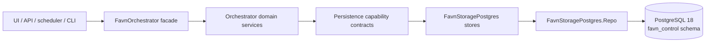
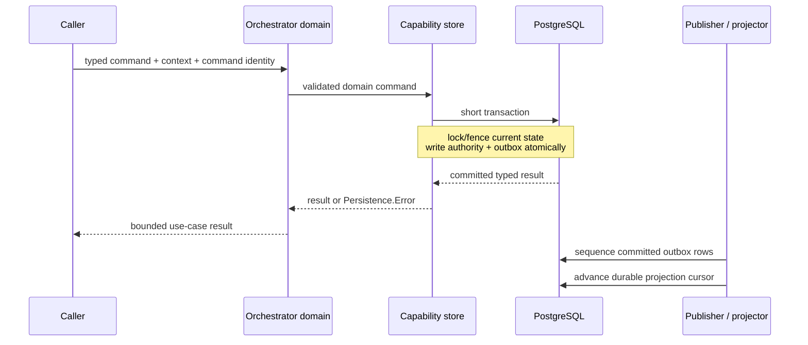

# PostgreSQL Control-Plane Storage

This document is the implementation guide for Favn's PostgreSQL 18
control-plane storage. It describes the code that exists now. The detailed
design rationale and scale budgets remain in the
[Storage V2 decision record](../../architecture/postgresql-control-plane-storage-v2.md).

## Scope

PostgreSQL stores orchestration metadata: workspaces, immutable manifests and
execution packages, deployments, runs, events, schedules, leases,
materializations, asset target generations and bindings, rebuild operations,
resource circuits and recovery candidates, backfills,
authentication, audit, logs, and repairable
projections.

It does not store customer business data, DuckLake metadata, blob data, secret
values, DuckDB state, or SQL sessions. Those are isolated per customer in the
data plane.

## Ownership and dependency direction

The dependency direction is deliberate:

- `favn_orchestrator` owns command, query, context, result, and error contracts.
- `favn_storage_postgres` depends on those contracts and implements them.
- The orchestrator does not compile against the PostgreSQL adapter. A deployment
  composition root selects `FavnStoragePostgres.Backend` at boot.
- `favn_view` calls orchestrator facades only.

`FavnOrchestrator.Persistence.Backend` composes thirteen focused store
capabilities. No 97-callback database adapter remains, and no generic
`execute/query` escape hatch is part of the contract.

## Boot composition

The OTP application specification is environment-independent. In normal dev
and production boot, `FavnOrchestrator.Application` validates configuration,
freezes the persistence runtime, and starts backend children before workers and
API listeners. Unit-test configuration sets `start_runtime: false`; integration
tests start the required components explicitly.

Production configuration is validated by
`FavnOrchestrator.ProductionRuntimeConfig`. It selects PostgreSQL, validates TLS,
pool, authentication, workspace, scheduler, and runner settings, then injects
the backend and redacted options. Local development runs that production
composition in the prebuilt control-plane container through
`Favn.Dev.ComposeLifecycle`.

The PostgreSQL backend supervisor owns:

- one Ecto repo and connection pool per orchestrator node;
- exact schema-readiness validation;
- the durable outbox publication sequencer and notification listener;
- bounded projection and maintenance workers;
- node-local bounded manifest caching.

Runtime nodes never migrate automatically. A separate migration command runs
with migration privileges before runtime deployment.

## Write path

Important properties:

- A state transition and its outbox event commit together.
- Command identities make retries deterministic; conflicting reuse is rejected.
- Ownership and claim writes require current fencing tokens.
- Persisted asset writes resolve and pin one target generation before claiming;
  projection evidence is keyed by that generation rather than deployment identity.
- Multi-node claimers use row locks and `SKIP LOCKED` where appropriate.
- Resource circuit acquisition locks requested resources in deterministic order;
  one expiring owner identity holds a half-open probe, and a terminal outcome is
  applied at most once for each run/node/attempt/resource identity.
- PostgreSQL sequences are identifiers, not transaction commit order. A durable
  sequencer assigns publication order after commit.
- Multi-step operations use transactions or `Ecto.Multi`; focused SQL is kept
  where PostgreSQL concurrency semantics must be explicit.

## Read path and boundedness

Query contracts describe an access pattern rather than exposing tables. Pages
use stable keyset cursors for growing histories. Interactive pages normally
return at most 200 rows; internal scans normally return at most 500.

Indexes align with workspace predicates, status filters, ordering, and cursor
columns. The implementation avoids list-all-plus-Elixir-filtering and N+1
loading. Large writes such as logs, deployment targets, and backfill windows are
batched.

JSONB is used only for bounded, versioned payloads that are read as a unit.
Frequently filtered, joined, ordered, fenced, or counted values are scalar
columns with constraints and indexes.

## Manifests and large SQL

Manifest publication separates compact catalog metadata from generated SQL:

1. Immutable execution packages are addressed by SHA-256 content hash.
2. `manifest_execution_packages` links each asset in a manifest to one package.
3. `manifest_versions` stores the compact manifest index and scalar counts.
4. Workspace deployments reference the global immutable manifest and persist an
   exact asset/pipeline whitelist.
5. Runtime fetches only the selected asset's package through indexed,
   workspace-authorized joins.

This prevents large SQL payloads from being repeatedly loaded during catalog,
planning, or unrelated asset execution. One immutable `run_plans` row stores the
submitted plan; mutable run snapshots retain its hash instead of rewriting the
full plan on every transition.

## Target generations

Each persisted asset target has one workspace-scoped binding. The binding points
to its active physical generation and records the desired manifest descriptor and
compatibility state. Initial planning creates a `building` generation; an ordinary
success alone does not activate it. Activation requires authoritative physical
reconciliation and a recorded fingerprint. Ordinary writes pin the resolved
generation in the run plan, claim, and immutable materialization ledger.

Asset-window and freshness projections use `evidence_generation_id` in their
identity. Persisted targets use the physical generation UUID; non-persisted
targets use their deterministic semantic-generation identity. Reads resolve the
current binding first, so evidence from a retired physical generation cannot be
presented as current evidence.

## Workspace isolation

Favn is designed for a small consultant-operated fleet of roughly 5–10 customer
companies, not public self-service SaaS.

- One customer maps to one workspace initially.
- Workspace-owned primary and foreign keys include `workspace_id` where ownership
  crosses tables.
- Customer requests receive a workspace context and cannot select another
  workspace.
- Consultant/platform operations require a separately authorized platform
  context.
- Shared immutable manifests and packages can be reused across workspaces.
- Each deployment is an exact target whitelist, supporting common assets and
  customer-specific assets in one repository.
- Customer business data, blob accounts, DuckLake metadata stores, and secret
  stores remain physically separate from this shared control plane.

PostgreSQL row-level security is not currently used because customers never
receive database access and the application must support explicit platform-wide
operations. Adding direct database access would require a separate security
design; it is not covered by the current threat model.

## Caches and notifications

Caches are bounded, node-local accelerators:

- compact immutable manifest releases may be cached;
- runner-compiled lookup state has its own bounded cache and lease lifecycle;
- package fetching remains content-addressed and authorization-checked;
- cache keys include workspace/deployment identity where data is tenant-specific.

PostgreSQL `NOTIFY` and local PubSub only reduce wake-up latency. Durable outbox
rows and persisted cursors make restart and missed-notification recovery correct.
Redis is not required for correctness or initial multi-node scale.

## Failure and recovery behavior

- Startup fails closed for invalid configuration, missing migrations, wrong schema
  shape, unavailable backend modules, or invalid runtime privileges.
- Lost owners cannot renew or commit with an old fencing token.
- Recovery claims abandoned runs in bounded batches and reconstructs work from
  pinned manifests, immutable run plans, and persisted checkpoints.
- Derived projections are repairable from authoritative rows/outbox events.
- Unknown transaction outcomes are resolved using the original command identity.
- Circuit and recovery rows survive orchestrator restarts. A successful probe
  closes the circuit before opt-in candidates are claimed into linked runs; the
  terminal source run remains immutable. A bounded supervised sweep finds
  claimable workspace/resource pairs, and deterministic run identity prevents
  duplicate recovery submissions after an uncertain completion update.
- Retention and purge operations are bounded maintenance jobs; immutable packages
  are removed only when no manifest link references them.

## Where to change code

| Concern | Owner |
| --- | --- |
| Command/query/result semantics | `apps/favn_orchestrator/lib/favn_orchestrator/persistence/` |
| Backend composition | `apps/favn_storage_postgres/lib/favn_storage_postgres/backend.ex` |
| Capability implementations | `apps/favn_storage_postgres/lib/favn_storage_postgres/*/` |
| Ecto schemas | `apps/favn_storage_postgres/lib/favn_storage_postgres/schemas/` |
| Migrations | `apps/favn_storage_postgres/lib/favn_storage_postgres/migrations/` |
| Runtime configuration | `FavnOrchestrator.ProductionRuntimeConfig` and `FavnStoragePostgres.Config` |
| Local composition | `Favn.Dev.ComposeLifecycle` and the prebuilt control-plane release |
| Operations | [`postgresql_operator_runbook.md`](../../production/postgresql_operator_runbook.md) |
| Tables and relationships | [`data-model.md`](data-model.md) |
| Tests | [`testing.md`](testing.md) |

## Design constraints for future changes

- Do not add a direct orchestrator dependency on `favn_storage_postgres`; that
  creates the wrong dependency direction and a cycle.
- Do not add generic CRUD callbacks to avoid naming a domain operation.
- Do not add unbounded list APIs or offset pagination for operational histories.
- Do not place customer data-plane credentials or data in this schema.
- Do not make notifications or caches authoritative.
- Schema changes require migrations, readiness updates, PostgreSQL integration
  tests, and an update to the ER documentation.
