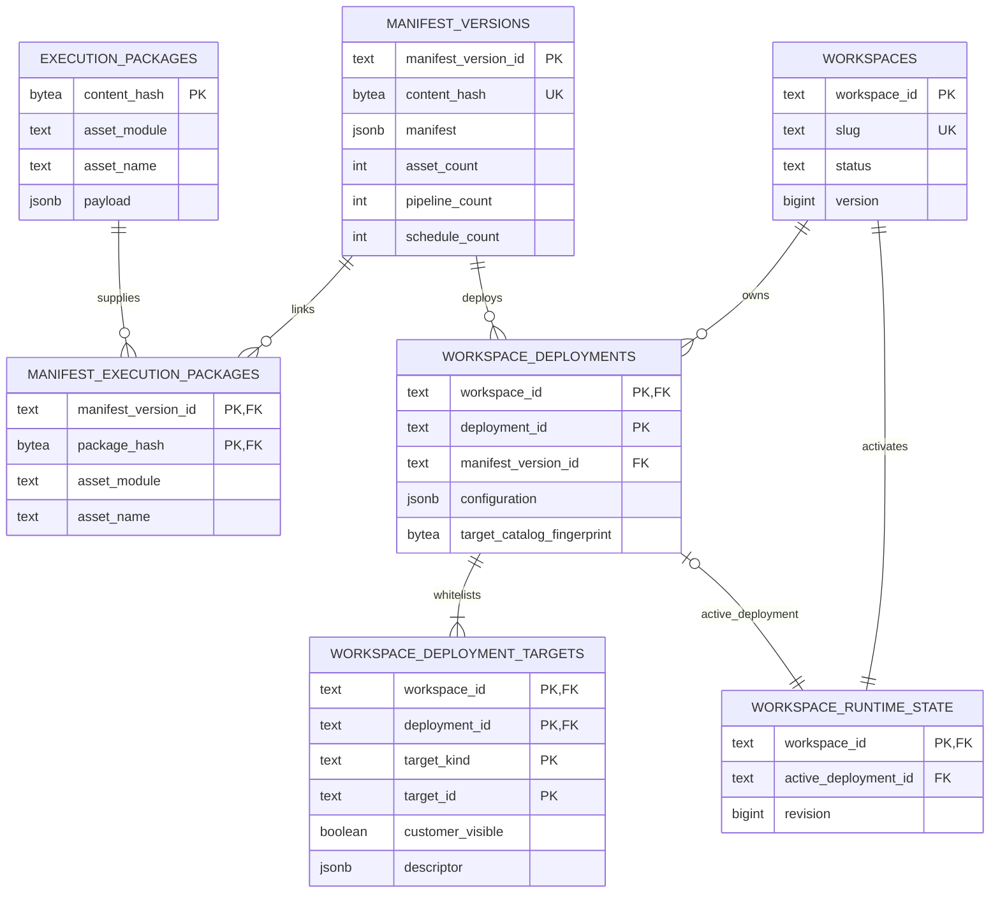
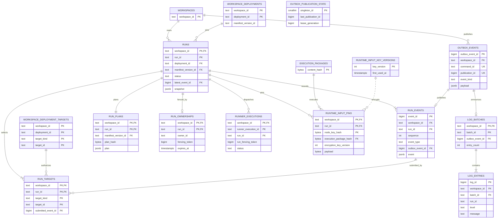
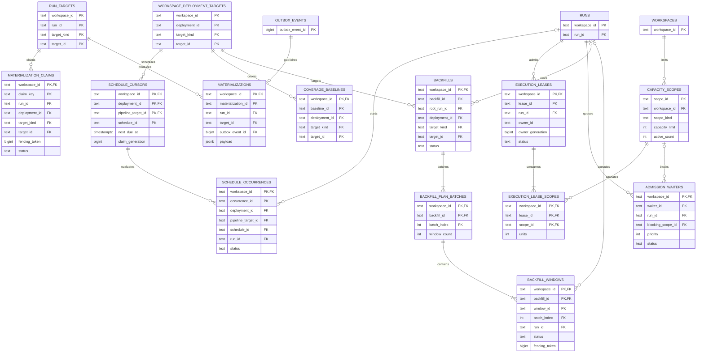

# PostgreSQL Data Model

All Favn control-plane tables live in the `favn_control` schema. PostgreSQL 18
migrations in `apps/favn_storage_postgres/lib/favn_storage_postgres/migrations/`
are authoritative; this document is the human-readable model.

The diagrams are split by domain so relationships remain readable. Solid
relationships represent database foreign keys. Dotted relationships are logical
projection/source relationships that are intentionally not enforced as foreign
keys.

## Registry, manifests, and deployments

Manifests and execution packages are global, immutable, content-addressed data.
Deployments bind a manifest plus workspace configuration to one customer. The
target table is the exact asset/pipeline authorization list for that deployment.

## Runs, events, execution, logs, and outbox

`RUNS` and `RUN_EVENTS` have deferred circular foreign keys: the run points at
its submitted/latest events, while every event points back to its run. This lets
one transaction establish authoritative snapshot and event consistency.
`RUN_PLANS` is immutable; `RUNS.snapshot` contains mutable state and the plan hash.

## Scheduling, admission, materialization, and backfills

Claims and leases are durable multi-node coordination records. Expiry allows
recovery; fencing generations prevent stale owners from committing after a
claim is reused.

## Identity, audit, maintenance, and projections

```mermaid
erDiagram
    WORKSPACES {
        text workspace_id PK
    }
    AUTH_ACTORS {
        text actor_id PK
        text normalized_username UK
        text status
        bigint version
    }
    AUTH_CREDENTIALS {
        text actor_id PK, FK
        text password_hash
        text algorithm
        bigint version
    }
    AUTH_SESSIONS {
        text session_id PK
        text actor_id FK
        bytea token_hash UK
        text status
        timestamptz expires_at
    }
    AUTH_WORKSPACE_MEMBERSHIPS {
        text workspace_id PK, FK
        text actor_id PK, FK
        text_array roles
        text status
    }
    AUTH_PLATFORM_GRANTS {
        text actor_id PK, FK
        text_array roles
        text status
    }
    AUTH_AUDIT_ENTRIES {
        bigint audit_id PK
        text workspace_id
        text principal_id
        text action
    }
    AUTH_PLATFORM_AUDIT_ENTRIES {
        bigint audit_id PK
        text principal_id
        text action
    }
    IDEMPOTENCY_RECORDS {
        text workspace_id PK
        text operation PK
        text principal_kind PK
        text principal_id PK
        bytea key_hash PK
        text status
        jsonb response
    }
    MAINTENANCE_JOBS {
        text job_id PK
        text scope_kind
        text workspace_id
        text status
        bigint fencing_token
        jsonb cursor
    }
    PROJECTION_CURSORS {
        text projector_name PK
        int shard_id PK
        bigint last_publication_id
        bigint fencing_token
    }
    PROJECTION_FAILURES {
        bigint failure_id PK
        text projector_name
        int shard_id
        bigint publication_id
        text workspace_id
    }
    EXECUTION_GROUP_OVERVIEWS {
        text workspace_id PK
        text root_run_id PK
        text status
        bigint source_publication_id
    }
    BACKFILL_OVERVIEWS {
        text workspace_id PK
        text backfill_id PK
        text status
        bigint source_publication_id
    }
    TARGET_STATUSES {
        text workspace_id PK
        text deployment_id PK
        text target_kind PK
        text target_id PK
        text status
        bigint source_publication_id
    }
    ASSET_WINDOW_STATES {
        text workspace_id PK
        text manifest_version_id PK
        text target_id PK
        text window_key PK
        text status
        bigint source_publication_id
    }
    ASSET_FRESHNESS_STATES {
        text workspace_id PK
        text deployment_id PK
        text target_id PK
        text freshness_key PK
        text status
        bigint source_publication_id
    }

    AUTH_ACTORS ||--o| AUTH_CREDENTIALS : authenticates
    AUTH_ACTORS ||--o{ AUTH_SESSIONS : opens
    AUTH_ACTORS ||--o{ AUTH_WORKSPACE_MEMBERSHIPS : receives
    WORKSPACES ||--o{ AUTH_WORKSPACE_MEMBERSHIPS : grants
    AUTH_ACTORS ||--o| AUTH_PLATFORM_GRANTS : receives
    WORKSPACES ||..o{ AUTH_AUDIT_ENTRIES : scopes
    AUTH_ACTORS ||..o{ AUTH_AUDIT_ENTRIES : acts
    AUTH_ACTORS ||..o{ AUTH_PLATFORM_AUDIT_ENTRIES : acts
    WORKSPACES ||..o{ IDEMPOTENCY_RECORDS : scopes
    WORKSPACES ||..o{ MAINTENANCE_JOBS : scopes
    PROJECTION_CURSORS ||..o{ PROJECTION_FAILURES : records
    PROJECTION_CURSORS ||..o{ EXECUTION_GROUP_OVERVIEWS : builds
    PROJECTION_CURSORS ||..o{ BACKFILL_OVERVIEWS : builds
    PROJECTION_CURSORS ||..o{ TARGET_STATUSES : builds
    PROJECTION_CURSORS ||..o{ ASSET_WINDOW_STATES : builds
    PROJECTION_CURSORS ||..o{ ASSET_FRESHNESS_STATES : builds
```

Passwords use Argon2id hashes and sessions store token hashes, never raw tokens.
Platform grants are separate from workspace membership so cross-workspace access
is explicit. Projection tables are derived, bounded read models and can be
repaired from authoritative publications.

## Complete table catalog

| Domain | Tables | Authority |
| --- | --- | --- |
| Workspace and registry | `workspaces`, `manifest_versions`, `execution_packages`, `manifest_execution_packages`, `workspace_deployments`, `workspace_deployment_targets`, `workspace_runtime_state` | Authoritative |
| Runs and execution | `runs`, `run_events`, `run_plans`, `run_targets`, `run_ownerships`, `runner_executions`, `runtime_input_pins`, `runtime_input_key_versions` | Authoritative |
| Publication | `outbox_events`, `outbox_publication_state` | Authoritative delivery ledger |
| Scheduling | `schedule_cursors`, `schedule_occurrences` | Authoritative |
| Admission | `capacity_scopes`, `execution_leases`, `execution_lease_scopes`, `admission_waiters` | Authoritative coordination |
| Materialization | `materialization_claims`, `materializations`, `coverage_baselines` | Authoritative |
| Backfills | `backfills`, `backfill_plan_batches`, `backfill_windows` | Authoritative |
| Logs | `log_batches`, `log_entries` | Authoritative operational history subject to retention |
| Identity and audit | `auth_actors`, `auth_credentials`, `auth_sessions`, `auth_workspace_memberships`, `auth_platform_grants`, `auth_audit_entries`, `auth_platform_audit_entries` | Authoritative |
| API/maintenance | `idempotency_records`, `maintenance_jobs` | Authoritative coordination |
| Projection infrastructure | `projection_cursors`, `projection_failures` | Durable projector state |
| Read projections | `execution_group_overviews`, `backfill_overviews`, `target_statuses`, `asset_window_states`, `asset_freshness_states` | Derived and repairable |
| Ecto | `schema_migrations` | Migration bookkeeping |

There are 48 application/schema tables including `schema_migrations`. Tables
without direct foreign keys still require workspace-scoped application contracts;
their lack of an FK is not permission to perform unscoped reads.

## Modeling rules

- Workspace-owned relationships use composite keys so the database rejects
  cross-workspace references.
- Global immutable content uses SHA-256 hashes and is shared safely.
- Fencing tokens and claim generations are monotonically increasing scalars.
- JSONB payloads are bounded and versioned; queryable lifecycle fields are scalar.
- Growing histories use identity keys plus workspace-aware keyset indexes.
- Derived projections retain a source publication cursor and are repairable.
- Deletion is conservative: most operational relationships use `RESTRICT` and
  retention runs through explicit maintenance operations.
