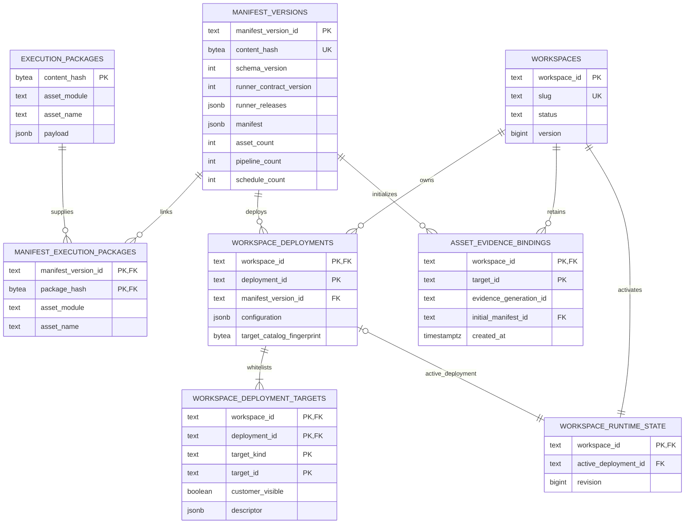
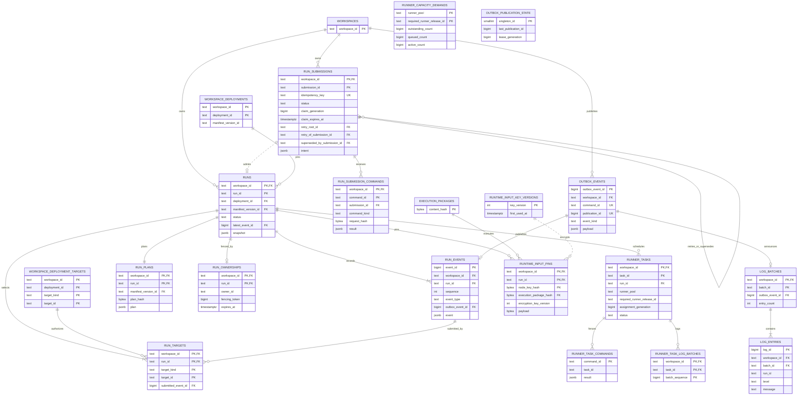

# PostgreSQL Data Model

All Favn control-plane tables live in the `favn_control` schema. PostgreSQL 18
migrations in `apps/favn_storage_postgres/lib/favn_storage_postgres/migrations/`
are authoritative; this document is the human-readable model.

The diagrams are split by domain so relationships remain readable. Solid
relationships represent database foreign keys. Dotted relationships are logical
projection/source relationships that are intentionally not enforced as foreign
keys.

## Registry, manifests, and deployments

```mermaid
erDiagram
    WORKSPACES {
        text workspace_id PK
        text slug UK
        text status
        bigint version
    }
    MANIFEST_VERSIONS {
        text manifest_version_id PK
        bytea content_hash UK
        int schema_version
        int runner_contract_version
        jsonb runner_releases
        jsonb manifest
        int asset_count
        int pipeline_count
        int schedule_count
    }
    EXECUTION_PACKAGES {
        bytea content_hash PK
        text asset_module
        text asset_name
        jsonb payload
    }
    MANIFEST_EXECUTION_PACKAGES {
        text manifest_version_id PK, FK
        bytea package_hash PK, FK
        text asset_module
        text asset_name
    }
    WORKSPACE_DEPLOYMENTS {
        text workspace_id PK, FK
        text deployment_id PK
        text manifest_version_id FK
        jsonb configuration
        bytea target_catalog_fingerprint
    }
    WORKSPACE_DEPLOYMENT_TARGETS {
        text workspace_id PK, FK
        text deployment_id PK, FK
        text target_kind PK
        text target_id PK
        boolean customer_visible
        jsonb descriptor
    }
    WORKSPACE_RUNTIME_STATE {
        text workspace_id PK, FK
        text active_deployment_id FK
        bigint revision
    }
    ASSET_EVIDENCE_BINDINGS {
        text workspace_id PK, FK
        text target_id PK
        text evidence_generation_id
        text initial_manifest_id FK
        timestamptz created_at
    }

    MANIFEST_VERSIONS ||--o{ MANIFEST_EXECUTION_PACKAGES : links
    EXECUTION_PACKAGES ||--o{ MANIFEST_EXECUTION_PACKAGES : supplies
    WORKSPACES ||--o{ WORKSPACE_DEPLOYMENTS : owns
    MANIFEST_VERSIONS ||--o{ WORKSPACE_DEPLOYMENTS : deploys
    WORKSPACE_DEPLOYMENTS ||--|{ WORKSPACE_DEPLOYMENT_TARGETS : whitelists
    WORKSPACES ||--|| WORKSPACE_RUNTIME_STATE : activates
    WORKSPACE_DEPLOYMENTS o|--|| WORKSPACE_RUNTIME_STATE : active_deployment
    WORKSPACES ||--o{ ASSET_EVIDENCE_BINDINGS : retains
    MANIFEST_VERSIONS ||--o{ ASSET_EVIDENCE_BINDINGS : initializes
```

Manifests and execution packages are global, immutable, content-addressed data.
Deployments bind a manifest plus workspace configuration to one customer. The
target table is the exact asset/pipeline authorization list for that deployment.
The immutable manifest row is also the authority for the runner release required
by that deployment; the value is not duplicated on `workspace_deployments`.
Historical manifests from schema versions before the runner-release contract keep
a null binding for audit only and cannot become active.

`manifest_versions.content_hash` is the authoritative unique deduplication key.
New authoring defaults the version ID to `mv_` plus the full hexadecimal content
hash, but PostgreSQL intentionally does not enforce that formula: imported and
historical rows may have explicit IDs. Re-publishing their content returns the
existing row and leaves all deployment and run references unchanged.

## Runs, events, execution, logs, and outbox

```mermaid
erDiagram
    WORKSPACES {
        text workspace_id PK
    }
    WORKSPACE_DEPLOYMENTS {
        text workspace_id PK
        text deployment_id PK
        text manifest_version_id
    }
    WORKSPACE_DEPLOYMENT_TARGETS {
        text workspace_id PK
        text deployment_id PK
        text target_kind PK
        text target_id PK
    }
    RUNS {
        text workspace_id PK, FK
        text run_id PK
        text deployment_id FK
        text manifest_version_id FK
        text status
        bigint latest_event_id FK
        jsonb snapshot
    }
    RUN_SUBMISSIONS {
        text workspace_id PK, FK
        text submission_id PK
        text idempotency_key UK
        text status
        bigint claim_generation
        timestamptz claim_expires_at
        text retry_root_id FK
        text retry_of_submission_id FK
        text superseded_by_submission_id FK
        jsonb intent
    }
    RUN_SUBMISSION_COMMANDS {
        text workspace_id PK, FK
        text command_id PK
        text submission_id FK
        text command_kind
        bytea request_hash
        jsonb result
    }
    RUN_EVENTS {
        bigint event_id PK
        text workspace_id FK
        text run_id FK
        int sequence
        text event_type
        bigint outbox_event_id FK
        jsonb event
    }
    RUN_PLANS {
        text workspace_id PK, FK
        text run_id PK, FK
        text manifest_version_id FK
        bytea plan_hash
        jsonb plan
    }
    RUN_TARGETS {
        text workspace_id PK, FK
        text run_id PK, FK
        text target_kind PK
        text target_id PK
        bigint submitted_event_id FK
    }
    RUN_OWNERSHIPS {
        text workspace_id PK, FK
        text run_id PK, FK
        text owner_id
        bigint fencing_token
        timestamptz expires_at
    }
    RUNNER_TASKS {
        text workspace_id PK, FK
        text task_id PK
        text run_id FK
        text runner_pool
        text required_runner_release_id
        bigint assignment_generation
        text status
    }
    RUNNER_TASK_COMMANDS {
        text command_id PK
        text task_id
        jsonb result
    }
    RUNNER_TASK_LOG_BATCHES {
        text workspace_id PK, FK
        text task_id PK, FK
        bigint batch_sequence PK
    }
    RUNNER_CAPACITY_DEMANDS {
        text runner_pool PK
        text required_runner_release_id PK
        bigint outstanding_count
        bigint queued_count
        bigint active_count
    }
    RUNTIME_INPUT_PINS {
        text workspace_id PK, FK
        text run_id PK, FK
        bytea node_key_hash PK
        bytea execution_package_hash FK
        int encryption_key_version
        bytea payload
    }
    RUNTIME_INPUT_KEY_VERSIONS {
        int key_version PK
        timestamptz first_used_at
    }
    OUTBOX_EVENTS {
        bigint outbox_event_id PK
        text workspace_id FK
        text command_id UK
        bigint publication_id UK
        text event_kind
        jsonb payload
    }
    OUTBOX_PUBLICATION_STATE {
        smallint singleton_id PK
        bigint last_publication_id
        bigint lease_generation
    }
    LOG_BATCHES {
        text workspace_id PK, FK
        text batch_id PK
        bigint outbox_event_id FK
        int entry_count
    }
    LOG_ENTRIES {
        bigint log_id PK
        text workspace_id FK
        text batch_id FK
        text run_id
        text level
        text message
    }
    EXECUTION_PACKAGES {
        bytea content_hash PK
    }

    WORKSPACES ||--o{ RUNS : owns
    WORKSPACES ||--o{ RUN_SUBMISSIONS : owns
    RUN_SUBMISSIONS ||--o{ RUN_SUBMISSION_COMMANDS : receives
    RUN_SUBMISSIONS ||..o| RUNS : admits
    RUN_SUBMISSIONS ||--o{ RUN_SUBMISSIONS : retries_or_supersedes
    WORKSPACE_DEPLOYMENTS ||--o{ RUNS : pins
    RUNS ||--|{ RUN_EVENTS : records
    OUTBOX_EVENTS ||--o| RUN_EVENTS : publishes
    RUNS ||--|| RUN_PLANS : plans
    RUNS ||--|{ RUN_TARGETS : selects
    WORKSPACE_DEPLOYMENT_TARGETS ||--o{ RUN_TARGETS : authorizes
    RUN_EVENTS ||--o{ RUN_TARGETS : submitted_by
    RUNS ||--o| RUN_OWNERSHIPS : fenced_by
    RUNS ||--o{ RUNNER_TASKS : schedules
    RUNNER_TASKS ||--o{ RUNNER_TASK_COMMANDS : fences
    RUNNER_TASKS ||--o{ RUNNER_TASK_LOG_BATCHES : logs
    RUNS ||--o{ RUNTIME_INPUT_PINS : pins
    EXECUTION_PACKAGES ||--o{ RUNTIME_INPUT_PINS : executes
    RUNTIME_INPUT_KEY_VERSIONS ||..o{ RUNTIME_INPUT_PINS : encrypts
    WORKSPACES ||--o{ OUTBOX_EVENTS : publishes
    OUTBOX_EVENTS ||--o| LOG_BATCHES : announces
    LOG_BATCHES ||--|{ LOG_ENTRIES : contains
```

`RUNS` and `RUN_EVENTS` have deferred circular foreign keys: the run points at
its submitted/latest events, while every event points back to its run. This lets
one transaction establish authoritative snapshot and event consistency.
`RUN_PLANS` is immutable; `RUNS.snapshot` contains mutable state and the plan hash.
The run snapshot also pins the complete `runner_releases` map beside the immutable
deployment ID, manifest version ID, and manifest content hash. The map is checked
against the referenced manifest before insert and cannot change on a transition.
Each `RUNNER_TASKS` row then pins the one exact pool and release required by that
asset or operation.

Runner tasks are authoritative from enqueue through claim, assignment lease,
fenced result delivery, acknowledgement, cancellation, and recovery. Capacity
demand is maintained transactionally per pool/release partition. Connected BEAM
runner membership is intentionally process-local and is not a database table.

`RUN_SUBMISSIONS` is authoritative before `RUNS` exists, so its intended
deployment, manifest, target, run identity, redacted authority, and normalized
intent are stored without a run foreign key. `submitted` is nevertheless
accepted only after the exact run, deployment, manifest, and requested target
rows exist. Asset requests require the requested primary target row; pipeline
requests use their exact non-primary pipeline row. Submission and run creation
share one workspace/run advisory lock so their separate tables cannot race.
Authority is an allowlisted audit snapshot derived from the
validated workspace context; it is not an authorization credential. Queued work has no claim;
preparing/admitting work has an expiring owner plus fencing generation; terminal
rows have no live claim. Safe retries and supersession use workspace-scoped
self-references, and every linked retry carries a new workspace-unique run
identity. `RUN_SUBMISSION_COMMANDS` stores bounded submission-id
references rather than copied intent, and has a direct workspace foreign key so
an empty claim receipt cannot create an unowned tenant identity. Nonterminal
receipts also store a small status/owner/generation result fence. A seven-day
command window plus indexed incremental pruning bounds polling and renewal
receipt growth without allowing an expired command to act again.

## Scheduling, admission, materialization, and backfills

```mermaid
erDiagram
    WORKSPACES {
        text workspace_id PK
    }
    WORKSPACE_DEPLOYMENT_TARGETS {
        text workspace_id PK
        text deployment_id PK
        text target_kind PK
        text target_id PK
    }
    RUNS {
        text workspace_id PK
        text run_id PK
    }
    RUN_TARGETS {
        text workspace_id PK
        text run_id PK
        text target_kind PK
        text target_id PK
    }
    SCHEDULE_CURSORS {
        text workspace_id PK, FK
        text deployment_id PK, FK
        text pipeline_target_id PK, FK
        text schedule_id PK
        timestamptz next_due_at
        bigint claim_generation
    }
    SCHEDULE_OCCURRENCES {
        text workspace_id PK, FK
        text occurrence_id PK
        text deployment_id FK
        text pipeline_target_id FK
        text schedule_id FK
        text run_id FK
        text status
    }
    CAPACITY_SCOPES {
        text scope_id PK
        text workspace_id FK
        text scope_kind
        int capacity_limit
        int active_count
    }
    EXECUTION_LEASES {
        text workspace_id PK, FK
        text lease_id PK
        text run_id FK
        text owner_id
        bigint owner_generation
        text status
    }
    EXECUTION_LEASE_SCOPES {
        text workspace_id PK, FK
        text lease_id PK, FK
        text scope_id PK, FK
        int units
    }
    ADMISSION_WAITERS {
        text workspace_id PK, FK
        text waiter_id PK
        text run_id FK
        text blocking_scope_id FK
        int priority
        text status
    }
    RESOURCE_CIRCUITS {
        text workspace_id PK
        text resource_kind PK
        text resource_name PK
        text state
        int consecutive_failures
        int failure_threshold
        bigint probe_after_ms
        timestamptz next_probe_at
        text probe_owner_id
        timestamptz probe_expires_at
    }
    RESOURCE_CIRCUIT_OUTCOMES {
        text workspace_id PK
        text outcome_id PK
        text run_id
        text asset_step_id
        int attempt
        text resource_kind
        text resource_name
        text status
    }
    RESOURCE_RECOVERY_CANDIDATES {
        text workspace_id PK
        text candidate_id PK
        text source_run_id
        text node_key
        text resource_kind
        text resource_name
        text status
        timestamptz expires_at
        text recovery_run_id
    }
    MATERIALIZATION_CLAIMS {
        text workspace_id PK, FK
        text claim_key PK
        text run_id FK
        text deployment_id FK
        text target_kind FK
        text target_id FK
        uuid target_generation_id FK
        text evidence_generation_id
        bigint fencing_token
        text status
    }
    MATERIALIZATIONS {
        text workspace_id PK, FK
        text materialization_id PK
        text run_id FK
        text target_id FK
        uuid target_generation_id FK
        text evidence_generation_id
        bigint outbox_event_id FK
        jsonb payload
    }
    ASSET_TARGET_GENERATIONS {
        text workspace_id PK, FK
        text target_id PK
        uuid target_generation_id PK
        text status
        text creating_descriptor_hash
        text active_descriptor_hash
    }
    ASSET_TARGET_BINDINGS {
        text workspace_id PK, FK
        text target_id PK
        uuid active_generation_id FK
        text desired_manifest_id FK
        text compatibility_status
    }
    REBUILD_OPERATIONS {
        text workspace_id PK, FK
        text operation_id PK
        text root_target_id
        uuid candidate_generation_id FK
        text state
        text phase
    }
    REBUILD_PLAN_ACTIONS {
        text workspace_id PK, FK
        text operation_id PK, FK
        text target_id PK
        text action
        text status
    }
    REBUILD_WINDOWS {
        text workspace_id PK, FK
        text operation_id PK, FK
        text target_id PK, FK
        text item_id PK
        text status
        bigint fencing_token
    }
    TARGET_OPERATION_LOCKS {
        text workspace_id PK, FK
        text target_id PK
        text operation_id
        text operation_type
        bigint fencing_token
    }
    TARGET_RECOVERY_OPERATIONS {
        text workspace_id PK, FK
        text operation_id PK
        text target_id FK
        uuid target_generation_id FK
        text materialization_id FK
        text state
        bigint version
    }
    COVERAGE_BASELINES {
        text workspace_id PK, FK
        text baseline_id PK
        text deployment_id FK
        text target_kind FK
        text target_id FK
    }
    BACKFILLS {
        text workspace_id PK, FK
        text backfill_id PK
        text root_run_id FK
        text deployment_id FK
        text target_kind FK
        text target_id FK
        text status
    }
    BACKFILL_PLAN_BATCHES {
        text workspace_id PK, FK
        text backfill_id PK, FK
        int batch_index PK
        int window_count
    }
    BACKFILL_WINDOWS {
        text workspace_id PK, FK
        text backfill_id PK, FK
        text window_id PK
        int batch_index FK
        text run_id FK
        text status
        bigint fencing_token
    }
    OUTBOX_EVENTS {
        bigint outbox_event_id PK
    }

    WORKSPACE_DEPLOYMENT_TARGETS ||--o{ SCHEDULE_CURSORS : schedules
    SCHEDULE_CURSORS ||--o{ SCHEDULE_OCCURRENCES : evaluates
    RUNS o|--o{ SCHEDULE_OCCURRENCES : starts
    WORKSPACES ||--o{ CAPACITY_SCOPES : limits
    RUNS ||--o{ EXECUTION_LEASES : admits
    EXECUTION_LEASES ||--|{ EXECUTION_LEASE_SCOPES : consumes
    CAPACITY_SCOPES ||--o{ EXECUTION_LEASE_SCOPES : allocates
    RUNS ||--o{ ADMISSION_WAITERS : queues
    CAPACITY_SCOPES o|--o{ ADMISSION_WAITERS : blocks
    WORKSPACES ||--o{ RESOURCE_CIRCUITS : protects
    RUNS ||--o{ RESOURCE_CIRCUIT_OUTCOMES : reports
    RUNS ||--o{ RESOURCE_RECOVERY_CANDIDATES : originates
    RUN_TARGETS ||--o{ MATERIALIZATION_CLAIMS : claims
    RUN_TARGETS ||--o{ MATERIALIZATIONS : produces
    ASSET_TARGET_GENERATIONS ||--o{ MATERIALIZATION_CLAIMS : pins
    ASSET_TARGET_GENERATIONS ||--o{ MATERIALIZATIONS : proves
    ASSET_TARGET_GENERATIONS ||--o| ASSET_TARGET_BINDINGS : activates
    ASSET_TARGET_GENERATIONS ||--o{ TARGET_RECOVERY_OPERATIONS : recovers
    REBUILD_OPERATIONS ||--|{ REBUILD_PLAN_ACTIONS : plans
    REBUILD_PLAN_ACTIONS ||--o{ REBUILD_WINDOWS : expands
    OUTBOX_EVENTS ||--o| MATERIALIZATIONS : publishes
    WORKSPACE_DEPLOYMENT_TARGETS ||--o{ COVERAGE_BASELINES : covers
    WORKSPACE_DEPLOYMENT_TARGETS ||--o{ BACKFILLS : targets
    RUNS o|--o{ BACKFILLS : roots
    BACKFILLS ||--|{ BACKFILL_PLAN_BATCHES : batches
    BACKFILL_PLAN_BATCHES ||--|{ BACKFILL_WINDOWS : contains
    RUNS o|--o{ BACKFILL_WINDOWS : executes
```

Claims and leases are durable multi-node coordination records. Expiry allows
recovery; fencing generations prevent stale owners from committing after a
claim is reused. Resource circuits use an exclusive expiring half-open probe;
their outcome ledger prevents duplicate terminal updates. Recovery candidates
link safe remaining work to an immutable terminal source run and, once claimed,
to a separate recovery run.

`rebuild_operations` is the authoritative lifecycle and immutable plan envelope.
`rebuild_plan_actions` checkpoints ordered target-level work;
`rebuild_windows` freezes logical full-load, empty-generation, or window items
and their claim/outcome state. Candidate generations remain linked to their
creating operation. `target_operation_locks` excludes concurrent normal writes
and other rebuilds with expiring, fenced ownership. Operator histories page on
workspace plus descending insertion/operation identity, with a separate state
prefix index.

`target_recovery_operations` stores planning intent before runner evidence is
requested, then immutable plans and the durable `planning` → `planned` →
`applying` → `succeeded | failed | outcome_unknown` lifecycle for
interrupted initial-generation recovery. Each operation references its exact
generation and successful materialization. It shares `target_operation_locks`
with rebuilds so activation is fenced against concurrent writes.

## Identity, audit, maintenance, and projections

```mermaid
erDiagram
    WORKSPACES {
        text workspace_id PK
    }
    AUTH_ACTORS {
        text actor_id PK
        text normalized_username UK
        text status
        bigint version
    }
    AUTH_CREDENTIALS {
        text actor_id PK, FK
        text password_hash
        text algorithm
        bigint version
    }
    AUTH_SESSIONS {
        text session_id PK
        text actor_id FK
        bytea token_hash UK
        text status
        timestamptz expires_at
    }
    AUTH_WORKSPACE_MEMBERSHIPS {
        text workspace_id PK, FK
        text actor_id PK, FK
        text_array roles
        text status
    }
    AUTH_PLATFORM_GRANTS {
        text actor_id PK, FK
        text_array roles
        text status
    }
    AUTH_AUDIT_ENTRIES {
        bigint audit_id PK
        text workspace_id
        text principal_id
        text action
    }
    AUTH_PLATFORM_AUDIT_ENTRIES {
        bigint audit_id PK
        text principal_id
        text action
    }
    IDEMPOTENCY_RECORDS {
        text workspace_id PK
        text operation PK
        text principal_kind PK
        text principal_id PK
        bytea key_hash PK
        text status
        jsonb response
    }
    MAINTENANCE_JOBS {
        text job_id PK
        text scope_kind
        text workspace_id
        text status
        bigint fencing_token
        jsonb cursor
    }
    PROJECTION_CURSORS {
        text projector_name PK
        int shard_id PK
        bigint last_publication_id
        bigint fencing_token
    }
    PROJECTION_FAILURES {
        bigint failure_id PK
        text projector_name
        int shard_id
        bigint publication_id
        text workspace_id
    }
    EXECUTION_GROUP_OVERVIEWS {
        text workspace_id PK
        text root_run_id PK
        text status
        bigint source_publication_id
    }
    BACKFILL_OVERVIEWS {
        text workspace_id PK
        text backfill_id PK
        text status
        bigint source_publication_id
    }
    TARGET_STATUSES {
        text workspace_id PK
        text deployment_id PK
        text target_kind PK
        text target_id PK
        text status
        bigint source_publication_id
    }
    ASSET_WINDOW_STATES {
        text workspace_id PK
        text evidence_generation_id PK
        text target_id PK
        text window_key PK
        text status
        bigint source_publication_id
    }
    ASSET_FRESHNESS_STATES {
        text workspace_id PK
        text evidence_generation_id PK
        text target_id PK
        text freshness_key PK
        text status
        bigint source_publication_id
    }

    AUTH_ACTORS ||--o| AUTH_CREDENTIALS : authenticates
    AUTH_ACTORS ||--o{ AUTH_SESSIONS : opens
    AUTH_ACTORS ||--o{ AUTH_WORKSPACE_MEMBERSHIPS : receives
    WORKSPACES ||--o{ AUTH_WORKSPACE_MEMBERSHIPS : grants
    AUTH_ACTORS ||--o| AUTH_PLATFORM_GRANTS : receives
    WORKSPACES ||..o{ AUTH_AUDIT_ENTRIES : scopes
    AUTH_ACTORS ||..o{ AUTH_AUDIT_ENTRIES : acts
    AUTH_ACTORS ||..o{ AUTH_PLATFORM_AUDIT_ENTRIES : acts
    WORKSPACES ||..o{ IDEMPOTENCY_RECORDS : scopes
    WORKSPACES ||..o{ MAINTENANCE_JOBS : scopes
    PROJECTION_CURSORS ||..o{ PROJECTION_FAILURES : records
    PROJECTION_CURSORS ||..o{ EXECUTION_GROUP_OVERVIEWS : builds
    PROJECTION_CURSORS ||..o{ BACKFILL_OVERVIEWS : builds
    PROJECTION_CURSORS ||..o{ TARGET_STATUSES : builds
    PROJECTION_CURSORS ||..o{ ASSET_WINDOW_STATES : builds
    PROJECTION_CURSORS ||..o{ ASSET_FRESHNESS_STATES : builds
```

Passwords use Argon2id hashes and sessions store token hashes, never raw tokens.
Platform grants are separate from workspace membership so cross-workspace access
is explicit. Projection tables are derived, bounded read models and can be
repaired from authoritative publications.

## Complete table catalog

| Domain | Tables | Authority |
| --- | --- | --- |
| Workspace and registry | `workspaces`, `manifest_versions`, `execution_packages`, `manifest_execution_packages`, `workspace_deployments`, `workspace_deployment_targets`, `workspace_runtime_state` | Authoritative |
| Runs and execution | `run_submissions`, `run_submission_commands`, `runs`, `run_events`, `run_plans`, `run_targets`, `run_ownerships`, `runner_tasks`, `runner_task_commands`, `runner_task_log_batches`, `runner_capacity_demands`, `runtime_input_pins`, `runtime_input_key_versions` | Authoritative |
| Publication | `outbox_events`, `outbox_publication_state` | Authoritative delivery ledger |
| Scheduling | `schedule_cursors`, `schedule_occurrences` | Authoritative |
| Admission | `capacity_scopes`, `execution_leases`, `execution_lease_scopes`, `admission_waiters` | Authoritative coordination |
| Resource circuits | `resource_circuits`, `resource_circuit_outcomes`, `resource_recovery_candidates` | Authoritative coordination |
| Target generations and rebuilds | `asset_evidence_bindings`, `asset_target_generations`, `asset_target_bindings`, `target_recovery_operations`, `rebuild_operations`, `rebuild_plan_actions`, `rebuild_windows`, `target_operation_locks` | Authoritative state and coordination |
| Materialization | `materialization_claims`, `materializations`, `coverage_baselines` | Authoritative |
| Backfills | `backfills`, `backfill_plan_batches`, `backfill_windows` | Authoritative |
| Logs | `log_batches`, `log_entries` | Authoritative operational history subject to retention |
| Identity and audit | `auth_actors`, `auth_credentials`, `auth_sessions`, `auth_workspace_memberships`, `auth_platform_grants`, `auth_audit_entries`, `auth_platform_audit_entries` | Authoritative |
| API/maintenance | `idempotency_records`, `maintenance_jobs` | Authoritative coordination |
| Projection infrastructure | `projection_cursors`, `projection_failures` | Durable projector state |
| Read projections | `execution_group_overviews`, `backfill_overviews`, `target_statuses`, `asset_window_states`, `asset_freshness_states`, `asset_attempt_overviews` | Derived and repairable |
| Ecto | `schema_migrations` | Migration bookkeeping |

There are 62 application/schema tables including `schema_migrations`. Tables
without direct foreign keys still require workspace-scoped application contracts;
their lack of an FK is not permission to perform unscoped reads.

## Modeling rules

- Workspace-owned relationships use composite keys so the database rejects
  cross-workspace references.
- Global immutable content uses SHA-256 hashes and is shared safely.
- Fencing tokens and claim generations are monotonically increasing scalars.
- JSONB payloads are bounded and versioned; queryable lifecycle fields are scalar.
- Growing histories use identity keys plus workspace-aware keyset indexes.
- Coverage counts and exact-key lookups read `asset_window_states` only through
  workspace, active evidence generation, target, successful status, and bounded
  range/key predicates. A zero-row successful materialization remains a
  successful window state.
- Non-persisted assets keep one immutable workspace-scoped evidence binding.
  Manifest activation initializes missing bindings but never rotates existing
  freshness or coverage identities.
- Derived projections retain a source publication cursor and are repairable.
- Deletion is conservative: most operational relationships use `RESTRICT` and
  retention runs through explicit maintenance operations.
