# SQLite Database Model

This document describes the SQLite control-plane database owned by
`apps/favn_storage_sqlite`. It intentionally covers only SQLite. The PostgreSQL
adapter exists, but its scaling-oriented model will be documented separately
when that implementation is revisited.

## Role

SQLite is Favn's first durable control-plane store for single-node operation and
local development. It persists orchestrator state behind the
`Favn.Storage.Adapter` boundary and is not used by `favn_view` or runners
directly.

The database stores:

- Authoritative compact manifest indexes, immutable SQL execution packages,
  active-manifest selection, run snapshots, and run events.
- Scheduler cursors and runtime settings needed after restart.
- Operational read models for backfills, freshness, execution groups, logs, and target status.
- Runtime coordination state for leases, admission waiters, and materialization claims.
- Run/node runtime-input pins, with sensitive payloads protected by the dedicated codec.
- Operator auth actors, credentials, sessions, audit entries, and command idempotency records.
- Ecto migration versions in `schema_migrations`.

SQLite does not store runner-owned DuckDB asset data, source credentials,
external warehouse state, service-token configuration, or compiled BEAM code.

## Implementation

Primary implementation files:

- `apps/favn_storage_sqlite/lib/favn/storage/adapter/sqlite.ex`
- `apps/favn_storage_sqlite/lib/favn_storage_sqlite/migrations.ex`
- `apps/favn_storage_sqlite/lib/favn_storage_sqlite/migrations/*.ex`
- `apps/favn_storage_sqlite/lib/favn_storage_sqlite/diagnostics.ex`
- `apps/favn_storage_sqlite/lib/favn_storage_sqlite/supervisor.ex`
- `apps/favn_storage_sqlite/lib/favn_storage_sqlite/repo.ex`

The adapter uses `Ecto.Adapters.SQL.query/3` with explicit SQL instead of Ecto
schemas. Codecs in `favn_orchestrator` normalize domain structs to stable
database records and restore records back to orchestrator DTOs or domain structs.

## Lifecycle

Startup goes through `Favn.Storage.Adapter.SQLite.child_spec/1`, which validates
the database path, starts `FavnStorageSqlite.Supervisor`, and boots a single
`FavnStorageSqlite.Repo` process tree.

The supervisor supports two migration modes:

- `:auto`: migrate empty or upgrade-required databases during startup.
- `:manual`: require an already-ready schema unless `initialize_empty?: true` is set.

Readiness diagnostics inspect the database through a temporary bootstrap repo and
return redacted status. The status classes are `:empty_database`, `:ready`,
`:schema_missing`, `:upgrade_required`, `:schema_newer_than_release`, and
`:schema_inconsistent`.

## Storage Shape

The database intentionally combines relational query columns with canonical
payload columns:

- Relational columns support bounded operator queries, filtering, uniqueness, and pagination.
- `manifest_index_json`, `package_json`, `record_payload`, `*_blob`, and
  `run_blob` preserve canonical DTO content.
- Timestamps are mostly stored as `:text` ISO-like strings in newer DTO tables and as `:utc_datetime_usec` in older foundation tables.
- Binary blobs are adapter/codecs-owned serialized DTOs, not public database contracts.
- Most logical relationships are enforced by adapter write paths and repair jobs, not by SQLite foreign keys.

Manifest-package references and `favn_execution_lease_scopes.lease_id` use
physical foreign keys. Other relationships in this document and diagram are
logical relationships.

## ER Diagram

```mermaid
erDiagram
    favn_manifest_versions {
        string manifest_version_id PK
        string content_hash UK
        integer schema_version
        integer runner_contract_version
        string serialization_format
        text manifest_index_json
        datetime inserted_at
    }

    favn_execution_packages {
        string content_hash PK
        string asset_module
        string asset_name
        text package_json
        datetime inserted_at
    }

    favn_manifest_execution_packages {
        string manifest_version_id FK
        string package_hash FK
    }

    favn_runtime_settings {
        string key PK
        text value_text
        datetime updated_at
    }

    favn_runs {
        string run_id PK
        string manifest_version_id
        string manifest_content_hash
        string status
        integer event_seq
        string snapshot_hash
        integer updated_seq
        string root_execution_group_id
        string parent_run_id
        string root_run_id
        string submit_kind
        string trigger_type
        text asset_ref_text
        text target_refs_text
        text window_key
        text pipeline_submit_ref_text
        binary run_blob
    }

    favn_run_events {
        string run_id
        integer sequence
        integer global_sequence UK
        datetime occurred_at
        binary event_blob
    }

    favn_scheduler_cursors {
        string pipeline_module
        string schedule_id
        integer version
        datetime updated_at
        binary state_blob
    }

    favn_pipeline_coverage_baselines {
        string baseline_id PK
        string pipeline_module
        string source_key
        string segment_key_hash
        string window_kind
        string coverage_until
        string created_by_run_id
        string manifest_version_id
        string status
        text record_payload
    }

    favn_backfill_windows {
        string backfill_run_id
        string child_run_id
        string pipeline_module
        string manifest_version_id
        string coverage_baseline_id
        string window_key
        string status
        integer attempt_count
        string latest_attempt_run_id
        string last_success_run_id
        text record_payload
    }

    favn_backfill_progress {
        string backfill_run_id PK
        integer total_count
        integer pending_count
        integer running_count
        integer ok_count
        integer error_count
        string status
        text record_payload
    }

    favn_asset_window_states {
        string asset_ref_module
        string asset_ref_name
        string pipeline_module
        string manifest_version_id
        string window_key
        string status
        string latest_run_id
        string latest_parent_run_id
        string latest_success_run_id
        text record_payload
    }

    favn_asset_freshness_states {
        string asset_ref_module
        string asset_ref_name
        string freshness_key
        string status
        string latest_success_run_id
        string latest_attempt_run_id
        string latest_attempt_status
        string manifest_version_id
        text record_payload
    }

    favn_target_statuses {
        string manifest_version_id
        string target_kind
        string target_id
        string target_ref_text
        string status
        string latest_run_id
        string latest_success_run_id
        string latest_failure_run_id
        string in_flight_run_id
        string freshness_status
        string freshness_key
        integer updated_seq
        text record_payload
    }

    favn_log_entries {
        string id PK
        integer global_sequence UK
        string run_id
        string asset_step_id
        string node_key_hash
        string asset_ref_key
        string runner_execution_id
        integer attempt
        string producer_id
        integer producer_sequence
        string occurred_at
        string level
        string source
        string stream
        text message
        text metadata_blob
        text log_blob
    }

    favn_execution_group_summaries {
        string group_id PK
        string root_run_id
        string root_status
        string status
        string trigger_type
        text target_refs_text
        boolean has_window
        boolean failed
        boolean running
        integer activity_seq
        binary summary_blob
    }

    favn_execution_leases {
        string lease_id PK
        string run_id
        string asset_step_id
        text acquired_at
        text expires_at
        text lease_payload
    }

    favn_execution_lease_scopes {
        string lease_id FK
        string scope_kind
        string scope_key
        integer scope_limit
    }

    favn_execution_admission_waiters {
        string waiter_id PK
        string run_id
        string asset_step_id
        string queue_reason
        string blocked_scope_kind
        string blocked_scope_key
        text deadline_at
        integer wake_generation
        text waiter_payload
    }

    favn_materialization_claims {
        string claim_key PK
        string asset_ref_module
        string asset_ref_name
        string freshness_key
        string input_fingerprint
        string run_id
        string asset_step_id
        string node_key
        string runner_execution_id
        string manifest_version_id
        string status
        text expires_at
        text record_payload
    }

    favn_auth_actors {
        string actor_id PK
        string username UK
        string display_name
        binary roles_blob
        string status
    }

    favn_runtime_input_pins {
        string run_id
        string node_key_hash
        string payload_fingerprint
        text record_payload
        text inserted_at
        text updated_at
    }

    favn_auth_credentials {
        string actor_id PK
        binary credential_blob
    }

    favn_auth_sessions {
        string session_id PK
        string token_hash UK
        string actor_id
        string provider
        text issued_at
        text expires_at
        text revoked_at
    }

    favn_auth_audits {
        string audit_id PK
        text occurred_at
        string action
        string actor_id
        string session_id
        string outcome
        binary entry_blob
    }

    favn_idempotency_records {
        string idempotency_record_id PK
        string operation
        string idempotency_key_hash
        string actor_id
        string session_id
        string service_identity
        string request_fingerprint
        string status
        integer response_status
        binary response_body_blob
        string resource_type
        string resource_id
        text expires_at
    }

    favn_counters {
        string name PK
        integer value
    }

    schema_migrations {
        integer version PK
        datetime inserted_at
    }

    favn_manifest_versions ||--o{ favn_runs : "logical manifest_version_id"
    favn_manifest_versions ||--o{ favn_pipeline_coverage_baselines : "logical manifest_version_id"
    favn_manifest_versions ||--o{ favn_backfill_windows : "logical manifest_version_id"
    favn_manifest_versions ||--o{ favn_asset_window_states : "logical manifest_version_id"
    favn_manifest_versions ||--o{ favn_asset_freshness_states : "logical manifest_version_id"
    favn_manifest_versions ||--o{ favn_manifest_execution_packages : "physical manifest_version_id FK"
    favn_execution_packages ||--o{ favn_manifest_execution_packages : "physical package_hash FK"
    favn_manifest_versions ||--o{ favn_target_statuses : "logical manifest_version_id"
    favn_runs ||--o{ favn_run_events : "logical run_id"
    favn_runs ||--o{ favn_log_entries : "logical run_id"
    favn_runs ||--o{ favn_execution_leases : "logical run_id"
    favn_runs ||--o{ favn_execution_admission_waiters : "logical run_id"
    favn_runs ||--o{ favn_materialization_claims : "logical run_id"
    favn_runs ||--o{ favn_runtime_input_pins : "logical run_id"
    favn_runs ||--o{ favn_backfill_windows : "backfill/child/latest run ids"
    favn_runs ||--o{ favn_execution_group_summaries : "logical root_run_id/group_id"
    favn_runs ||--o{ favn_target_statuses : "latest/in-flight run ids"
    favn_pipeline_coverage_baselines ||--o{ favn_backfill_windows : "logical coverage_baseline_id"
    favn_backfill_windows ||--o| favn_backfill_progress : "logical backfill_run_id"
    favn_auth_actors ||--o{ favn_auth_sessions : "logical actor_id"
    favn_auth_actors ||--o{ favn_auth_credentials : "logical actor_id"
    favn_auth_actors ||--o{ favn_auth_audits : "logical actor_id"
    favn_execution_leases ||--o{ favn_execution_lease_scopes : "physical lease_id FK"
```

## Tables

| Table | Purpose | Primary or unique identity | Payload columns |
| --- | --- | --- | --- |
| `favn_manifest_versions` | Immutable compact manifest-index versions registered with the orchestrator. | `manifest_version_id`; unique `content_hash`. | `manifest_index_json`. |
| `favn_execution_packages` | Immutable content-addressed SQL execution artifacts. | `content_hash`. | `package_json`. |
| `favn_manifest_execution_packages` | Exact package references owned by each canonical manifest index. | Unique `(manifest_version_id, package_hash)`. | None. |
| `favn_runtime_settings` | Small key/value settings such as active manifest version. | `key`. | `value_text`. |
| `favn_runs` | Latest authoritative run snapshot and query metadata. | `run_id`. | `run_blob`. |
| `favn_run_events` | Append-only run transition/event stream. | Unique `(run_id, sequence)` and unique `global_sequence`. | `event_blob`. |
| `favn_scheduler_cursors` | Per-pipeline/per-schedule scheduler cursor state with optimistic versioning. | Unique `(pipeline_module, schedule_id)`. | `state_blob`. |
| `favn_pipeline_coverage_baselines` | Backfill coverage baseline read model. | `baseline_id`. | `record_payload`. |
| `favn_backfill_windows` | Per-window backfill read model. | Unique `(backfill_run_id, pipeline_module, window_key)`. | `record_payload`. |
| `favn_backfill_progress` | Aggregated backfill progress by parent run. | `backfill_run_id`. | `record_payload`. |
| `favn_asset_window_states` | Latest known state for an asset/window key. | Unique `(asset_ref_module, asset_ref_name, window_key)`. | `record_payload`. |
| `favn_asset_freshness_states` | Latest known state for an asset freshness key. | Unique `(asset_ref_module, asset_ref_name, freshness_key)`. | `record_payload`. |
| `favn_target_statuses` | Active asset/pipeline status catalogue and detail read model. | Unique `(manifest_version_id, target_kind, target_id)`. | `record_payload`. |
| `favn_log_entries` | Structured runner/orchestrator log entries with global cursor ordering. | `id`; unique `global_sequence`; unique `(producer_id, producer_sequence)`. | `metadata_blob`, `log_blob`, `node_key_blob`, `asset_ref_blob`. |
| `favn_execution_group_summaries` | Bounded execution-group/run-history summary read model. | `group_id`. | `summary_blob`. |
| `favn_execution_leases` | Active execution admission leases. | `lease_id`. | `lease_payload`. |
| `favn_execution_lease_scopes` | Scope rows for execution leases. | Unique `(lease_id, scope_kind, scope_key)`. | None. |
| `favn_execution_admission_waiters` | Runs waiting for admission capacity or scope availability. | `waiter_id`. | `waiter_payload`. |
| `favn_materialization_claims` | Asset freshness/materialization claim coordination. | `claim_key`. | `record_payload`. |
| `favn_runtime_input_pins` | Exact normalized runtime inputs selected before SQL execution. | Unique `(run_id, node_key_hash)`. | `record_payload` is plaintext only for non-sensitive pins and AES-GCM protected for sensitive pins. |
| `favn_auth_actors` | Operator/user actors. | `actor_id`; unique `username`. | `roles_blob`. |
| `favn_auth_credentials` | Actor credential records. | `actor_id`. | `credential_blob`. |
| `favn_auth_sessions` | Opaque-session token hashes and revocation state. | `session_id`; unique `token_hash`. | None. |
| `favn_auth_audits` | Redacted auth/business audit entries. | `audit_id`. | `entry_blob`. |
| `favn_idempotency_records` | Mutating API idempotency reservation and replay state. | `idempotency_record_id`; unique operation/actor/session/service/key scope. | `response_body_blob`. |
| `favn_counters` | Monotonic counters for global write/event/log sequences. | `name`. | None. |
| `schema_migrations` | Ecto-owned list of applied SQLite migration versions. | `version`. | None. |

## Indexes

Primary keys and unique indexes are listed in the table section. Additional
indexes support the adapter's bounded reads and repair paths:

| Table | Index columns | Used for |
| --- | --- | --- |
| `favn_runs` | `(status, updated_seq)` | Status-filtered run recovery and active-run scans. |
| `favn_runs` | `(root_execution_group_id, updated_seq)` | Execution-group child run aggregation ordered by write sequence. |
| `favn_runs` | `(root_execution_group_id, run_id)` | Execution-group membership lookup and deterministic ordering. |
| `favn_runs` | `(manifest_version_id, pipeline_submit_ref_text, updated_seq)` | Target-scoped pipeline history for active manifest detail pages. |
| `favn_runtime_input_pins` | `(run_id)` | Load all safe pin lineage for run details and replay. |
| `favn_scheduler_cursors` | `(pipeline_module, schedule_id)` unique | Exact scheduler cursor lookup and optimistic update. |
| `favn_pipeline_coverage_baselines` | `(pipeline_module, status)` | Pipeline/status-filtered coverage listing. |
| `favn_pipeline_coverage_baselines` | `(source_key, segment_key_hash)` | Segment coverage lookup. |
| `favn_backfill_windows` | `(pipeline_module, window_key)` | Pipeline/window lookup. |
| `favn_backfill_windows` | `(status, updated_at)` | Status-filtered window listing. |
| `favn_backfill_windows` | `(backfill_run_id, status)` | Backfill progress repair/counting. |
| `favn_backfill_progress` | `(status, updated_at)` | Operator backfill-progress lists. |
| `favn_asset_window_states` | `(pipeline_module, window_key)` | Pipeline/window latest asset state lookup. |
| `favn_asset_window_states` | `(status, updated_at)` | Status-filtered asset-window lists. |
| `favn_asset_freshness_states` | `(status, updated_at)` | Freshness status listing. |
| `favn_asset_freshness_states` | `(manifest_version_id)` | Manifest-scoped freshness repair/rebuild. |
| `favn_log_entries` | `(run_id, global_sequence)` | Run log streaming and replay. |
| `favn_log_entries` | `(run_id, asset_step_id, global_sequence)` | Step-scoped log streaming. |
| `favn_log_entries` | `(asset_ref_key, global_sequence)` | Asset-scoped logs. |
| `favn_log_entries` | `(level, global_sequence)` | Level-filtered logs. |
| `favn_log_entries` | `(source, global_sequence)` | Source-filtered logs. |
| `favn_log_entries` | `(occurred_at)` | Time-range log filters. |
| `favn_log_entries` | `(runner_execution_id, global_sequence)` | Runner-execution scoped logs. |
| `favn_log_entries` | `(stream, global_sequence)` | Stdout/stderr or stream-specific logs. |
| `favn_log_entries` | `(node_key_hash, global_sequence)` | Node-key scoped logs without storing raw keys in the index. |
| `favn_execution_group_summaries` | `(activity_seq, group_id)` | Default execution history ordering. |
| `favn_execution_group_summaries` | `(trigger_type, activity_seq)` | Trigger-filtered execution history. |
| `favn_execution_group_summaries` | `(root_status, activity_seq)` | Root-status filtered execution history. |
| `favn_execution_group_summaries` | `(failed, activity_seq)` | Failed execution history. |
| `favn_execution_group_summaries` | `(running, activity_seq)` | Running execution history. |
| `favn_execution_group_summaries` | `(has_window, activity_seq)` | Windowed execution history. |
| `favn_target_statuses` | `(manifest_version_id, target_kind)` | Active manifest asset/pipeline catalogue reads. |
| `favn_target_statuses` | `(manifest_version_id, target_kind, status, updated_at)` | Status-filtered target catalogue reads. |
| `favn_target_statuses` | `(latest_run_id)` | Target-status repair after run changes. |
| `favn_target_statuses` | `(in_flight_run_id)` | In-flight target repair and cancellation handling. |
| `favn_execution_leases` | `(expires_at)` | Lease expiry cleanup. |
| `favn_execution_leases` | `(run_id)` | Run-scoped lease release. |
| `favn_execution_lease_scopes` | `(scope_kind, scope_key)` | Scope capacity checks. |
| `favn_execution_admission_waiters` | `(run_id)` | Run-scoped waiter removal. |
| `favn_execution_admission_waiters` | `(deadline_at)` | Deadline expiry cleanup. |
| `favn_execution_admission_waiters` | `(blocked_scope_kind, blocked_scope_key, inserted_at, waiter_id)` | FIFO wakeup by blocked scope. |
| `favn_materialization_claims` | `(status, expires_at)` | Claim expiry/recovery. |
| `favn_materialization_claims` | `(run_id)` | Run-scoped claim lookup. |
| `favn_materialization_claims` | `(asset_ref_module, asset_ref_name, freshness_key)` | Asset freshness claim lookup. |
| `favn_auth_sessions` | `(actor_id, revoked_at)` | Actor session listing/revocation. |
| `favn_auth_audits` | `(occurred_at)` | Latest audit list. |
| `favn_idempotency_records` | `(expires_at)` | Expired idempotency cleanup. |
| `favn_idempotency_records` | `(resource_type, resource_id)` | Resource-linked idempotency lookup. |

## How Favn Uses The Database

Execution-package upload writes hash-verified immutable rows to
`favn_execution_packages`. Manifest registration runs in one transaction: it
refuses missing package hashes, writes the compact row to
`favn_manifest_versions`, and writes exact foreign-key references to
`favn_manifest_execution_packages`.
Activation stores the active manifest version in `favn_runtime_settings` under
the adapter-owned `active_manifest_version_id` key.

Run transitions write `favn_runs` and `favn_run_events` together. The adapter
guards event sequence alignment and snapshot hash alignment, then uses counters
for monotonic write ordering and global event replay ordering. SSE and run-detail
replay paths read from `favn_run_events` by run sequence or global sequence.

Scheduler state is stored in `favn_scheduler_cursors`. The `(pipeline_module,
schedule_id)` key is exact; the SQLite adapter stores a sentinel for `nil`
schedule ids so `nil` never falls back to a concrete schedule id.

Backfill state is stored as derived read models in
`favn_pipeline_coverage_baselines`, `favn_backfill_windows`,
`favn_backfill_progress`, and `favn_asset_window_states`. These rows are used for
operator lists and repairable projections rather than as the only source of
truth for run execution.

Freshness state is stored in `favn_asset_freshness_states`. Latest-key freshness
updates also feed the target-status projection for active asset catalogue reads.

Target catalogue and target detail status are served from
`favn_target_statuses`. Run transitions and latest-key freshness writes update
the projection. `FavnOrchestrator.rebuild_target_statuses/1` can rebuild missing
or stale rows from authoritative run/freshness history. Target detail history
uses bounded target-scoped run queries, including
`pipeline_submit_ref_text` for named pipeline runs.

Execution history lists are served from `favn_execution_group_summaries` instead
of repeatedly aggregating child runs. The summary is a read model that can be
rebuilt from `favn_runs` when needed.

Logs are stored in `favn_log_entries` with a global sequence and producer
deduplication key. Cursor-based reads use `global_sequence` plus filter-specific
indexes.

Execution admission uses `favn_execution_leases`,
`favn_execution_lease_scopes`, and `favn_execution_admission_waiters` to persist
capacity reservations and waiters across process failures. Stale rows are
expired by repair/startup flows.

Materialization coordination uses `favn_materialization_claims` to reserve work
for asset/freshness/input combinations. Claim rows include status, expiry,
heartbeat, and canonical payload fields.

Auth uses `favn_auth_actors`, `favn_auth_credentials`, `favn_auth_sessions`, and
`favn_auth_audits`. Sessions store token hashes, never raw tokens. Audit payloads
are redacted DTO blobs.

Mutating HTTP/API commands use `favn_idempotency_records`. A request reserves a
record by operation, actor/session/service identity, and idempotency-key hash.
Completed commands persist replay response DTOs; duplicate matching requests can
replay the stored logical response.

## Consistency And Repair

The authoritative core is manifest rows plus run snapshots/events. Several
tables are read models and can be repaired or rebuilt:

- `favn_execution_group_summaries`
- `favn_target_statuses`
- `favn_backfill_progress`
- Backfill/freshness read-model rows when the owning projector supports repair.

The adapter uses transactions where multi-row state must move together, such as
run transition persistence. Optimistic concurrency appears in scheduler cursor
versions and guarded run-event sequence writes.

`pipeline_submit_ref_text` is nullable in the migration so legacy rows can be
selected for repair. Repaired rows store a module ref string for module-submitted
pipeline runs and an empty-string sentinel for rows without a named pipeline
submit ref.

## Operational Notes

SQLite is intended for one backend node on durable local or attached storage. Do
not run multiple backend nodes against the same SQLite database, and do not place
the database on NFS, SMB, object-storage mounts, or distributed filesystems.

Production paths should be absolute and should live outside build artifacts.
Readiness diagnostics redact the configured path. Backup and restore procedures
belong to the single-node operator runbook and must preserve SQLite sidecar files
when WAL mode creates them.

Schema rollback is backup restore, not down-migration. Existing private-dev data
from incompatible pre-DTO schemas may need to be reset or restored from a
compatible backup rather than migrated in place.
